# NiteOwl Agent Access Layer — Architecture

**Status: documentation only.** Nothing in this document was implemented as part of
writing it. No schema was changed, no route was added, no environment variable was
changed, no working code was refactored. Written 2026-08-26 against commit `d51bd26`.

**Extended 2026-08-27 against commit `f05db92`**, same rules, by the competitive-moat and
governed-agent review. That addendum is §14–§22; §1–§13 are unchanged, and every claim they
make about the code was re-verified rather than assumed. The pass changed no production
code, no schema and no flag, and it did not touch the active Remy phone-call work.

**Extended again 2026-08-28 against commit `5cf097e`**, same rules, by the third
competitive review — *agents as commodities, and distribution as the incumbent's weapon*.
That addendum is **§23–§30**. §1–§22 are unchanged apart from one factual correction inside
§21.5, marked in place. The pass changed no production code, no schema, no flag and no
environment variable, created no new document, and did not touch the active Remy phone-call
work (§29.4).

This document designs the **Agent Access Layer (AAL)**: the governed capability layer
through which external agents — Claude, ChatGPT, Copilot, a business's own agent, a
customer's agent — discover and exercise NiteOwl capabilities.

Companion documents, which this one does not duplicate:

| Document | What it holds |
|---|---|
| `docs/ARCHITECTURE.md` Parts I–II | The future-compatibility and provider guardrail. §3.3 events, §3.4 permissions, §3.9 Core boundaries, §4 compatibility map |
| `docs/ARCHITECTURE.md` **Part III** — *not merged; see §21.4* | Compounding moat and outcome intelligence. §20.4 Operating State, §20.5 Outcome Spine, §20.6 provenance, §20.7 Decision & Outcome Memory, §23 causal tiers, §24 Cross-Product Learning Contract, §25 copy test |
| `PROJECT_CONTEXT.md` | Product definition, development principles, booking rules |
| `src/lib/integrations/types.ts` | The **egress** capability framework this design deliberately mirrors |

Governing principle, inherited unchanged from `docs/ARCHITECTURE.md`:

> **MINIMUM CHANGE NOW, MAXIMUM COMPATIBILITY LATER.**

---

## 1. What this layer is, and what it is not

### 1.1 Three directions of traffic

The word *capability* is already in use in this repository, and conflating the two
meanings is the first mistake available.

| Direction | Exists? | Meaning of "capability" | Lives in |
|---|---|---|---|
| **Egress** — NiteOwl → provider | **Yes** | What an external provider can do *for us* (`calendar`) | `src/lib/integrations` |
| **Ingress, human** — browser → NiteOwl | **Yes** | n/a — routes, not capabilities | `src/app/api/*`, `src/middleware.ts` |
| **Ingress, agent** — agent → NiteOwl | **No** | What NiteOwl will do *for an authorised caller* | **This document** |

`CapabilityId` in `src/lib/integrations/types.ts` means egress and must keep meaning
only that. The AAL introduces a separate `AgentCapabilityId` in a separate registry.
If the two unions are merged, `"calendar"` acquires two meanings and the booking
engine eventually imports an agent concern — the exact coupling the integration
framework was built to prevent.

### 1.2 Not an API, and not an MCP server

An API exposes routes. This layer exposes **capabilities that a specific caller has
been authorised to hold**, in a specific business and product context, with every
consequential exercise adjudicated and recorded. MCP is a protocol it speaks, not
what it is. Both properties are architectural requirements, not framing:

- a caller's capability list is **computed per principal**, never a static manifest
- an invocation is **adjudicated**, never merely routed
- every consequential decision produces a **canonical record**, whether or not it
  went ahead

### 1.3 Identity mechanisms that exist today, and why none fits

| Mechanism | Scope | Why it cannot carry an agent |
|---|---|---|
| Supabase Auth session (`src/middleware.ts`) | Owner, browser | Cookie-shaped, no capability scoping, no revocation granularity |
| `widget_key` (`/api/widget/chat`) | Org | Public by design — it ships in page source. Low trust, read-adjacent only |
| Manage-link token (`/api/bookings/manage`) | One appointment | Single-purpose, single-subject, correct as-is |

A fourth is required. See §6.

---

## 2. Layer shape

```
   Agent  (Claude · ChatGPT · Copilot · a business's own · a customer's own)
     │
     │  MCP today.  REST / A2A / whatever follows — replaceable.
     ▼
┌──────────────────────────────────────────────────────────────┐
│  PROTOCOL ADAPTER            src/lib/agents/protocols/mcp    │
│  Owns: JSON-RPC envelopes, tool naming, protocol error codes │
│  Produces: AgentInvocation — a plain internal value          │
└──────────────────────────────────────────────────────────────┘
     │   { principal, capability, args, idempotencyKey, correlationId }
     ▼
┌──────────────────────────────────────────────────────────────┐
│  GOVERNANCE KERNEL          src/lib/agents/kernel            │
│  Protocol-free. Deterministic. No LLM.                       │
│                                                              │
│   1  TENANT      whose data is in scope        → org_id      │
│   2  IDENTITY    who is calling, for whom      → principal   │
│   3  PERMISSION  may they hold this verb       → grant set   │
│   4  AUTHORITY   may this instance, now        → ladder      │
│   5  QUOTA       is there budget               → counters    │
│                                                              │
│  Always emits: DecisionRecord                                │
└──────────────────────────────────────────────────────────────┘
     │   permit
     ▼
┌──────────────────────────────────────────────────────────────┐
│  CAPABILITY HANDLER         src/lib/agents/capabilities      │
│  Thin. Maps validated args onto an EXISTING choke point.     │
│  Contains no booking, availability or hours logic.           │
└──────────────────────────────────────────────────────────────┘
     │
     ▼
   DOMAIN — checkBookingSlot() · capturePartialLead() · calendarService
     │
     ▼
   Canonical events + decision records   (org-scoped, append-only)
```

Every arrow points inward to logic that already exists. The AAL adds a way to reach
the booking engine; it never adds a second one.

---

## 3. The five checks

They are five different questions, in an order where each narrows the next. They are
routinely collapsed into "auth", and collapsing them is how a capability layer ends
up permitting an action nobody intended.

### 3.1 Tenant — *whose data is in scope?*

Resolved **from the credential, structurally**. An `org_id` appearing in invocation
arguments is ignored, and its presence is itself worth recording.

This preserves the rule `docs/ARCHITECTURE.md` §1.4 verified against production:
service-role queries bypass RLS, so every query must carry an explicit `org_id`. The
kernel becomes the single place that supplies it to agent-originated work.

### 3.2 Identity — *who is calling, and on whose behalf?*

```
Principal = {
  agentCredentialId    which registered agent
  orgId                the tenant, from §3.1
  kind                 owner_delegate | staff_delegate | customer_agent
  subjectUserId        null today — membership does not exist (ARCHITECTURE L7)
  subjectLeadId        set only for customer_agent
  productContext       which NiteOwl product's surface is being addressed
}
```

Three principal kinds, deliberately distinguished:

- **`owner_delegate`** — an agent acting for the business owner. Org-wide scope.
- **`staff_delegate`** — reserved. There is no staff or membership model yet, so this
  is a named seam and nothing more. Do not build it.
- **`customer_agent`** — an agent acting for an end customer. Scoped to one lead or
  appointment, in the same spirit as the manage-link token.

`customer_agent` will be the first kind the market asks for and is by far the most
dangerous: it must never resolve an org-wide capability, and it must never see
another customer's subject id. Recommendation in §8 is to leave it out of Phase 1.

`subjectUserId` stays null until membership exists. Reserving the field costs nothing;
building the model now would be building an empty set (`docs/ARCHITECTURE.md` §3.4).

### 3.3 Permission — *may this principal hold this capability at all?*

Static, coarse, **verb-level**. A stored grant set per credential, intersected with:

- **product entitlement** — is this org entitled to the product the capability belongs to
- **billing state** — `hasActiveAccess(org)` from `src/lib/billing/access.ts`

**A real gap, worth stating precisely.** `src/middleware.ts` gates
`BILLING_GATED_PATHS = ['/dashboard','/chat','/leads','/calendar','/knowledge','/settings']`.
The matcher does run on `/api`, but `/api` is not in that list — deliberately, to
avoid a database round-trip on public API routes. An agent endpoint mounted under
`/api` therefore inherits **no billing gate at all**. The kernel must call
`hasActiveAccess` itself. Otherwise the AAL quietly becomes the way to keep operating
a lapsed account.

### 3.4 Authority — *may this specific invocation proceed, now, unattended?*

Dynamic, **instance-level**, argument-dependent. This is where the four-level ladder
named in `docs/ARCHITECTURE.md` §3.4 — Observe → Recommend → Approval required →
Automatic — actually lives.

The distinction to hold onto:

> **Permission is about the verb. Authority is about the instance.**
>
> *"May cancel appointments"* is permission.
> *"May cancel **this** appointment, ninety minutes before it starts, without asking
> the owner"* is authority.

Authority returns one of four outcomes, and they are not three:

| Outcome | Meaning |
|---|---|
| `permit` | Proceed, unattended |
| `require_approval` | Legitimate, but a human decides. Queued, not executed |
| `deny` | Not allowed |
| `unable_to_authorise` | **We could not tell.** Not a denial — see §4 |

Authority rules are per-capability *classes*, not per-capability code: value
thresholds, proximity-to-start windows, volume-per-period, first-time-vs-repeat.
They must be **deterministic and replayable**. No model call belongs in this step —
a governance decision that cannot be reproduced cannot be audited.

### 3.5 Quota — *is there budget?*

Agents loop; humans do not. This check matters far more here than on any existing
route.

`src/lib/rateLimit.ts` states its own limits honestly in its header comment: state is
per warm serverless instance, and it exists to cap worst-case abuse cost, not to
enforce an exact quota. That is the right tool for the public widget and the wrong
tool for a metered capability grant. **Durable per-principal counting is a
prerequisite for issuing the first agent credential**, not a later optimisation.

---

## 4. The fail-closed doctrine

The strongest rule already in this codebase is stated at `src/lib/bookingAvailability.ts:40`:

> *"We could not check" is NEVER "it is free."*

`BookingSlotDecision` carries that rule in its shape: `internalCheckFailed` and
`externalCheckFailed` exist *specifically* so a caller can say "we could not check"
instead of the untrue "you are outside opening hours" or "that slot is fully booked".

The AAL generalises it without amendment:

> **"We could not authorise" is never "permit."**

A governance-store read failure produces `unable_to_authorise` — a refusal that is
explicitly distinguishable from `deny`, exactly as `internalCheckFailed` is
distinguishable from `reason: "capacity"`. The agent is told the truth, and the
business is not told an action was forbidden when in fact nothing was consulted.

Two consequences, both accepted deliberately:

1. The governance store becomes a **hard dependency of every consequential agent
   action**. That is a real availability cost, and it is the correct trade: an
   unadjudicated consequential action is worse than a refused one.
2. Read capabilities may degrade more gracefully than mutating ones, but a mutating
   capability whose grant set cannot be read **must refuse**.

`docs/ARCHITECTURE.md` §16 already argues this rule should hold against every provider
below Remy, including the one Remy is built on. The AAL is the first place it must
also hold against Remy's own governance data.

---

## 5. Discovery is itself a governed action

> Agents must discover only capabilities authorised for that business, user and
> product context.

This has a precise architectural consequence: **one resolver, two callers.**

```
resolveGrantedCapabilities(principal) → AgentCapabilityDescriptor[]
```

- the protocol adapter's `list` renders exactly this
- `invoke` re-checks against exactly this

Never two code paths. Divergence produces one of two failures, both bad:

- **visible but uncallable** — agents retry, burn tokens, and the product looks broken
- **callable but hidden** — a shadow API that governance reporting will not show

Two further properties:

**The capability list is tenant-sensitive information.** It reveals which products a
business runs and, by implication, which integrations are connected. It is a response
that must be authorised, not a static manifest served to anyone who asks.

**Descriptors must be stable and versioned.** Agents cache tool schemas. A silently
changed argument shape is not a deploy, it is a fleet of broken agents. Capability
manifests carry a version; a breaking change is a new capability id, not an edit.

---

## 6. Contracts

### 6.1 The capability contract

Mirrors the integration framework deliberately. `docs/ARCHITECTURE.md` §5 calls that
framework the best-reasoned code in the repository; the same discipline applies here,
in the opposite direction.

```ts
interface AgentCapability {
  readonly manifest: AgentCapabilityManifest   // id, version, title, description, arg schema
  readonly effect: "read" | "write" | "consequential"
  readonly authorityClass: AuthorityClass      // which authority questions apply
  handle(ctx: AgentContext, args: unknown): Promise<AgentResult>
}
```

Registered explicitly in an `agentCapabilities` registry — **separate from
`integrations`** — with the same properties that registry already has: explicit
registration rather than module side effect, replaceable entries for test doubles,
and validation at registration time so a manifest claiming something it does not
implement fails at boot rather than inside a real customer's booking.

**The binding rule:**

> A capability handler calls an existing domain choke point. It does not query tables
> directly, and it contains no booking, availability, hours or capacity logic. If a
> capability needs a rule that does not exist yet, the rule is built in the domain
> first and exposed second.

This is what stops the AAL becoming a second booking path — which
`docs/ARCHITECTURE.md` §3.4 names as the one thing that would make a permission layer
genuinely hard to retrofit. It also extends §3.3's standing rule ("never let another
consumer read Remy's tables directly") to inbound callers.

The first capabilities therefore map one-to-one onto things that already exist:

| Capability | Effect | Choke point |
|---|---|---|
| `remy.availability.check` | read | `checkBookingSlot()` |
| `remy.appointment.list` | read | org-scoped leads read |
| `remy.knowledge.search` | read | `business_knowledge` retrieval |
| `remy.lead.list` | read | org-scoped leads read |
| `remy.appointment.book` | consequential | `capturePartialLead()` |
| `remy.appointment.reschedule` | consequential | reschedule path, incl. `appointmentBusyWindow()` + `rescheduleExclusion` |
| `remy.appointment.cancel` | consequential | cancellation path |

### 6.2 Decision records and events are two different things

Conflating them is common and costly.

| | **DecisionRecord** | **Event** |
|---|---|---|
| Answers | What governance decided, and why | What happened in the business |
| Written | Every consequential invocation — **including refusals** | Only on effect |
| Example | `deny — authority: within-2h-of-start` | `appointment.cancelled` |

A denied invocation produces a decision record and no event. A permitted one produces
a decision record and one or more events. **An audit that records only successes
cannot answer "did anything try?"** — which is the first question a business asks
after an incident.

Both fit the table shape `docs/ARCHITECTURE.md` §3.3 already prescribes — `org_id`,
`event_type`, `occurred_at`, `source`, `actor`, `subject_type`/`subject_id`,
`correlation_id`, `metadata` jsonb, `dedupe_key` — following the durable pattern
already proven twice in this codebase by `voice_events` and `integration_jobs`.

Decision record contents:

- principal (credential id, kind, subject, product context)
- capability id **and version**
- outcome: `permit` / `require_approval` / `deny` / `unable_to_authorise`
- **which of the five checks decided it, and the rule that fired**
- an argument **digest**, plus explicitly whitelisted fields — never raw arguments
- `correlation_id` threading adapter → kernel → domain → provider

The argument-digest rule is deliberate. Agent arguments carry customer names, phone
numbers and email addresses; a decision log that stores them raw becomes the largest
PII surface in the product, retained longest and read least.

**On the "second consumer" trigger.** `docs/ARCHITECTURE.md` §3.9 defers the events
table until a second real consumer exists, and that deferral still stands for
*product* consumers. The AAL is not a second product — it is the first caller that
makes the events table **mandatory rather than optional**, because an agent action
with no record is an unattributable action. This is a change of status, not a
violation of the trigger.

---

## 7. Provider-specific agents must never become the system of record

Five rules, in force from the first capability:

1. **Agents receive references plus a read of canonical state — never authority to
   assert state.** NiteOwl returns `{ appointmentId, startsAt, status, version }`.
   The agent's memory of that is a cache with no standing.

2. **Writes are commands NiteOwl adjudicates, not state replications.** There is no
   "sync my view into you" capability, ever. A write says *"book 10:00 Tuesday"*, and
   NiteOwl re-runs the entire booking decision. It never says *"the appointment is now
   10:00 Tuesday."*

3. **Conflict is NiteOwl's to resolve**, with the rules it already has. An agent
   proposing a slot that `checkBookingSlot` refuses receives a refusal, regardless of
   what the agent believes about the calendar.

4. **Optimistic concurrency.** Mutating capabilities take the version token they read.
   A stale write is refused, not applied. Without this, two agents acting on one
   appointment silently resolve last-write-wins.

5. **Idempotency keys are caller-supplied but namespaced per principal** —
   `(org_id, agent_credential_id, key)`. Otherwise two agents can collide on a key and
   one receives the other's result. This reuses the `dedupe_key` discipline already
   established by `voice_events`, `integration_jobs` and
   `CalendarEventInput.idempotencyKey`.

Rule 2 is the load-bearing one. It is what keeps a provider's agent a *client* of
NiteOwl rather than a peer holding a competing copy of the truth.

---

## 8. Protocol replaceability

MCP is a transport and a schema serialisation. It gets an **adapter** — precisely the
role `providers/google.ts` plays behind `CalendarCapability`, a pattern this repository
has already proven.

**The falsifiable test:**

> Delete `src/lib/agents/protocols/mcp/`. The kernel, the registry, every capability
> and all of their tests must still compile and pass.

If they do not, MCP has leaked into the core.

| Belongs to the adapter | Must never enter the kernel |
|---|---|
| JSON-RPC envelopes, MCP error codes | — |
| Tool naming and namespacing conventions | Capability ids shaped by MCP naming rules |
| Session and transport semantics | Kernel state tied to a session |
| Mapping transport auth → `Principal` | MCP-specific auth assumptions |
| Mapping `AgentDecision` → protocol errors | Governance outcomes named after protocol codes |

MCP's own authorisation story has moved more than once. Keeping credential issuance
internal (§9) and letting the adapter translate is what stops a spec revision reaching
the governance kernel.

---

## 9. Agent credentials

A new, org-scoped credential type is required — see §1.3 for why none of the three
existing mechanisms fits.

Properties, none optional:

- **org-scoped**, individually named ("Sarah's Claude", "booking bot")
- **hashed at rest**, never recoverable after issue — reuse the discipline in
  `src/lib/integrations/crypto.ts`
- **scoped to a capability set** at issue time, narrowable later
- **independently expiring**, and **individually revocable**
- **last-used tracked**, so an owner can see what is actually active

And one product requirement that is really an architectural one:

> **Listing and revoking agent access must be visible in the dashboard from the day
> the first credential is issued.**

A capability layer a business cannot see and cannot switch off is not governed. It is
just an API with extra steps.

---

## 10. Sequencing

`docs/ARCHITECTURE.md` §3.4 already wrote the rule that governs this whole programme:

> *"The first action Remy takes that a business would want to withhold is the moment
> the permission model becomes mandatory, and it must not ship in the same change as
> the action it governs."*

The AAL **is** that moment. Therefore:

| Phase | Contents | Ships |
|---|---|---|
| **0 — Decide** | Principal model, capability id grammar, decision-record shape, authority classes. Nothing built. | No code |
| **1 — Read-only, fully governed** | Kernel with all five checks, decision records, MCP adapter, agent credentials, dashboard visibility + revocation. **Read capabilities only.** | Full governance on a set where a bug cannot hurt a customer |
| **2 — Authority ladder** | Approval queue, authority rules, owner-facing approvals, durable quota. **No new capabilities.** | The thing that governs writes — before any write exists |
| **3 — First consequential capability** | `appointment.book`, then reschedule, then cancel — each behind an authority class already in production. | One capability at a time |

**Phase 2 preceding Phase 3 is the entire point.** Shipping a write capability with
governance "to follow" is exactly the failure the existing guardrail warns against,
and it is the default outcome if phases 2 and 3 are merged for schedule reasons.

---

## 11. What not to build

Explicitly out of scope, each for a stated reason:

| Not building | Why |
|---|---|
| An event bus or broker | `docs/ARCHITECTURE.md` §3.3 — a table plus the existing `after()` pattern is sufficient for one application |
| Any new booking, availability or hours logic | §6.1 binding rule. A second booking path is the one unrecoverable mistake |
| A generic query capability, or REST-over-tables | Would make the schema an external contract and defeat every check in §3 |
| Extraction of NiteOwl Core | The trigger remains a second real consumer (§3.9). The AAL is a caller, not a product |
| A staff / membership model | Reserve `subjectUserId`, leave it null. ARCHITECTURE L7 |
| Any agent-facing write before Phase 3 | §10 |
| An LLM anywhere in the kernel | Governance must be deterministic and replayable |
| A marketplace, directory or routing engine | `docs/ARCHITECTURE.md` §3.9 — unchanged |

---

## 12. Open decisions

Three calls are needed before Phase 1 begins.

### 12.1 Is `customer_agent` in scope for Phase 1?

**Recommendation: no — owner-delegate only.** Customer-facing agents multiply the
identity surface at exactly the moment the kernel is least proven, and the manage-link
token already serves the narrow customer case correctly.

### 12.2 Does appointment identity get fixed first? — *the largest risk here*

`docs/ARCHITECTURE.md` C3/P1/L1 record that **a lead, a customer and an appointment are
the same row**, and §5 concludes this "needs to be *decided* before calendar event
writes bake the current identity into stored external references."

An agent capability exposing `appointment` as a first-class object with a stable id is
a **second, worse baking of that identity** — this time into an external contract, held
by third-party agents that cache schemas and that NiteOwl does not control or deploy.
An internal reference can be migrated. A published capability contract cannot be
migrated on our schedule.

This is the strongest argument yet for resolving P1, and the single decision most
likely to be regretted if deferred past Phase 1.

### 12.3 Durable quota store

Required before the first credential is issued (§3.5), not after. It is the one piece
of new infrastructure this design actually needs.

---

## 13. Verdict

The governance model this layer requires is unusually well supported by what already
exists. Consequential actions already funnel through single choke points; idempotency
is designed in at five independent places; the booking engine already models the
"we could not check" outcome as distinct from refusal, which is precisely the shape a
decision record needs. The AAL is largely an exercise in **routing a new kind of caller
into rules the product already enforces**, and in recording what it decided.

Two things are genuinely new and must be built rather than borrowed: a credential and
principal model (§3.2, §9), and durable adjudication state — grants, authority rules,
approvals, quotas, decision records (§3.3–§3.5, §6.2).

One thing is genuinely at risk, and it is not in this layer: **appointment identity**
(§12.2). Publishing an agent contract over the current lead/appointment fusion converts
a deferrable internal decision into an external one held by callers we do not deploy.

---
---

# Addendum — Agents as Substrate

**Added 2026-08-27 against commit `f05db92`.** Same rules as §1–§13: **documentation
only.** No schema, no route, no flag, no environment variable, no working code. Nothing
below was implemented and nothing below asks for implementation now.

This addendum exists because a second competitive review sharpened the strategic question
in a way that changes what this layer *is for* — not what it does. §1–§13 designed the
AAL as a governance mechanism. §14–§22 argue it is also the surface on which Part III's
asset is either accumulated or lost, and then close the specific gaps that follow.

**It deliberately does not restate** the four intelligence layers, the provenance
vocabulary, the causal tiers, the Cross-Product Learning Contract, the free-product
staging model or the network-intelligence gates. All six already exist in
`docs/ARCHITECTURE.md` Part III (§20, §23, §24, §26, §27) and are referenced, not copied.
Where this addendum and Part III describe the same artefact, §17 reconciles them into one.

---

## 14. What the second competitive review actually changes

Part III §17 tested the claim *"AI agents plus proprietary native data is a moat"* and
found it false — every component is purchasable, and only accumulated action-to-outcome
history survives the copy test. **That conclusion is unchanged and this addendum does not
reopen it.**

The newer observation is different, and it is about position rather than about data:

> Competitors are no longer trying to own the agent. They are trying to become the
> **operating substrate underneath whichever agent the customer chooses** — holding the
> permissions, the business rules, the workflow execution and the outcome measurement,
> and letting the customer bring any model.

If that is right, the agent itself is the commodity layer and the contested layer is
exactly the one this document specifies. Three consequences follow, and only the third is
new work.

**First, the AAL stops being an integration feature.** §1.2 already said it is not an API.
The stronger statement is that it is the *only* sanctioned way NiteOwl intelligence leaves
NiteOwl. That was a governance claim; it is now also a strategic one.

**Second — and this is the part worth being precise about — an ungoverned access path does
not merely leak data, it fails to accumulate the asset.** This is the sentence that
connects the two documents:

> Part III's moat is not the data. It is the **record of what was decided, on what
> evidence, under whose authority, and what followed**. A caller that reaches the domain
> outside the kernel produces no decision record. The business is not only unprotected —
> it is not being *learned from*.

So the three realistic ways an external agent reaches a NiteOwl business today all destroy
the asset in the same way, and each is a plausible customer behaviour rather than an
attack:

| Path | What it costs |
|---|---|
| The owner pastes dashboard contents into an agent | No adjudication, no record, and NiteOwl never sees the action that followed |
| The owner exports their data into another vendor's substrate | The outcome accrues to that vendor's history, not NiteOwl's |
| A future ungoverned convenience endpoint | The worst case: NiteOwl serves the traffic, carries the risk, and still writes no decision record |

**Third, the new work.** The competitive framing raises the cost of designing this layer
badly. It does **not** raise the urgency of building it, and treating it as urgent would
be the Part III §31 risk — *"moat framing distracting from the product"* — arriving exactly
on schedule. The sequencing in §10 is unchanged, Phase 0 is still where this sits, and
Remy's phone-call reliability remains the priority (§21.5). What changes is that two
Phase-0 decisions are added (§16, §17), and both are decisions rather than builds.

---

## 15. The copy test, applied to this layer

Part III §25 applies the copy test to products. Applied to the access layer itself it
separates cleanly, and the separation should govern how much effort each part deserves:

| Component | Time for a funded competitor | Verdict |
|---|---|---|
| An MCP server over existing endpoints | **Days** | Commodity. Build it cheaply, replace it freely (§8) |
| Tool schemas and descriptions | Days | Commodity |
| A capability registry with input/output contracts | Weeks | Commodity — everyone will have one |
| Per-tenant permission and authority policy | Months | **Table stakes**, not a moat. Necessary and insufficient |
| Approval queues and graduated autonomy | Months | Table stakes |
| **The accumulated record of what agents proposed, what was permitted or refused and why, and what followed** | **Cannot be back-filled** | **The moat** — Part III's asset, reached through this layer |

The conclusion is a resource-allocation rule, not an architecture change:

> **Spend as little as possible on the protocol and the registry, and refuse to compromise
> on the decision record.** The first two are commodities NiteOwl must have. The third is
> the only part that compounds, and it is the part most easily dropped for schedule
> reasons because nothing visibly breaks when it is missing.

This also confirms §8's replaceability test was the right instinct. A protocol that is a
commodity should be *cheap to delete*, which is precisely what that test enforces.

---

## 16. The capability contract, completed

§6.1 defines the minimal contract — manifest, effect, authority class, handler — and the
binding rule that a handler calls an existing domain choke point. Both stand. What §6.1
left implicit is everything a capability must declare *about its consequences*, and that
turns out to be where the AAL meets Part III.

### 16.1 The declaration set

A capability declares, at registration:

| Field | Why it must be declared rather than discovered |
|---|---|
| `id` + `version` | §5 — agents cache schemas; a breaking change is a new id, never an edit |
| `domainOwner` | Which product owns the rule. `remy` today, permanently for booking |
| `input` / `output` contract | Validated before the kernel runs, so a malformed call is refused without consulting governance |
| `effect` — read / write / consequential | Already in §6.1. Drives the fail-closed rule in §4 |
| `requiredPermissions` | The verb-level grants a principal must hold (§3.3) |
| `authorityClass` | Which authority questions apply to an instance (§3.4) |
| `allowedPrincipalKinds` | `owner_delegate` today; `customer_agent` must be opt-in per capability, never inherited (§12.1) |
| `tenantScope` — org-wide / subject-scoped | A subject-scoped capability may never be resolved org-wide. This is the structural half of `customer_agent` containment |
| `dataClassification` of inputs **and** outputs | Part III §20.8. Assigning it at declaration is free; retrofitting it across an accumulated corpus is a quarter of work |
| `idempotency` — required / natural / not-applicable | Whether the caller must supply a key (§7.5) |
| `failureBehaviour` | Which of `deny` / `unable_to_authorise` / domain refusal a given failure maps to. **Never inferred at runtime** |
| **`emitsEvents`** | The canonical event types this capability can produce — Part III §20.5 |
| **`emitsDecisionType`** | The decision type written on every consequential invocation — Part III §20.7 |
| `auditRequirements` | Retention, and whether the argument digest needs whitelisted fields beyond the default (§6.2) |

The last three are the genuinely new ones, and they carry a registration-time rule that is
the point of the whole section:

> **A capability may not name an event type that does not exist in the canonical
> vocabulary, and a `consequential` capability must name a decision type.** Both are
> validated when the registry is built, so a capability that would act without being
> recorded fails at boot rather than inside a real customer's booking.

This mirrors what §6.1 already asks of manifests — validation at registration rather than
at invocation — and extends it from *shape* to *consequence*. It is what makes "an agent
action with no record is an unattributable action" (§6.2) mechanically true instead of
merely intended.

### 16.2 On naming it a "Capability Registry"

The name is fine and no better one is needed. Two clarifications keep it from drifting:

- It is **the same registry §6.1 already specifies** (`agentCapabilities`), not a second
  component. Nothing new is created by naming it.
- It stays strictly separate from `CapabilityId` in `src/lib/integrations/types.ts`, for
  the reason §1.1 gives: those are egress capabilities, and merging the two unions makes
  `"calendar"` mean two things and eventually drags an agent concern into the booking
  engine.

### 16.3 Discovery, restated against the illustrative list

The illustrative capabilities named in the review — check availability, create / reschedule
/ cancel appointment, retrieve customer context, create opportunity, request follow-up,
generate invoice, update customer state, send approved message, retrieve a business metric,
recommend an action — are **mostly capabilities of products that do not exist.** §6.1's
seven remain the whole realistic surface, because each maps onto a choke point that already
exists. The rule from §6.1 governs the rest:

> If a capability needs a rule that does not exist yet, the rule is built in the domain
> first and exposed second.

`generate invoice` has no domain. `send approved message` has `lib/email.ts` but no
approval model (§18). `recommend an action` has no decision store. None of them is a
capability yet; each is a product waiting for its rule.

---

## 17. One decision record, two profiles — *the real finding of this pass*

**This is the only defect this review found in the existing documentation, and it is an
artefact of how the two documents were written.**

`docs/ARCHITECTURE.md` Part III was written 2026-08-18 and **has never been merged** — it
lives on branch `docs/architecture-part3-compounding-moat` (commit `724f3dd`) and is absent
from `main`. This document was written eight days later against `d51bd26`, where Part III
was not in the tree. The consequence is that **§6.2 and Part III §20.7 each define a
decision record, independently, with different field sets** — two definitions of the single
artefact both documents call the moat.

Left alone, this resolves itself the worst way available: whichever document the
implementer reads first becomes the schema, and the other's fields arrive later as a
migration over rows that never carried them.

**The resolution, and it costs nothing today:**

> There is **one** `DecisionRecord`, defined by `docs/ARCHITECTURE.md` Part III §20.7.
> §6.2 of this document is not a rival definition — it is the **agent-originated profile**
> of that record: the additional fields an agent invocation must populate, plus one
> restriction it must obey.

| | Contributed by |
|---|---|
| `org_id`, `decision_id`, `decision_type`, `originating_product`, `decided_at`, subject refs, `correlation_id`, `action_taken`, `alternatives_considered`, `reason_codes`, `evidence_refs`, `confidence`, `provenance`, `authority_level`, `approval_required`, `approved_by`, `action_status`, `resulting_event_ids`, `outcome_refs`, `model` / `policy_version` / `schema_version` | **Part III §20.7** — the base record, for every decision NiteOwl makes, agent or not |
| `principal` (credential id, kind, subject, product context), `capability_id` + `capability_version`, `deciding_check` (which of the five checks decided, and the rule that fired), `adjudication_outcome` | **§6.2** — populated only when the decision originated at the AAL |
| **The argument-digest restriction** — arguments stored as a digest plus explicitly whitelisted fields, never raw | **§6.2**, and it should be promoted to the base record. Agent arguments carry names, phone numbers and email addresses; a decision log that stores them raw becomes the largest PII surface in the product, retained longest and read least |

Three consequences worth stating plainly:

1. **Not two tables.** A second decision store keyed to agents would fragment the exact
   history Part III §25 says is the only thing that cannot be copied.
2. **`authority_level` and `adjudication_outcome` are different axes, and conflating them
   is easy.** Part III's `authority_level` (observe / recommend / approval-required /
   automatic) is **what the business granted**. §3.4's outcome (`permit` /
   `require_approval` / `deny` / `unable_to_authorise`) is **what adjudicating this one
   invocation produced**. A capability granted `automatic` authority can still return
   `unable_to_authorise` when the governance store is unreadable — that is §4 working, and
   a schema storing only one of the two cannot express it.
3. **`unable_to_authorise` must survive into the persisted record**, for the same reason
   `lookup_failed` is distinct from `capacity_full` in `checkBookingSlot`. A history that
   cannot tell "we refused" from "we could not tell" will teach a learner the wrong lesson
   in exactly the situations that matter most.

This unification is a **Phase 0 decision** (§10) and is carried into §21.1.

---

## 18. Graduated autonomy — the ladder, and why it stays empty

§3.4 gives adjudication four outcomes. Part III §20.7 stores four authority levels. The
fuller ladder a governed action layer eventually needs has six bands, and they are bands of
*granted standing*, not of adjudication:

| Band | Meaning | What it may do unattended |
|---|---|---|
| `observe` | Read only | Nothing consequential |
| `recommend` | May propose | Writes a decision record with `action_status: proposed`; takes no action |
| `approval_required` | May act once a human agrees | Queues; the approving actor is recorded (Part III §20.7 `approved_by`) |
| `bounded_automatic` | May act inside stated limits | Acts within value, proximity, volume and novelty bounds — the authority-class questions of §3.4 |
| `policy_automatic` | May act under a business-authored policy | Acts; `policy_version` is recorded so the decision is replayable against the policy that produced it |
| `escalate` | The exception path | **Not a band an agent holds** — it is the outcome when a band's bounds are exceeded. Must resolve to a human, never to a wider band |

Four rules, all free to adopt now:

- **The band is granted per `(org, credential, capability)`.** Not per agent, not per
  product, and never global. A credential holding `bounded_automatic` on
  `appointment.reschedule` holds `observe` on everything else until told otherwise.
- **The default for a newly registered capability is `observe`**, including for credentials
  that already exist. A new capability must never widen a grant issued before it existed.
- **Authority is defined by the business, never asserted by the agent.** An agent's claim
  about its own authority is an argument, and arguments are validated input, not governance
  state.
- **Escalation resolves upward to a human, never sideways to another agent.** An agent
  approving another agent's action is a permission model with no human in it.

**And the honest status: this ladder governs an empty set, and building it now would be
building it for nothing.** `docs/ARCHITECTURE.md` §3.4 established that Remy takes no
autonomous consequential action — every write is a direct consequence of a live customer
message. That is still true at `f05db92`. The ladder becomes real at Phase 3's first agent
write, and §10 already requires it to ship in Phase 2, *before* the action it governs.
Nothing here moves that.

---

## 19. Demand ↔ capacity ↔ commercial reasoning

Field-service competitors increasingly couple demand generation to operational capacity —
unused capacity triggering outreach, capacity shortage triggering demand suppression. The
question for this review is only *where such a loop would attach*, and the answer is that
it needs no new layer:

```
Business Operating State  ──reads──▶  demand/capacity reasoning  ──writes──▶  DecisionRecord
   (Part III §20.4)                    a consumer, not a layer          (Part III §20.7)
                                                │
                                                ▼
                                    a recommendation — never an action
```

It is a **consumer of Operating State and a producer of decisions**. Naming it as a
component would be inventing a subsystem for a product that does not exist.

Two things genuinely block it today, and both are already-named Part III gaps rather than
new findings:

- **M5** — Operating State has no home and is re-derived per request, so there is no notion
  of *capacity that went unused*, only of capacity free at the instant someone asked.
- **M1** — demand that did not convert is overwritten rather than recorded, so the input
  side of the loop is being destroyed daily.

One observation Part III did not make, and it is the reason this section exists:

> **A demand-generating recommendation would be the first NiteOwl action that is
> consequential without being customer-initiated.** Every write today is downstream of a
> live customer message. An outreach action is not.

That is precisely the trigger `docs/ARCHITECTURE.md` §3.4 / L5 names for the permission
model becoming mandatory — *"the first action Remy takes that a business would want to
withhold"*. So the ordering is forced, and it is worth recording so it cannot be shortcut
later:

> The demand ↔ capacity loop cannot ship before the authority ladder (§18), which cannot
> ship before Operating State has a home (Part III L20), which cannot ship before
> appointment identity and real durations (Part I L1 / L2).

Four dependencies deep, behind three unfired triggers. **LATER at the earliest, and nothing
is to be built.**

---

## 20. Updated architecture diagram

Part III §21 diagrams the intelligence layers. It predates this document and therefore has
no agent path. This is the same picture with the access layer composed onto it; when Part
III merges (§21.4) this replaces the §21 diagram rather than sitting beside it.

**Solid = exists today. Dashed = does not exist and is not to be built now.**

```mermaid
flowchart TB
    subgraph Ext["External agents — replaceable, never the record"]
        AG["Claude · ChatGPT · Copilot<br/>a business&#39;s own · a customer&#39;s own"]:::none
    end

    subgraph Proto["Protocol adapters — commodity, cheap to delete §8, §15"]
        MCP[MCP adapter<br/>JSON-RPC · tool naming]:::future
        OTHER[REST / A2A / whatever follows]:::none
    end

    subgraph AAL["Agent Access Layer — §2, §3"]
        KERNEL[Governance kernel · deterministic · no LLM<br/>1 tenant → 2 identity → 3 permission<br/>4 authority → 5 quota]:::future
        REG[Capability Registry §16<br/>effect · authority class · tenant scope<br/>classification · emitted events · decision type]:::future
        CRED[Agent credentials §9<br/>org-scoped · hashed · revocable]:::future
    end

    subgraph Product["Remy — product domain, permanently Remy's"]
        CHOKE[Existing choke points<br/>checkBookingSlot · capturePartialLead · calendarSync]:::own
        ENG[Booking engine · availability · capacity · hours]:::own
    end

    subgraph Human["Human ingress — exists today"]
        DASH[Dashboard · widget · booking page · phone]:::own
    end

    subgraph Core["NiteOwl Core — conceptual, NOT extracted"]
        ID[Business Identity<br/>organisations.id]:::core
        GRAPH[Business Graph]:::core
        STATE[Business Operating State<br/>read model — M5]:::future
        SPINE[(Outcome Spine<br/>canonical events)]:::future
        DEC[(Decision &amp; Outcome Memory<br/>ONE record, two profiles §17)]:::future
        PROVEN[Provenance · confidence · classification]:::future
        MEM[Business Memory<br/>business_knowledge]:::core
        LEARN[Learning Layer — MUCH LATER]:::future
    end

    subgraph Prov["Providers — capabilities only, never the record"]
        GC[Google Calendar]:::prov
        VAPI[Vapi]:::prov
        AI[OpenAI]:::prov
        RS[Resend]:::prov
    end

    AG -.-> MCP
    AG -.-> OTHER
    MCP -.-> KERNEL
    OTHER -.-> KERNEL
    CRED -.-> KERNEL
    REG -.-> KERNEL
    KERNEL -. "permit only" .-> CHOKE
    KERNEL -. "every outcome, incl. refusals" .-> DEC

    DASH --> CHOKE --> ENG
    ENG --> GC
    ENG --> AI
    CHOKE --> RS
    DASH --> VAPI

    CHOKE -. emit .-> SPINE
    CHOKE -. "reason codes already computed — M2" .-> DEC
    ID --> GRAPH
    GRAPH --> STATE
    SPINE -.-> STATE
    SPINE -.-> DEC
    PROVEN -.governs.-> SPINE
    PROVEN -.governs.-> DEC
    DEC -.-> LEARN
    LEARN -. "proposals only — never writes facts" .-> DEC
    MEM --> ENG

    BYPASS["NO BYPASS PATH<br/>an agent never reaches the domain,<br/>the database or a provider<br/>except through the kernel"]:::gate
    AG -.->|forbidden| BYPASS
    BYPASS -.->|forbidden| CHOKE

    classDef prov fill:#fde8e8,stroke:#c53030,color:#1a202c
    classDef own fill:#e6f4ea,stroke:#2f855a,color:#1a202c
    classDef core fill:#e8f0fe,stroke:#2b6cb0,color:#1a202c
    classDef future fill:#f7fafc,stroke:#718096,stroke-dasharray:4 3,color:#1a202c
    classDef gate fill:#fed7d7,stroke:#c53030,color:#1a202c
    classDef none fill:#ffffff,stroke:#cbd5e0,stroke-dasharray:2 2,color:#4a5568
```



The property the diagram is drawn to make visible: **every arrow from an agent passes
through the kernel, and the kernel writes to Decision & Outcome Memory on every outcome —
including refusals.** Human ingress reaches the same choke points by a different route,
which is why the AAL adds no second booking path (§6.1).

---

## 21. Status, sequencing and open decisions

### 21.1 Phase 0 gains two decisions

§10's phasing is unchanged. Phase 0 — *decide, build nothing* — gains two items, both free
today and both expensive after the first record is written:

| Added | Why now |
|---|---|
| **The single `DecisionRecord`, with the agent profile as an extension** (§17) | Two definitions currently exist in two documents. Whichever is implemented first silently wins |
| **Capabilities declare their emitted events and decision type, validated at registration** (§16.1) | It is what makes "no unattributable agent action" mechanical rather than aspirational |

### 21.2 Classification of everything this addendum names

| Item | Classification |
|---|---|
| Unify the decision record; agent fields as a profile (§17) | **NOW — decision only.** No code, no schema. A Phase 0 item, and Phase 0 has not started |
| Capability declaration set, incl. `emitsEvents` / `emitsDecisionType` (§16) | **PREPARE** — contract documented, nothing built |
| Argument-digest rule promoted to the base decision record (§17) | **PREPARE** |
| Graduated-autonomy bands (§18) | **PREPARE** — vocabulary now; the ladder is built in Phase 2, before any write exists |
| Protocol adapters kept cheap and deletable (§8, §15) | **PREPARE** — already the stated test |
| Demand ↔ capacity ↔ commercial reasoning (§19) | **LATER**, behind four dependencies and three unfired triggers |
| Capability Registry implementation, MCP server, credentials, quota store | **LATER** — Phase 1, and Phase 1 has not been approved |
| Cross-product agent access; `customer_agent` | **LATER** — §12.1 recommends owner-delegate only for Phase 1 |
| Network intelligence, benchmarks, outcome-trained models | **MUCH LATER** — Part III §27's five gates, unchanged and unmet |

**Nothing in this addendum is classified NOW as a build.** The single NOW item is a
decision that resolves a contradiction between two existing documents.

### 21.3 What this addendum deliberately does not add

Naming a thing in a review is not a reason to create it.

| Not added | Why |
|---|---|
| A separate "Capability Registry" component | It is the `agentCapabilities` registry §6.1 already specifies |
| A second decision or audit store | §17 — one record, two profiles |
| A Business Operating State table or service | Part III §20.4 — it is a read model, and M5's trigger has not fired |
| A demand / capacity engine | §19 — four dependencies deep |
| Any of the illustrative capabilities without a domain rule | §16.3 — the rule is built in the domain first |
| An MCP server, credentials, quota store or approval queue | Phase 1 / 2 work, unapproved |
| A benchmark, cohort or network feature | Part III §27 gates, unchanged |
| A new architecture document | This extends the two that already exist |

### 21.4 Open decision — Part III is unmerged

**This needs an explicit decision and is the one thing here that cannot be resolved without
the owner.**

`docs/ARCHITECTURE.md` Part III (§17–§33, ~1,039 lines, commit `724f3dd`) sits on branch
`docs/architecture-part3-compounding-moat` and is not on `main`. `main`'s
`docs/ARCHITECTURE.md` ends at §16. Every Part III reference in this addendum therefore
points at a document a reader of `main` cannot open.

Three options, in the order recommended:

1. **Merge Part III as it stands**, then apply the stitching set in §21.6. It was written
   to the same rules, changed no code, and this addendum is built on it.
2. **Merge Part III with the §21.6 edits already applied**, as one documentation change.
3. **Leave it unmerged** and accept that the canonical architecture set is split across a
   branch — which is how the §17 contradiction arose in the first place.

No branch was merged, created or pushed, and no commit was made.

### 21.5 Phone-fix protection — verified

**The active Remy phone-call work remains untouched and remains the current engineering
priority.** Verified rather than assumed, at `f05db92`:

- No file under `src/lib/voice/` was modified, and none was opened for edit.
- `src/lib/leadCapture.ts`, `bookingAvailability.ts`, `availability.ts`, `calendarSync.ts`
  and `calendarService.ts` are unmodified.
- No Vapi, Google Calendar, Supabase, OpenAI or Resend behaviour was changed; no provider
  was added, replaced or reconfigured.
- No schema, migration, environment variable or feature flag was touched.
  `CALENDAR_EVENT_CREATION_ORG_IDS` remains as it was.
  *(Corrected 2026-08-28: this bullet originally added that
  `VOICE_CALENDAR_BOOKING_ENABLED` was absent from production. That claim was already
  wrong when written. `PROJECT_CONTEXT.md` records the flag as **set in production**, with
  voice calendar booking verified end-to-end on 2026-08-27. The pass still touched no flag;
  only the claim about the flag's value was false, and it is corrected here rather than
  left to mislead a later reader. See §26.)*
- The deferred service-matching false positive recorded in `PROJECT_CONTEXT.md` is
  unchanged, and none of its rejected approaches was retried.
- The only file this pass modified is this document.

Everything in §14–§22 is behind Remy's calendar and phone reliability, without exception.

### 21.6 Documentation changes made, and the stitching set still pending

**Modified in this pass:**

| File | Change | Reason |
|---|---|---|
| `docs/AGENT_ACCESS_LAYER.md` | Header status block; companion-document table now cites Part III and its unmerged state; **new §14–§22** | The existing governed-agent document is the correct home for the agent-substrate framing, the completed capability contract and the autonomy ladder. Extending it avoids a third overlapping architecture document |

**Created:** none. **Production code, schema, flags, environment:** none.

**Pending, and requiring §21.4 to be settled first** — the edits that stitch Part III to
this document, listed exactly so they can be applied in one pass:

| Target | Edit |
|---|---|
| Part III §20.7 | Note that agent-originated decisions add the §6.2 profile fields, and adopt the argument-digest rule for the base record |
| Part III §20.7 | Distinguish `authority_level` (granted standing) from adjudication outcome, and require `unable_to_authorise` to be representable |
| Part III §21 diagram | Replace with §20 above, which includes the agent path |
| Part III §25 copy-test table | Add the §15 row: the access layer is commodity; the record reached through it is not |
| Part III §30 PREPARE | Add the capability declaration set (§16.1) and the autonomy vocabulary (§18) |
| Part III §32 | Restate phone-fix protection at `f05db92` |
| `PROJECT_CONTEXT.md` | One line recording that the canonical architecture set is `docs/ARCHITECTURE.md` Parts I–III plus `docs/AGENT_ACCESS_LAYER.md` |

---

## 22. Addendum verdict

The competitive reframing is correct and it changes less than it appears to. **"Become the
substrate" is a claim about position, and the architecture that serves it was already
specified** — in §1–§13 for governance, and in Part III for the asset. What the second
review adds is the connection between them, and one sentence worth keeping:

> An ungoverned access path does not merely leak data. It **fails to write the decision
> record**, and the decision record is the only thing here a competitor cannot buy.

Three things are genuinely worth taking from this pass:

1. **One decision record, not two** (§17). Two documents independently defined the moat's
   central artefact, because one of them was never merged. This is the only defect found,
   it is free to fix as a decision, and it stops being free the day the first record is
   written.
2. **A capability declares its consequences** (§16.1). Registration-time validation that a
   consequential capability names a decision type is what turns "no unattributable agent
   action" from an intention into a boot failure.
3. **The protocol is a commodity; the record is the moat** (§15). Spend accordingly, and
   keep the adapter cheap enough to delete.

Everything else remains Phase 0, and Phase 0 remains unstarted — correctly, because the
product's next milestone is a reliable phone call, not a governed agent.

---
---

# Addendum II — Commodity Agents, and Distribution as the Contested Layer

**Added 2026-08-28 against commit `5cf097e`.** Same rules as §1–§22: **documentation
only.** No schema, no migration, no route, no flag, no environment variable, no working
code. Nothing below was implemented and nothing below asks for implementation now. The
only file this pass modified is this one.

This is the **third** competitive review to reach this architecture. The first (Part III
§17) tested *"AI agents plus proprietary native data is a moat"* and found it false. The
second (§14) found that competitors had stopped trying to own the agent and had started
trying to be the substrate underneath it. The third adds one observation neither made, and
it is about **price and reach rather than about capability or position**.

**It deliberately does not restate** the four intelligence layers, the Operating State
categories, the provenance vocabulary, the causal tiers, the Cross-Product Learning
Contract, the copy test, the free-product staging model or the network-intelligence gates.
All of them exist in `docs/ARCHITECTURE.md` Part III (§20, §23–§27) and are referenced, not
copied. Nor does it restate the governance kernel, the five checks, the capability
contract, the autonomy ladder or the protocol-replaceability test, which are §1–§22 above.

---

## 23. What the third review actually adds

The new input is this:

> Large incumbents can give AI away, because they already own the distribution. The agent
> is not merely commoditised — it is becoming a **free** attachment to a customer
> relationship somebody else already has.

Two of the three strategic conclusions in this document survive that unchanged, and it is
worth being explicit about which, because a review that changes nothing is a useful result
and is usually mis-read as a review that was not done properly.

| Prior conclusion | Status after the third review |
|---|---|
| Agent count is not a moat (Part III §17) | **Unchanged.** Reinforced — an agent that can be given away free is definitionally not a moat |
| The contested layer is the governed substrate, not the agent (§14) | **Unchanged.** Reinforced |
| The protocol and the registry are commodities; the decision record is the asset (§15) | **Unchanged** |
| The sequencing — Phase 0, behind Remy's phone reliability (§10, §21.5) | **Unchanged.** Nothing here is urgent |

What genuinely changes is narrower, and it is a question this architecture had not been
asked before:

> If the incumbent's advantage is that they are already *in front of* the customer, then
> NiteOwl's answer cannot be a better agent, a cheaper agent, or more agents. It has to be
> **a reason for a business to be in contact with NiteOwl before it is shopping for AI at
> all** — and that is what the free products are for.

Part III §26 already designs the free-product platform. It designs it as a **product
architecture** — genuine standalone value, staged consent, provenance on self-reported
inputs. It does not design it as a **distribution architecture**, because the competitive
framing that makes distribution the contested layer had not been stated when it was
written. §25 closes that, and finds two seams that are cheap to settle now and awkward
later.

Three further things this review found are not about distribution at all: the canonical
architecture set is not in the repository (§24), one Operating State question the review
raised is genuinely open (§26), and §20's diagram silently dropped a layer (§27).

---

## 24. Finding — the canonical architecture set is not in the repository

**This is the most consequential finding of this pass, and it is not an architecture
finding. It is a durability one.**

§21.4 recorded that Part III was unmerged and asked for a decision. That decision was not
taken, and the situation has since got worse in a way §21.4 did not anticipate. Verified
at `5cf097e`:

| Document | Where it actually lives | Reachable from `main`? |
|---|---|---|
| `docs/ARCHITECTURE.md` Parts I–II (§1–§16) | `main` | Yes |
| `docs/ARCHITECTURE.md` **Part III** (§17–§33, ~1,039 lines) | branch `docs/architecture-part3-compounding-moat`, commit `724f3dd` | **No** |
| `docs/AGENT_ACCESS_LAYER.md` (this document) | **no commit, on any branch** — `git log --all -- docs/AGENT_ACCESS_LAYER.md` returns nothing; `git status` reports it `??` | **No** |

So of the three documents that make up the canonical architecture, **one is on a branch and
one has never been committed at all.** Three competitive reviews have now been performed;
the output of two of them exists nowhere in the repository's history.

Two concrete consequences, neither speculative:

1. **An untracked file is one ordinary command from gone.** `git clean -fd`, a fresh clone,
   a stash operation on the wrong path, or a change of machine each destroy this document
   with no copy anywhere. It has survived two days by luck.
2. **The repository actively signposts readers at the out-of-date document.**
   `CHECKLIST.md:3` names `docs/ARCHITECTURE.md` (2026-08-08) as *"the architecture map"*,
   and `PROJECT_CONTEXT.md` mentions neither Part III nor this document. A reader following
   the repository's own directions gets Parts I–II and has no way to learn that two further
   reviews exist. That is precisely how the §17 contradiction — two independent definitions
   of the decision record — came to be written in the first place, and the conditions that
   produced it are still in place and have widened.

**This is not a production defect.** Nothing about security, tenant isolation, data
integrity or production reliability is affected, so it does not meet the STOP-and-report
bar that governs code. It is nonetheless the one item in this addendum classified **NOW**,
and it cannot be resolved without the owner, because committing is not authorised.

The options are unchanged in shape from §21.4 and have simply acquired a third document:

1. **Commit this document and merge Part III as they stand**, then apply the stitching set
   in §29.5. Recommended. Both were written to the same rules, both changed no code.
2. **Commit and merge with the stitching edits already applied**, as one documentation
   change.
3. **Leave both outside `main`**, and accept that the canonical architecture set is split
   across a branch and an untracked file. This is the current state, and it is the state
   that produced the only defect either review has found in the other.

No branch was merged, created, pushed or checked out during this pass, and no commit was
made.

---

## 25. Free products as distribution — the loop, and the two seams it opens

Part III §26 stands unchanged and is not restated. What follows attaches to it.

The distribution loop the third review asks the architecture to leave room for:

```
useful free tool  →  immediate standalone result  →  voluntary repeat usage
  →  a persistent relationship  →  optional product adoption  →  measured improvement
  →  stronger diagnostic intelligence  →  a better free tool
```

Every arrow up to *"immediate standalone result"* is already designed (Part III §26's
staged model). The word that is new, and that carries all of the architectural weight, is
**repeat**. §26's outcome loop assumes re-assessment happens; it does not say how a visitor
who has deliberately not created an account gets back to a result they produced three
months ago. Answering that badly is how a diagnostic tool quietly becomes a tracking
system.

**Verified before writing this: no free product exists.** There is no scanner, assessment,
score or diagnostic anywhere in `src/`, and none is named in `CHECKLIST.md` or
`PROJECT_CONTEXT.md`. The only adjacent thing is `sales_leads` — NiteOwl's own marketing
funnel, correctly carrying no `org_id` (Part III §18). Everything below is therefore free
to adopt and costs nothing today.

### 25.1 Seam one — linking runs without creating an identity

Two of Part III §26's own rules pull against each other the moment repeat usage matters:

- assessment data lives in **its own namespace with no `org_id`** and **expires by default**
- a measured improvement requires run *N* to be comparable with run *N−1*

The resolution that keeps both, and it is a rule rather than a mechanism:

> **A series of assessments is linked by a bearer token the visitor holds, never by an
> identity NiteOwl infers.**

Four consequences, each with a reason:

- **The token is the shape that already exists in this codebase.** The manage-link token at
  `/api/bookings/manage` is single-subject, single-purpose and carries no account — exactly
  the trust profile a returnable assessment link needs. Reuse that discipline; do not
  invent a second one, and do not reach for a session cookie.
- **Holding the token links runs. It does not create a Business Identity.** Promotion into
  the Graph remains the explicit, recorded, revocable consent step §26 already specifies. A
  linked series is still anonymous assessment data, and a visitor who returns four times
  has granted nothing.
- **Expiry still applies — to the token and to the data.** A lapsed series is gone. That is
  the correct default and it is the honest price of not holding an account. A tool that
  quietly extends retention to make its own metrics look better has broken §26's first rule.
- **Identity is never inferred.** Not from IP, not from a device fingerprint, and — this is
  the dangerous one — **never by matching a business name typed into a public form against
  an existing `organisations` row.** That last would be a cross-tenant join performed on
  unauthenticated, self-reported text, letting an anonymous visitor's form reach a real
  tenant's record. It is the most plausible accidental route to cross-tenant leakage this
  architecture has, precisely because it looks like a helpful feature ("we found your
  business!"). **Forbidden outright.**

One structural note follows, and it is the reason the free-product platform deserves its
own namespace rather than a flag on existing tables:

> The free-product surface is **the only NiteOwl surface that legitimately has no
> `org_id`.** Every other protection in this architecture is ultimately a variation on
> *"every query carries an explicit `org_id`"* (Part I §1.4, §3.1 above). That rule cannot
> protect a surface that has no tenant. Its isolation must therefore be **structural — a
> separate namespace — and not a query discipline**, because the query discipline has
> nothing to bind to here.

### 25.2 Seam two — the loop's last arrow learns from the least trustworthy data NiteOwl holds

The final arrow — *stronger diagnostic intelligence → a better free tool* — is
cross-visitor learning. Part III §26 already labels its input the lowest-trust thing in the
whole architecture: a number typed into a public form by an unauthenticated visitor,
promoted as `business_provided` and **never** `verified`.

So the arrow is not free, and two rules govern it:

- **It is a §27 network-intelligence activity and inherits all five of §27's gates** —
  minimum cohort size, de-identification with a re-identification analysis, lawful basis and
  per-purpose revocable consent, an opt-out that removes contribution, and stated benchmark
  provenance. Nothing about a statistic being computed over free-tool data instead of tenant
  data relaxes any of them.
- **A provenance floor, which §27 did not need to state because it assumed tenant data:**
  a cohort statistic may never be computed over inputs that nobody verified. *"Businesses
  like yours report X"* is a claim about what people typed into a form, and if it is
  displayed as a claim about what is true, it is Part III §26's *"sales figure, not a
  finding"* arriving through a different door.

Which leaves the honest version of what the loop can defensibly accumulate, and it is not
the benchmark:

> What compounds is **not** what businesses reported. It is **which recommendations were
> acted on, and what measurably changed between two runs by the same holder.**

The reported figures stay unverified forever. The *delta between two runs of the same
scoring version by the same token-holder* is an **observation** — something that happened,
in Part III §20.6's sense — and it is an action-to-outcome record. That is the same asset
Part III §17 identified, reached from a completely different direction, and it is the only
part of the free-product platform that survives the copy test.

Two mechanical requirements follow, and both are already implied by Part III §26's
*"the scoring version must be stored with every result"*: the scoring version is stored per
run, and **a change of scoring version breaks comparability and must be visible** rather
than silently producing an improvement that is really a re-weighting.

---

## 26. Business Operating State — the expanded list, and where each part belongs

The third review lists a wider set of things Operating State should eventually represent.
Part III §20.4's four categories — **durable fact / commitment / observation / derived** —
absorb almost all of it without amendment, and the temptation the review itself warns
against ("do not create one giant mutable state object") is best resisted by placing each
item rather than by adding categories.

| Named in the review | Where it belongs | Note |
|---|---|---|
| Capacity, demand, jobs in progress, appointments, staff availability | Already placed | Commitment + derived (§20.4) |
| Travel/buffer, blocked capacity, temporary conditions, running late | Already placed | **Observation** — and §20.4's rule that *every observation expires* is the one that matters most here |
| **Skills / capabilities, resources, territories, roles** | **Graph, not State** | These change when the *business* changes, not when the *day* changes. Filing them as State is the first step towards the giant mutable object |
| **Uncertainty** | **Not a category at all** | It is `confidence` + `provenance` on whichever assertion carries it (§20.6). Uncertainty is an attribute of a fact, never a class of fact |
| Customer priority, commercial priority | Derived, and cross-product | Scout/Beacon-shaped claims. Under Part III §24 they arrive as **permissioned derived claims carrying provenance**, never as a column on a lead |
| **Current cash / financial constraints** | **Ledger's, and read-only here** | See §26.2 — this one has a live prohibition attached |
| **Pending decisions / approvals** | **The genuinely open one** | See §26.1 |

### 26.1 Where a pending approval lives — and why getting it wrong costs a booking

A queued approval (§18's `approval_required` band) is not a durable fact, not an
observation and not derived. It looks like a commitment, and modelling it as one would be
wrong in a way that reaches production behaviour:

> A pending approval is a **Decision record with `action_status: proposed`** (Part III
> §20.7), *projected* into Operating State read-only. It is **not** a commitment, because
> **a queued approval reserves nothing.**

The failure that rule prevents is specific and familiar. If a pending reschedule approval
were treated as a commitment, the slot it proposes would be counted as occupied, and
`checkBookingSlot` would refuse a time that is genuinely free — reintroducing, from a new
direction, the same class of error as Part I C1 (overlaps not prevented) and Part II R3
(the check-to-create race). The converse error is worse and must be named alongside it: a
slot that genuinely *is* held is a **commitment** under §20.4 and must never be demoted to
"merely pending", or it gets sold twice.

The distinction is therefore: **proposed reserves nothing; held reserves something.** They
look alike in a queue and they are opposites in the availability calculation.

### 26.2 Financial constraints — a prohibition, stated before anyone asks for the feature

Part III §24 already forbids a synchronous cross-product call on a customer-facing path.
The expanded Operating State list makes the violating feature easy to imagine, so it is
worth naming while it is still hypothetical:

> **Remy must never wait on Ledger to answer a caller.** A financial constraint may shape a
> *recommendation*; it must never gate a booking in the live path.

"Don't take unprofitable jobs" is a reasonable thing for a business to want and an
unreasonable thing to put between a caller and an answer. Under §24 it is a permissioned
derived claim read from what Core already holds, or it is absent — and if it is absent, the
booking proceeds. This is the same posture as the calendar's *"not connected is not an
error"* (§1.5).

### 26.3 One claim corrected

§21.5 of the previous addendum asserted that `VOICE_CALENDAR_BOOKING_ENABLED` remained
absent from production. That was wrong when written, and it is corrected in place above.
`PROJECT_CONTEXT.md` records the flag as **set in production**, with voice calendar booking
verified end-to-end on 2026-08-27 — a live call producing a genuine `booked` lead and a
synced calendar link.

The correction changes nothing in either document's reasoning, and it is recorded rather
than quietly fixed for a reason that is itself architectural: **these documents assert
verified facts about production, and a false one that goes unmarked teaches a later reader
to trust the rest less.** The pass touched no flag; only the claim about the flag's value
was false.

---

## 27. Consolidated architecture diagram

§20's diagram was written to replace Part III §21's, and in doing so **it silently dropped
§21's free-product layer.** Neither document now holds the whole picture: §21 has the free
products and no agent path, §20 has the agent path and no free products. This is the same
failure mode as §17 — two documents diverging because one could not see the other — and it
is repaired here rather than left for a third occurrence.

This diagram supersedes both. **Solid = exists today. Dashed = does not exist and is not to
be built now.**

```mermaid
flowchart TB
    subgraph Ext["External agents — replaceable, never the record"]
        AG["Claude · ChatGPT · Copilot<br/>a business&#39;s own · a customer&#39;s own"]:::none
    end

    subgraph Proto["Protocol adapters — commodity, cheap to delete §8, §15"]
        MCP[MCP adapter<br/>JSON-RPC · tool naming]:::future
        OTHER[REST / A2A / whatever follows]:::none
    end

    subgraph AAL["Agent Access Layer — §2, §3"]
        KERNEL[Governance kernel · deterministic · no LLM<br/>1 tenant → 2 identity → 3 permission<br/>4 authority → 5 quota]:::future
        REG[Capability Registry §16<br/>effect · authority class · tenant scope<br/>classification · emitted events · decision type]:::future
        CRED[Agent credentials §9<br/>org-scoped · hashed · revocable]:::future
    end

    subgraph Product["Remy — product domain, permanently Remy&#39;s"]
        CHOKE[Existing choke points<br/>checkBookingSlot · capturePartialLead · calendarSync]:::own
        ENG[Booking engine · availability · capacity · hours]:::own
    end

    subgraph Human["Human ingress — exists today"]
        DASH[Dashboard · widget · booking page · phone]:::own
    end

    subgraph Core["NiteOwl Core — conceptual, NOT extracted"]
        ID[Business Identity<br/>organisations.id]:::core
        GRAPH[Business Graph<br/>durable structure]:::core
        STATE[Business Operating State<br/>read model · §26 — M5]:::future
        SPINE[(Outcome Spine<br/>canonical events)]:::future
        DEC[(Decision &amp; Outcome Memory<br/>ONE record, two profiles §17<br/>proposed approvals live here §26.1)]:::future
        PROVEN[Provenance · confidence · classification]:::future
        MEM[Business Memory<br/>business_knowledge]:::core
        LEARN[Learning Layer — MUCH LATER]:::future
    end

    subgraph Free["Free products — distribution §25 · separate namespace, NO org_id until consent"]
        TOOL[Public tool UI]:::free
        SESS[Temporary assessment session<br/>TTL · anonymous · runs linked by a<br/>bearer token the visitor holds §25.1]:::free
        DIAG[Diagnostic engine → findings<br/>self-reported = business_provided,<br/>NEVER verified]:::free
        PROMO{{Explicit consent<br/>= the ONLY promotion path}}:::gate
    end

    subgraph Prov["Providers — capabilities only, never the record"]
        GC[Google Calendar]:::prov
        VAPI[Vapi]:::prov
        AI[OpenAI]:::prov
        RS[Resend]:::prov
    end

    subgraph Other["Other products — NONE BUILT"]
        P2[Scout · Ledger · Atlas · Pulse<br/>Forge · Nova · Beacon]:::none
    end

    AG -.-> MCP
    AG -.-> OTHER
    MCP -.-> KERNEL
    OTHER -.-> KERNEL
    CRED -.-> KERNEL
    REG -.-> KERNEL
    KERNEL -. "permit only" .-> CHOKE
    KERNEL -. "every outcome, incl. refusals" .-> DEC

    DASH --> CHOKE --> ENG
    ENG --> GC
    ENG --> AI
    CHOKE --> RS
    DASH --> VAPI

    CHOKE -. emit .-> SPINE
    CHOKE -. "reason codes already computed — M2" .-> DEC
    ID --> GRAPH
    GRAPH --> STATE
    SPINE -.-> STATE
    SPINE -.-> DEC
    DEC -. "proposed ≠ held §26.1" .-> STATE
    PROVEN -.governs.-> SPINE
    PROVEN -.governs.-> DEC
    PROVEN -.governs.-> GRAPH
    DEC -.-> LEARN
    LEARN -. "proposals only — never writes facts" .-> DEC
    MEM --> ENG

    TOOL --> SESS --> DIAG --> PROMO
    PROMO -.->|consent recorded| GRAPH
    PROMO -.->|consent recorded| SPINE
    PROMO -.->|"no consent → expires"| SESS

    SPINE <-. "canonical events + permissioned<br/>derived claims ONLY" .-> P2

    BYPASS["NO BYPASS PATH<br/>an agent never reaches the domain,<br/>the database or a provider<br/>except through the kernel"]:::gate2
    AG -.->|forbidden| BYPASS
    BYPASS -.->|forbidden| CHOKE

    NOJOIN["NEVER: match a name typed into a<br/>public form against organisations §25.1"]:::gate2
    SESS -.->|forbidden| NOJOIN
    NOJOIN -.->|forbidden| GRAPH

    classDef prov fill:#fde8e8,stroke:#c53030,color:#1a202c
    classDef own fill:#e6f4ea,stroke:#2f855a,color:#1a202c
    classDef core fill:#e8f0fe,stroke:#2b6cb0,color:#1a202c
    classDef future fill:#f7fafc,stroke:#718096,stroke-dasharray:4 3,color:#1a202c
    classDef free fill:#fffaf0,stroke:#b7791f,color:#1a202c
    classDef gate fill:#fefcbf,stroke:#975a16,color:#1a202c
    classDef gate2 fill:#fed7d7,stroke:#c53030,color:#1a202c
    classDef none fill:#ffffff,stroke:#cbd5e0,stroke-dasharray:2 2,color:#4a5568
```



The two red gates are the properties the picture exists to make visible: **an agent reaches
the domain only through the kernel**, and **the free-product surface never reaches the Graph
except through recorded consent** — never through an inferred match.

---

## 28. The copy test, applied to distribution

§15 applied the copy test to the access layer and produced a spending rule. Applied to
distribution it produces a sharper one, because here NiteOwl is not merely at parity with
the incumbent — it is **structurally behind**, and pretending otherwise is how money gets
spent on the wrong half.

| Component | Time for a funded competitor | Verdict |
|---|---|---|
| A free diagnostic tool — scanner, score, assessment | **Weeks** | Commodity |
| Its scoring rules, report layout, copy | Weeks | Commodity |
| SEO, content, paid acquisition | Buyable — **and the incumbent buys it better** | **Not contestable.** Do not compete here |
| An installed base reached by bundling AI free | **Cannot be matched at all** | **The incumbent's moat.** Competing on price against it is a losing race by construction |
| A relationship with a business that ran a tool three times over eighteen months and acted on the findings | **Cannot be back-filled** | Candidate |
| **The corpus of recommendation → action → measured re-assessment change** (§25.2) | **Cannot be bought** | **The asset** |

The resource-allocation rule, exactly parallel to §15's:

> **Spend as little as possible on the tool itself, and refuse to compromise on run-linkage
> integrity and on the provenance of what gets recorded.** The tool is the part a competitor
> reproduces in a month. The linked series of runs with honest provenance is the part that
> cannot be started retroactively.

And the caveat that keeps this from becoming a plan: **NiteOwl has zero free products and
zero paying businesses today.** This asset accumulates at the speed of real usage, exactly
like Part III §25's, which is why nothing here is classified above PREPARE and why the
correct action this week is still a reliable phone call.

---

## 29. Status, classification, and what this pass changed

### 29.1 Review of every concept the third review named

Following §21.3's rule — *"naming a thing in a review is not a reason to create it"* — each
concept is placed against what already exists.

| Concept named | Verdict | Where it lives |
|---|---|---|
| Business Graph | **ALREADY EXISTS** — adequate | Part III §20.2; Part I §3.1 |
| Business Operating State | **EXISTS, STRENGTHENED** | Part III §20.4 + **§26** here (placement of the expanded list; pending approvals) |
| Outcome Spine / canonical events | **ALREADY EXISTS** — every field the review asks for is already specified | Part III §20.5, §22 |
| Decision & Outcome Memory | **ALREADY EXISTS** — one record, two profiles | Part III §20.7 + §17 above |
| Agent Access Layer | **ALREADY EXISTS** — fully specified | §1–§13 above |
| Capability / Skill Registry | **ALREADY EXISTS** — it is `agentCapabilities`, not a new component | §6.1, §16 above (and §16.2 on the name) |
| MCP as adapter, never a dependency | **ALREADY EXISTS** — with a falsifiable test | §8, §15 above |
| Governed action execution / graduated autonomy | **ALREADY EXISTS** — six bands, deliberately governing an empty set | §18 above |
| Demand ↔ capacity ↔ commercial intelligence | **ALREADY EXISTS** — placed, and four dependencies deep | §19 above |
| Cross-product action-to-outcome intelligence | **ALREADY EXISTS** | Part III §23 (four causal tiers), §25 |
| Product-specific moats | **ALREADY EXISTS** — all eight mapped | Part III §25 |
| Cross-Product Learning Contract | **ALREADY EXISTS** — four exchanges, five prohibitions | Part III §24 |
| Free-products platform | **ALREADY EXISTS** as product architecture | Part III §26 |
| **Free products as distribution** | **GENUINE GAP — closed here** | **§25** — run linkage without identity; the provenance floor on the learning arrow |
| Privacy-safe benchmark / network intelligence | **ALREADY EXISTS** — five gates, MUCH LATER | Part III §27, extended by §25.2's provenance floor |
| Provenance first-class | **ALREADY EXISTS** — nine source types | Part III §20.6 |
| Provider-independence test | **ALREADY EXISTS** | Part III §28; Part II §14 |
| Resource-control objective | **ALREADY EXISTS** | Part III §17, §33 |
| Copy test | **ALREADY EXISTS**, extended twice | Part III §25 → §15 (access layer) → **§28** (distribution) |
| A single consolidated diagram | **GAP — repaired here** | **§27**; §20 had dropped §21's free-product layer |
| Canonical architecture set being reachable | **GENUINE GAP — cannot be closed without approval** | **§24** |

**Nothing new was created merely because the review named it.** No new document, no new
component, no new layer, no new table, no new category of state.

### 29.2 Classification

| Item | Classification |
|---|---|
| **Commit this document and settle Part III's merge** (§24) | **NOW — decision only, and it needs the owner.** No code, no schema. The output of two reviews is currently outside the repository's history, one of them in no commit at all |
| Unify the decision record; agent fields as a profile (§17) | **NOW — decision only.** Carried forward from §21.2, **still unresolved** |
| Free-product run linkage by held token, never by inferred identity (§25.1) | **PREPARE** — a rule, documented. No free product exists |
| Never match public-form input against `organisations` (§25.1) | **PREPARE** — a prohibition adopted before the feature that would violate it exists |
| Free-product namespace isolation is structural, not a query discipline (§25.1) | **PREPARE** |
| Provenance floor on cohort statistics over self-reported inputs (§25.2) | **PREPARE** — tightens Part III §27, which is itself MUCH LATER |
| Pending approvals are proposed decisions, not commitments (§26.1) | **PREPARE** — free now; a booking-availability defect if discovered later |
| Skills / resources / territories are Graph, not State (§26) | **PREPARE** — a placement rule |
| No synchronous Ledger read in Remy's live path (§26.2) | **PREPARE** — restates Part III §24 against a feature someone will ask for |
| Consolidated diagram (§27) | **Done** — documentation repair, no build |
| Distribution copy test and its spending rule (§28) | **PREPARE** — a resource-allocation rule, not a component |
| Capability Registry, MCP server, credentials, quota store, approval queue | **LATER** — Phase 1/2, unapproved and unchanged |
| Any free product at all | **LATER** — none exists, none is proposed here |
| Network intelligence, benchmarks, outcome-trained models | **MUCH LATER** — Part III §27's five gates, unmet, now plus §25.2's floor |

**Nothing in this addendum is classified NOW as a build.** The two NOW items are both
decisions, and one of them has been outstanding since 2026-08-27.

### 29.3 Risks — the delta only

Part III §31's risk table stands unchanged. Four entries are added or re-priced by this
pass:

| Risk | Change |
|---|---|
| **Architecture documentation lost or ignored** | **New, and it has already fired once.** An untracked file and an unmerged branch produced the §17 contradiction; the same conditions are still in place across three documents (§24) |
| **Cross-tenant leakage** | **Re-priced.** Part III named it as the end of the company but located it in aggregation and query discipline. §25.1 identifies a nearer route: an anonymous public form matched against real tenant records, which arrives disguised as a helpful feature |
| **Fake benchmark confidence** | **Re-priced.** Part III gated it on tenant data. §25.2 shows the free-product path reaches the same failure over *less* trustworthy inputs, and it will be tempting sooner because free-tool volume arrives before tenant volume |
| **Moat framing distracting from the product** | **Unchanged and still the largest practical risk.** This is the third such review. The product still has zero paying businesses, and the correct response to all three remains a reliable phone call |

The remaining risks the review names — overengineering, incorrect authority, external agent
bypass, AI hallucination stored as fact, bad causal inference, schema explosion, provider
lock-in, protocol lock-in, uncontrolled autonomy, product coupling — are each already
carried, unchanged, by Part III §31, §4, §7, §18, §20.6, §23, §28 and §24 respectively.

### 29.4 Phone-fix protection — verified, not assumed

**The active Remy phone-call work remains untouched and remains the current engineering
priority.** Checked at `5cf097e`:

- `git status --porcelain` reports exactly two entries: `supabase/.temp/cli-latest`
  (a Supabase CLI version cache, already modified before this pass began and not touched by
  it) and `docs/AGENT_ACCESS_LAYER.md`. **No file under `src/` was modified or opened for
  edit**, and nothing under `src/lib/voice/` was changed.
- The live assistant tool surface is unchanged and still pinned by regression tests:
  `tests/voiceConversation.test.mjs:1416` asserts exactly `endCall` and `check_availability`,
  and `tests/voiceAvailability.test.mjs:334` asserts `tools.length === 2`. **No third tool,
  no mid-call booking path.**
- The PR #30 voice-closing rule is untouched: `src/lib/voice/assistant.ts` rules 9 and 11
  are unmodified, and the truthful *"currently showing as available"* closing stands.
- `src/lib/leadCapture.ts`, `bookingAvailability.ts`, `availability.ts`, `calendarSync.ts`
  and `calendarService.ts` are unmodified.
- No Vapi, Google Calendar, Supabase, OpenAI or Resend behaviour was changed; no provider was
  added, replaced or reconfigured.
- **No schema, migration, environment variable or feature flag was touched**, and no file was
  added to `docs/sql/`. `VOICE_CALENDAR_BOOKING_ENABLED` and
  `CALENDAR_EVENT_CREATION_ORG_IDS` are as they were; the only change concerning the former
  is the correction of a false *claim* about it in §21.5 (§26.3).
- The deferred service-matching false positive in `PROJECT_CONTEXT.md` is unchanged, and none
  of its rejected approaches was retried.
- No branch was created, checked out, merged or pushed. No commit was made.

Everything in §23–§30 sits behind Remy's phone and calendar reliability, without exception.

### 29.5 Documentation changes made, and the stitching set still pending

**Modified in this pass:**

| File | Change | Reason |
|---|---|---|
| `docs/AGENT_ACCESS_LAYER.md` | Header extended to record this pass; §21.5's `VOICE_CALENDAR_BOOKING_ENABLED` claim corrected in place with the correction marked (§26.3); **new §23–§30** | The governed-agent document is already the home for competitive-review addenda (§21.3). Extending it avoids a third overlapping architecture document, which both this review and §21.3 forbid |

**Created:** none. **Production code, schema, flags, environment, providers:** none.

**Pending, and requiring §24 to be settled first.** This extends §21.6's table rather than
replacing it — the earlier rows are unchanged and still pending:

| Target | Edit | Source |
|---|---|---|
| Part III §20.7 | Agent-originated decisions add the §6.2 profile fields; adopt the argument-digest rule for the base record | §21.6 |
| Part III §20.7 | Distinguish `authority_level` (granted standing) from adjudication outcome; require `unable_to_authorise` to be representable | §21.6 |
| Part III §20.7 | Note that a pending approval is `action_status: proposed` and **reserves nothing** | **§26.1, new** |
| Part III §20.4 | Add the placement table: skills/resources/territories are Graph; uncertainty is an attribute, not a category | **§26, new** |
| Part III §21 diagram | Replace with **§27** above — not §20, which had dropped the free-product layer | **§27, revised** |
| Part III §25 copy-test table | Add §15's row (access layer commodity, record not) **and §28's distribution rows** | §21.6, extended |
| Part III §26 | Add §25.1's run-linkage rule, the no-inferred-identity prohibition, and §25.2's provenance floor | **§25, new** |
| Part III §30 PREPARE | Add the capability declaration set (§16.1), the autonomy vocabulary (§18), and the §29.2 PREPARE rows | §21.6, extended |
| Part III §32 | Restate phone-fix protection at `5cf097e` | §21.6, revised |
| `PROJECT_CONTEXT.md` | One line recording that the canonical architecture set is `docs/ARCHITECTURE.md` Parts I–III plus `docs/AGENT_ACCESS_LAYER.md` | §21.6 |
| `CHECKLIST.md:3` | The architecture-map signpost points at the 2026-08-08 document only, and should name all three | **§24, new** |

---

## 30. Addendum II verdict

The third competitive review is correct that agents are becoming a free attachment to
somebody else's customer relationship, and it changes less about this architecture than the
first two did — which is the expected result once a design has already absorbed the two
harder framings. **The strategic conclusions of §14–§22 and of Part III stand unchanged.**

Three things are worth taking from this pass:

1. **The canonical architecture set is not in the repository** (§24). Two of the three
   documents are outside `main`, and this one is in no commit at all. That condition has
   already produced one defect (§17's duplicate decision record), it is one ordinary git
   command from destroying two reviews' output, and it is the only item here that cannot
   wait — while also being the only one that cannot be resolved without the owner.

2. **Free products are a distribution architecture, and *repeat* is the word that carries
   the weight** (§25). Linking a visitor's runs without creating an identity has exactly one
   honest answer — a token they hold — and exactly one tempting wrong answer: matching what
   they typed against real tenant records, which is a cross-tenant join wearing a helpful
   feature's clothes.

3. **Proposed reserves nothing; held reserves something** (§26.1). A pending approval and a
   held slot look identical in a queue and are opposites in the availability calculation.
   Settling that now costs a sentence; discovering it later costs a booking.

Everything else remains Phase 0, and Phase 0 remains correctly unstarted. The product's next
milestone is still a reliable phone call — and this is now the third document in a row to
end by saying so.
