# NiteOwl / Remy — Architecture and Future-Compatibility Guardrail

**Status: documentation only.** Nothing in this document was implemented as part of
writing it. No schema was changed, no route was changed, no environment variable was
changed, no working code was refactored. Written 2026-08-08 against commit `8b4862e`.

**Part I** (§1–5) is the future-infrastructure guardrail review: architecture, tenancy,
entity model, NiteOwl Core and Business Graph compatibility.
**Part II** (§6–16) extends it with the provider-independence and resilience review —
provider inventory and risk, failure isolation, truthful degradation, idempotency,
source of truth, portability and recovery. Part II does not repeat Part I; where a
finding belongs to both, Part II references it by its Part I label (C1, C2, C3, P1).
**Part III** (§17–33, added 2026-08-18) extends both with the compounding-moat and
outcome-intelligence review: business operating state, the outcome spine, decision and
outcome memory, provenance, the cross-product learning contract, the free-product
assessment layer, and what NiteOwl must own rather than rent. Part III likewise does not
repeat Parts I and II; it references their labels (C3, P1, L1, L2, L4, L5, R3, B3).
**Part IV** (§34–39, added 2026-08-31) is the fourth competitive review — *outcome
intelligence, governed agent architecture and resource control*. It found the existing
architecture sufficient for almost everything that review named. Its substantive work is
therefore twofold: it **applies the stitching set** that `docs/AGENT_ACCESS_LAYER.md`
§29.5 left pending, folding the two agent-access addenda into Part III **in place**, and
it adds three genuinely new findings, **M7–M9**. Part IV does not restate Part III — the
new material is applied where it belongs, and Part IV records the pass.
**Part V** (§40–46, added 2026-08-31) is a **targeted addendum**, not a full review:
operational sovereignty — what happens when a provider changes the terms rather than merely
going down — and diagnostic intelligence, the step between *what happened* and *what we
decided*. It adds three findings, **M10–M12**, and changes nothing else.

Governing principle for every recommendation below:

> **MINIMUM CHANGE NOW, MAXIMUM COMPATIBILITY LATER.**

The immediate priority remains Remy's calendar and receptionist work — reliable
booking, cancellation and rescheduling. Everything here is either an observation
about what already exists, or a *deferred* recommendation with a stated trigger.
Where this document names a future NiteOwl product (Scout, Pulse, Beacon, Ledger,
Forge, Atlas, Nova), it does so only to mark a boundary. **None of them is built,
scaffolded or depended on anywhere in this repository, and nothing here creates a
dependency on one.**

Companion documents, which this one does not duplicate:

| Document | What it holds |
|---|---|
| `PROJECT_CONTEXT.md` | Product definition, development principles, roadmap |
| `SESSION_SUMMARY.md` §20 | The twelve integration-framework architecture decisions and their reasoning |
| `CHECKLIST.md` | Live launch-readiness state, per-feature verification status |
| `CHANGELOG.md` | Every change, with root causes |
| `docs/VOICE_AI_PLAN.md` | Voice platform design and isolation guarantees |
| `docs/sql/*.sql` | The schema itself — hand-run, additive, each file self-documenting |

---

## 1. Current architecture

### 1.1 Shape

A single Next.js 16 application on Vercel, one Supabase Postgres per environment
(dev `kioljdihgbcboxlnwghv`, prod `sklcqvvnuigpewzarbiv`), OpenAI for language,
Vapi for telephony, Resend for email, Stripe for billing. There are no
microservices, no message broker and no separate worker. That is the correct shape
for the current product and this document recommends no change to it.

### 1.2 Channels

Four customer-facing entry points share one engine:

```
website widget ─┐
dashboard chat ─┼─→ capturePartialLead()  ─→ leads
public /booking ┤        (leadCapture.ts)
phone call ─────┘─→ voice/calls.ts ────────┘
```

Only `leads.source` differs (`chat`, `web_widget`, `dashboard_preview`, `voice`),
which is what keeps dashboard testing out of production analytics. This is a real
architectural strength and should be preserved: a booking rule can only be enforced
once if there is only one place that books.

### 1.3 Entities that exist today

| Table | Tenant key | Notes |
|---|---|---|
| `organisations` | `id` (is the tenant) | `owner_id` → `auth.users`. Holds business identity, hours defaults, `timezone`, `appointment_duration_minutes`, `max_concurrent_bookings`, `emergency_mode_enabled`, `notification_email`, `widget_key`, Stripe/billing state |
| `leads` | `org_id` | The customer, the enquiry **and the appointment, all in one row** |
| `business_hours` | `org_id` | One row per weekday |
| `business_knowledge` (+ `_revisions`) | `org_id` | The Knowledge Base; RLS-owner-scoped, audit + revision triggers |
| `knowledge_imports` / `_files` / `knowledge_staged_items` | `org_id` | AI import staging |
| `conversations`, `messages` | `org_id` | Chat history |
| `voice_calls`, `voice_events`, `voice_settings` | `org_id` | `voice_events` is append-only raw payloads; `voice_settings.phone_number` is the inbound tenant key |
| `integration_connections` / `_resources` / `_jobs` / `_links` | `org_id` | The integration framework (2026-08-04) |
| `sales_leads` | *none* | NiteOwl's **own** marketing funnel, not tenant data. Correctly separate |

### 1.4 Multi-tenant isolation — inspected, and sound

Every business-owned table carries `org_id` (or is `organisations` itself). Two
distinct trust models are used, deliberately:

1. **RLS-scoped server client** (`lib/supabase/server.ts`) for authenticated
   dashboard reads. Policies are of the form
   `org_id in (select id from organisations where owner_id = auth.uid())`.
2. **Service-role client** (`lib/supabase/admin.ts`) for unauthenticated paths —
   the public widget, the voice webhook, the token-authenticated booking-manage
   page. RLS is bypassed, so **every query must carry an explicit `org_id`**, and
   the file says so.

Inspection findings:

- Every service-role query reviewed either filters by an explicit `org_id`, or
  filters by a primary key that was itself resolved from an org-scoped or
  token-scoped lookup. No query was found that could operate across businesses.
- `/api/leads` verifies `organisations.owner_id = user.id` before both GET and
  POST, and rejects with 403 rather than trusting the client-supplied `org_id`.
- Credential tables (`integration_connections`, `integration_jobs`) have RLS
  enabled with **no policies at all** — deny-all to anon *and* authenticated, so a
  signed-in owner cannot read their own encrypted tokens through the public key.

**Verified against production, read-only, 2026-08-08** (counts only; no row
contents, keys or PII were printed):

| Table | service-role rows | anon-key rows |
|---|---|---|
| `integration_connections` | 1 | **0** |
| `integration_resources` | 1 | 0 (owner-policy table; no session on the probe) |
| `leads` | 5 | **0** |
| `integration_jobs` | 0 | 0 — *empty, so not conclusive* |
| `integration_links` | 0 | 0 — *empty, so not conclusive* |

`integration_connections` holding a row that the public key cannot see is direct
proof that encrypted Google credentials are not readable via the anon key. This
closes the outstanding item at `CHECKLIST.md` line 55 for the table that matters;
`integration_jobs` remains formally unproven only because it has no rows yet.

**Assessment: tenant isolation is adequate. Do not redesign it.**

### 1.5 Calendar architecture

```
booking caller
   │
   ├─ checkBookingSlot()                    lib/bookingAvailability.ts
   │     business hours → internal capacity → external calendar
   │                                          (in that order, short-circuiting)
   │
   ├─ availability.ts                        the internal engine. Imports NO
   │                                         integration module — the external
   │                                         layer composes ON TOP of it
   │
   └─ calendarService.ts                     the org-level capability contract
          resolveOrgCalendar / getOrgBusyIntervals /
          createOrgEvent / updateOrgEvent / cancelOrgEvent
                     │
                     ▼
          registry → CalendarCapability      lib/integrations/types.ts
                     │
                     ▼
          providers/google.ts                the only adapter today
```

Three rules already hold and must not be weakened:

1. **"Not connected" is not an error.** The flag is checked before any query, so an
   org with no calendar costs zero database round trips and behaves exactly as it
   did before the feature existed.
2. **"Cannot check" is never "free."** An outage, an expired token or an unreadable
   calendar returns `lookup_failed`/`needs_reauth`, never an empty busy list. The
   caller must refuse to confirm.
3. **One provider request per question.** `getBusyIntervals` covers the whole
   14-day window once; candidate scanning reuses the returned list rather than
   re-asking per candidate.

**Live state (verified 2026-08-08).** `INTEGRATIONS_ENABLED`,
`CALENDAR_SYNC_ENABLED` and `CALENDAR_AVAILABILITY_BLOCKING` are all present in
Vercel production. Google Calendar is connected and a primary calendar is selected
for org `e3a9ae40…`. Reads are wired **only** into the phone path
(`voice/availabilityTool.ts`). Writes are **not wired at all** —
`createOrgEvent`, `updateOrgEvent` and `cancelOrgEvent` have zero call sites, and
nothing has ever written a row to `integration_links`.

---

## 2. Findings

Classified per the guardrail: **CRITICAL NOW** (a real current risk),
**PREPARE NOW** (small, low-risk, clearly justified), **LATER** (default).

### CRITICAL NOW

> **RESOLVED 2026-08-08 (not yet deployed).** Capacity is now an interval
> overlap, and both it and the business-hours read fail closed. The finding is
> kept below as the record of what was wrong and why. See the note after it for
> what the fix does and does not cover.

#### C1. The internal capacity check compares exact timestamps, so overlapping appointments are not prevented

`isSlotAvailable` (`src/lib/availability.ts:438`) counts booked leads with
`.eq("appointment_datetime", isoDatetime)` — **exact equality**, not overlap. With
the production settings of `appointment_duration_minutes = 60` and
`max_concurrent_bookings = 1`, a booking at 10:00 and a booking at 10:30 both pass:
neither timestamp equals the other, so each sees a count of zero.

`overlapsBusy()` — correct half-open interval logic — already exists in the same
file, but it is applied only to *external* busy intervals, never to the org's own
bookings.

- **Why it is critical:** `PROJECT_CONTEXT.md` lists "Double Booking Prevention" as
  complete and tested. It prevents *identical-timestamp* double booking only. Every
  channel is affected, because every channel reaches this function.
- **Why it is not fixed here:** the fix changes core booking logic, and would
  change which bookings are accepted for every existing org. That needs the owner's
  explicit approval, and a decision about whether duration comes from the org
  default or from a per-appointment value (see C3).
- **Scope of a fix, when approved:** replace the equality predicate with an overlap
  query over `[start, start + duration)`, reusing `overlapsBusy`'s existing
  semantics so back-to-back bookings stay legal. One function.

#### C1/R1 — what the 2026-08-08 fix actually covers

**Fixed.** One overlap definition (`appointmentOverlapWindow` /
`appointmentsOverlap`) now serves the shared capacity check *and* the voice
held-slot check, expressed as a strict range on `appointment_datetime` so
Postgres can still answer it with an index range scan. Half-open is preserved,
so back-to-back appointments remain bookable. Both the capacity read and the
business-hours read fail closed, with `lookup_failed` kept distinct from
`no_hours_configured` — the latter still fails open, which is what a business
mid-setup depends on.

**Two limits worth recording, neither introduced by the fix:**

1. **Duration is org-level.** Every appointment is
   `organisations.appointment_duration_minutes` long, so all intervals are the
   same width and one can never strictly *contain* another — containment
   reduces to partial overlap. Changing the org default retroactively changes
   every stored appointment's implied end, and therefore which historical
   bookings would now be considered clashes. This is L2, and it is the thing to
   fix before per-service or per-staff durations arrive.
2. **The overlap is checked, not claimed.** Two concurrent bookings can still
   both pass the check before either writes, because nothing takes a lock. That
   is the check-to-create race in §R3, and it is why §R3 asks for the internal
   claim to precede the external write at milestone 5.

**A behaviour change the fix required.** Capacity now excludes the lead being
rescheduled (`excludeLeadId`). Under exact-match a lead moving 10:00 → 10:30
never met itself; under overlap it does, so without the exclusion every short
reschedule would be refused as a clash with its own booking. `capturePartialLead`
resolves the existing lead *before* the availability check for this reason — the
only structural change in the pass.

#### C2. Chat and the widget book without consulting the calendar, while the phone refuses on the same calendar

`capturePartialLead` calls `isWithinBusinessHours` + `isSlotAvailable` directly
(`src/lib/leadCapture.ts:717`). It never calls `checkBookingSlot`. The phone path
does. With `CALENDAR_AVAILABILITY_BLOCKING` live in production, the two channels
now disagree: a caller is turned away from a slot that a website visitor can book
straight over, and the website booking is never written to Google Calendar (no
write path is wired), so the phone will not see it either.

- This is **already the top open item** in `CHECKLIST.md` (line 61) and needs no new
  architecture — only the wiring that is next in the milestone plan.
- It is listed as CRITICAL NOW because turning blocking on made one channel strict
  while leaving the others unchanged, and the asymmetry is live against real
  configuration today.
- **`/api/bookings/manage` has the same gap**, and one more besides: a customer
  self-service reschedule or cancel goes through neither `checkBookingSlot` nor any
  calendar write, so once event sync is wired it will silently desynchronise the
  external event. Wire all four paths in one pass, not three.

#### C3. A lead is a customer, an enquiry and an appointment at once — so a returning customer's second booking overwrites their first

There is no `appointments` table. An appointment *is* a `leads` row with
`status='booked'` and `appointment_datetime` set, guarded by a CHECK constraint and
by `bookingInvariant.ts`. For one enquiry that becomes one booking, this is a clean
and deliberate simplification, and it should not be dismantled casually.

The failure appears on the **second** booking. `findOpenLeadForCapture` layer 2
matches on email or phone across conversations with no time bound, and
`MERGEABLE_STATUSES` includes `booked`. So a chat or widget customer who books
Tuesday 10:00 and comes back a month later to book Friday 14:00 has their existing
row mutated: `appointment_datetime` becomes Friday, the Tuesday appointment
disappears from the calendar, and no confirmation email is sent — the send is
guarded by `existing.status !== "booked"`, which is false.

- Voice is **not** affected: layer 2 is skipped for `source='voice'`, so each call
  creates an isolated lead (fixed 2026-08, for a different reason).
- Verify the real-world incidence before choosing a fix — production currently holds
  test orgs only, so this may have no live victims yet.
- **This is also the single most important decision for future compatibility.** See
  §3.1 and P1.

### PREPARE NOW

#### P1. Decide appointment identity *before* wiring calendar event creation

This is a decision, not a build, and it costs nothing today. It becomes expensive
the moment milestone 5 runs.

`integration_links` carries `unique (subject_type, subject_id, connection_id,
capability)`. When `createOrgEvent` is finally wired, whatever is passed as
`subject_id` becomes the permanent, stored identity of "the thing that has a
calendar event". If that is the **lead id**, then one lead can hold exactly one
calendar event forever, and C3's rebooking case cannot be represented at all —
un-baking it later means a data migration over live rows plus reconciliation
against Google.

The framework already anticipates this: `subject_type` is deliberately
unconstrained text with a default of `'lead'`, so choosing `'appointment'` later
costs nothing *in the schema*. What it costs is the rows already written under the
other choice.

Recommended decision, to be taken before milestone 5 and recorded here:

- Wire event creation with `subject_type = 'appointment'`, and make `subject_id`
  the identity of an appointment.
- **Today that identity can still be the lead's id** — one lead, one appointment,
  no new table, no migration, no behaviour change. Nothing is built.
- If and when appointments are separated from leads (§3.1), `subject_type` already
  says what the row means, and only the id values need reconciling — not the shape,
  not the index, not the semantics.

The same argument applies to `CalendarEventInput.idempotencyKey`, which must be
derived from the appointment identity rather than the lead id if the two ever
diverge.

#### P2. This document

`docs/ARCHITECTURE.md` did not exist. The architecture decisions were real and
well-reasoned but scattered across `SESSION_SUMMARY.md` §20, individual SQL file
headers and long code comments — each excellent in isolation, none of them a map.

### LATER

Each carries the trigger that should promote it. Default to leaving these alone.

| # | Item | Trigger |
|---|---|---|
| L1 | **Split `appointments` from `leads`** (§3.1) | The first of: repeat bookings become common; per-appointment duration is needed; multi-staff arrives; schedule recovery is built |
| L2 | **Per-appointment duration.** Duration is org-level and read at query time, so changing the org default retroactively changes every historical appointment's implied end | Duration becomes per-service or per-staff — which is exactly when Dynamic Schedule Recovery needs it |
| L3 | **Remaining hardcoded `Europe/London`** — `availability.ts` `getLondonParts` default, `leadCapture.ts` `resolveAppointmentDatetime`, `bookings/manage` `londonWallTimeToUtcIso`. `organisations.timezone` exists and defaults to the same value, so behaviour is identical for every org today | Already staged: Stage 2 is the resume point on branch `timezone-aware-availability`. The first non-UK org makes it urgent |
| L4 | **Structured event log** (§3.3) | A second consumer of "what happened", or the first analytics requirement that a query over `leads` cannot answer |
| L5 | **AI permission model** (§3.4) | The first action Remy takes that a business would want to withhold — cancelling, moving a confirmed customer, or messaging out |
| L6 | **Business Operating Profile consolidation** (§3.2) | Configuration outgrows `organisations` columns — realistically at multi-location or multi-staff |
| L7 | **Organisation membership** (staff logins). `organisations.owner_id` is a single owner; there is no memberships table | The first business that needs two people signed in |
| L8 | **`lead_summary` security-definer view** — still outstanding from the 2026-07-15 RLS work | Before any non-owner role reads it |
| L9 | **`/api/leads` is dead code** with an incomplete status whitelist | Decide: wire it up or delete it. Already flagged in `CHECKLIST.md` |
| L10 | **Provider adapters beyond calendar** (messaging, telephony, email) | A second provider in that category. `CapabilityId` is deliberately `"calendar"` only |

---

## 3. Future-compatibility notes

Each subsection answers one question: *does today's architecture block this, and
what is the smallest seam that keeps it open?* None of it is to be built now.

### 3.1 Appointments and the Business Graph

The conceptual graph — Business, Customer, Lead, Service, Appointment, Employee,
Location, Conversation, Outcome — is a **modelling target, not a storage
technology**. Relational Postgres remains entirely appropriate; nothing here argues
for a graph database, and introducing one would be exactly the speculative
infrastructure the guardrail forbids.

What matters is that entities have stable identities and honest relationships.
Today's model collapses three graph nodes into one row:

```
                    today                          eventual
  Conversation ──→ ┌──────────┐          Conversation ──→ Lead ──→ Appointment
                   │  leads   │                             │           │
  Customer ──────→ │  (one    │          Customer ──────────┘           │
                   │   row)   │                                         │
  Appointment ───→ └──────────┘          Service ────────────────────────┘
```

The collapse is *fine* while one enquiry means one booking. It stops being fine at
the first of: a customer with two appointments, an appointment that outlives its
enquiry, appointments assigned to staff, or an appointment history worth learning
from. C3 shows the first of those already produces wrong behaviour.

Seams that already exist and cost nothing to keep:

- `integration_links.subject_type` is polymorphic text — a calendar event can be
  linked to an appointment without a schema change (P1).
- `integration_resources.staff_id` exists with no foreign key, reserved for
  multi-staff routing, and the primary-resource uniqueness is a *partial* index per
  staff — so one-calendar-per-staff needs no redesign.
- `voice_calls.lead_id` and `leads.conversation_id` already express real edges.

Seams to avoid closing: do not add a second unique constraint that assumes one
appointment per lead, and do not write external event ids as columns on `leads` —
`integration_links` already exists precisely so that never happens.

### 3.2 Business Operating Profile

The eventual structured profile — identity, locations, hours, services, pricing,
staff, calendars, policies, appointment/cancellation/callback rules, notification
preferences, etiquette, escalation, AI permissions, travel and buffer rules — today
lives in three places: columns on `organisations`, rows in `business_hours`, and
free text in `business_knowledge`.

That is adequate and should not be consolidated now. The direction, when the
trigger arrives (L6), is **additive**: keep `organisations` as the identity row,
and add profile sections as their own tables keyed by `org_id`, each with the
metadata the guardrail asks for — `source`, `updated_at`, `approval_status`, and
`confidence` where an AI extracted the value. The knowledge-import pipeline already
demonstrates that pattern working (staged items → review → approve → commit →
publish, with revisions and an audit trigger), so it is a proven shape in this
codebase rather than a new invention.

The one thing to avoid: do not let `business_knowledge` become the profile. It is
prose for a language model. Structured operating rules that the *booking engine*
must enforce belong in structured storage — the existing split, where hours drive
both the validator and the prompt from one source, is the correct precedent.

### 3.3 Events and operational history

The application does not emit structured events. Operational history is inferable
from `leads` status transitions, `voice_calls`, `conversations` and Vercel logs.

There is, however, already a **working durable-event pattern** in this codebase,
used twice and worth reusing rather than reinventing:

- `voice_events` — raw payload stored *before* processing, `dedupe_key` unique so
  provider retries are idempotent, `processed_at` NULL plus `processing_error` for
  replay.
- `integration_jobs` — the same idea for outbound work: `dedupe_key` unique,
  `attempts`/`max_attempts`/`next_attempt_at`, payload snapshotted so a retry does
  not depend on the subject still looking the same.

When L4's trigger arrives, an `events` table following that shape — `org_id`,
`event_type`, `occurred_at`, `source`, `actor`, `subject_type`/`subject_id`,
`correlation_id`, `metadata` jsonb, `dedupe_key` — is a small additive step, and
emission can be added at existing call sites without restructuring them. **Do not
build an event bus.** A table plus the existing `after()` pattern is sufficient for
a single application, and a broker would be infrastructure with no consumer.

On shared versus product events: only a handful of concepts are plausibly meaningful
outside Remy — `customer.created`, `lead.created`, `appointment.booked`,
`appointment.cancelled`, `appointment.completed`, `customer.feedback_received`.
Everything else (call ringing, transcript processed, knowledge published) is
internal. The rule to respect today is simply: **never let another consumer read
Remy's tables directly.** A stable event or a service call, or nothing.

### 3.4 Permissions, action safety and audit

Nothing in Remy takes an autonomous consequential action today. It books, and it
escalates. Every write is a direct consequence of a customer message in a live
conversation, and there is no path that cancels, moves, refunds or discounts.

That means the four-level model (Observe → Recommend → Approval required →
Automatic) has nothing to govern yet, and building it now would be governing an
empty set. The architectural obligation today is narrower and worth stating
plainly: **the first action Remy takes that a business would want to withhold is the
moment the permission model becomes mandatory, and it must not ship in the same
change as the action it governs.**

Two properties already hold and should be preserved deliberately, because they are
what a permission and audit layer will later attach to:

- **Idempotency is designed in, not bolted on.** `integration_jobs.dedupe_key`,
  `integration_links`' unique indexes, `CalendarEventInput.idempotencyKey`,
  `voice_events.dedupe_key`, and the needs-review `metadata` flag are five
  independent guards against an action happening twice.
- **Consequential actions already funnel through single choke points** —
  `capturePartialLead` for booking, `calendarService` for the calendar. A
  permission check has somewhere obvious to go. Keep it that way; a second booking
  path is what would make this genuinely hard.

Audit today is `console.log` to Vercel plus Sentry. That is thin but honest, and the
`events` table in §3.3 is the natural home for provenance when it is needed.

### 3.5 Reception Intelligence, Schedule Recovery, Revenue Recovery

All three are Remy-owned, none is built, and none is blocked — but each has one
concrete dependency worth recording:

- **Reception Intelligence / Adaptive Etiquette** depends on interaction outcomes
  being distinguishable. `leads.status` already carries a coarse outcome, and
  `metadata` jsonb absorbs detail without migrations. Not blocked.
- **Dynamic Schedule Recovery** is the most demanding, and depends on exactly the
  things C1, C3, L1 and L2 concern: appointment identity, a real end time (not an
  org-default duration), assigned staff, and reschedule history. It cannot be built
  meaningfully on today's model. **This is the strongest argument for treating C3
  and P1 as real** — not because recovery is imminent, but because every appointment
  written before the model is fixed is data that recovery would later have to
  reinterpret.
- **Revenue Recovery** wants missed calls, abandoned enquiries, unfilled
  cancellation slots and unanswered callbacks. `voice_calls.ended_reason` and lead
  statuses already capture most of the raw signal. Not blocked. Keep the *sales
  pipeline* half of this out of Remy — that is Scout's domain, and Remy's job stops
  at the reception-entry opportunity.

### 3.6 Business Memory and the Shared Business Brain

Remy's eventual contribution to a shared brain is reception and customer-entry
intelligence: what customers ask for, when demand peaks, which services are
requested, where booking friction occurs, what escalates. It should not become
responsible for understanding other domains.

The discipline to hold today is about *what gets stored*, and it is already mostly
right: `business_knowledge` is structured and editable with revisions and audit;
transcripts are stored on `voice_calls` and windowed to the last 10 messages when
used for notifications; the needs-review dedup flag is a structured field, not a
log line. Two things to keep resisting: storing conversation transcripts as a
substitute for structured facts, and collecting anything without a current use.

A future memory layer must distinguish verified business facts from AI-inferred
observations, with source and confidence. The knowledge-import tables already model
exactly that distinction (staged, reviewed, approved, published, with confidence on
AI extraction) — reuse it rather than inventing a parallel scheme.

### 3.7 Privacy and data separation

Three categories, and the current architecture keeps them apart correctly:

- **Business/customer operational data** — `leads`, `conversations`, `voice_calls`,
  `business_knowledge`. Tenant-owned, `org_id`-scoped, RLS-protected.
- **NiteOwl's own software and business data** — the code, and `sales_leads` (the
  marketing funnel, correctly having no `org_id` and living behind an `ADMIN_EMAIL`
  gate).
- **Derived intelligence** — does not exist yet.

Nothing today aggregates across businesses, and nothing should start without a
lawful basis, permissions, minimisation and a retention rule decided first. No
change is recommended and none was made. One live item carried over from
`project_pilot_baseline`: sales-chat diagnostic logging containing PII is
deliberately still on in production for the pilot and should be removed afterwards
— that is a pre-existing, owner-known decision, restated here so it is not lost.

### 3.8 Provider independence

**This is the part of the guardrail the codebase already satisfies**, and it needs
no work. `CalendarCapability` expresses NiteOwl domain semantics —
`getBusyIntervals`, `createEvent`, `updateEvent`, `cancelEvent` — not a wrapped
Google API, and emphatically not a `provider.execute(action)` escape hatch. The
booking engine asks `checkBookingSlot`; it never learns which vendor answered.

Deliberate restraints worth preserving:

- `CapabilityId` is `"calendar"` and nothing else. Messaging and CRM interfaces are
  explicitly *not* defined, because inventing message-threading semantics with no
  product behind them bakes in a guess, and a wrong guess is worse than no
  abstraction.
- Credentials are one encrypted blob whose shape the auth strategy chooses, not
  `access_token`/`refresh_token` columns — which is what keeps the first non-OAuth
  integration from needing a migration.
- Providers receive local wall time plus an IANA zone, never a UTC offset.
- Provider implementations are stateless; decryption, refresh and status transitions
  belong to the connection layer.

The one seam to watch: `resolveOrgCalendar` returns a single primary calendar. That
is the right version-1 rule, and it lives in a partial unique index rather than the
table shape, so multi-calendar and per-staff calendars need no redesign.

### 3.9 NiteOwl Core boundaries, and the network

**Nothing should be extracted into a shared core yet.** Every candidate capability
— identity, permissions, integrations, events, audit — has exactly one consumer.
The trigger for extraction is **a second real consumer**, not a possible one.

When that day comes, the natural candidates, in the order they would earn it:

1. **Business identity + membership** — the thing a business should not have eight
   copies of. Today `organisations` + `owner_id`.
2. **The integration framework** — already generic enough to serve another product
   unchanged; it is the least Remy-specific code in the repository.
3. **Events and audit** — only once they exist (§3.3).

Everything else in Remy — booking, availability, reception behaviour, the voice
adapter, the knowledge base, lead capture — is Remy's specialist domain and should
stay Remy's, permanently.

On the opt-in network (routing an unfulfillable request to another participating
business): nothing in the current architecture makes this prohibitively difficult.
It needs stable business identity, service definitions, availability and consent —
the first three exist in some form, and consent is a permission-model concern
(§3.4). No marketplace, directory, routing engine or matching system is built or
recommended. The only thing that would genuinely block it later is per-business
data that cannot be described in shared terms, which is not the case today.

---

## 4. NiteOwl Compatibility Map

Documentation only. **The application must not be restructured to match this
table.**

| Subsystem | Classification | Note |
|---|---|---|
| Booking engine / availability | **Remy-owned permanently** | Remy's core domain. C1 applies |
| Calendar capability contract | Provider-adapter seam — **already correct** | §3.8 |
| Google provider adapter | Provider-specific adapter | Replaceable without touching booking |
| Integration framework (4 tables + registry) | **Likely future NiteOwl Core** | Least Remy-specific code here. Do not extract until a second consumer |
| Appointments | **Remy-owned**, future Business Graph participant | Currently fused into `leads` — C3, P1, L1 |
| Leads | Remy-owned; **shared entity reference candidate** | `lead.created` is a plausible shared event |
| Customers | Not modelled separately today | Would be a Business Graph node and a Core identity candidate — L1 |
| Conversations / messages | Remy-owned permanently | Reception domain |
| Voice / telephony | Remy-owned; provider-adapter candidate | Vapi is directly integrated, not behind a capability contract. Fine — one provider, one consumer |
| Knowledge Base + import | Remy-owned; **future Shared Business Brain contributor** | Already has provenance, review and revisions |
| Business configuration (`organisations`, hours) | **Future NiteOwl Core** (Business Operating Profile) | §3.2, L6 |
| Staff | Does not exist | Seam reserved: `integration_resources.staff_id` |
| Services | Prose in `business_knowledge` only | Structured services are an L6 concern |
| Notifications / email | Remy-owned; shared-contract candidate | Resend behind `lib/email.ts` — one seam already |
| AI / model usage | Remy-owned; provider-adapter candidate | OpenAI called directly. No action — one provider |
| Analytics | Does not exist | Future cross-product event consumer — L4 |
| Authentication | **Future NiteOwl Core** | Supabase Auth. Single-owner today — L7. **Do not migrate now** |
| Permissions | Does not exist | Future Core capability — L5, §3.4 |
| Audit / activity history | Logs + Sentry only | Future Core capability — L4 |
| Billing (Stripe) | Remy-owned today, Core-shaped later | Per-org subscription. Untouched |
| `sales_leads` / marketing site | **NiteOwl-owned, never tenant data** | Correctly separate already |

---

## 5. Verdict

Remy's architecture is in good shape for what is being asked of it. The integration
framework in particular already implements the capability-contract pattern this
guardrail asks for, with better reasoning than most greenfield attempts, and it
should be left alone. Tenant isolation is sound and was verified against production.

The one genuine structural gap is that **a lead, a customer and an appointment are
the same row**. That is a defensible simplification for one-enquiry-one-booking, it
produces one wrong behaviour today (C3), it hides a second (C1), and it is the
single thing that future scheduling capability most depends on. It does not need to
be fixed now. It needs to be *decided* before calendar event writes bake the current
identity into stored external references (P1).

Everything else defaults to LATER, as it should.

---
---

# Part II — Provider Independence and Resilience

Added 2026-08-08, same commit, same rules: **documentation only**, nothing implemented,
no provider migrated, no vendor added, no working integration touched.

Governing principle for this part:

> **MINIMUM CHANGE NOW, MAXIMUM RECOVERABILITY AND PORTABILITY LATER.**

Two things worth saying before the findings, because they shape everything below.

**First: the calendar integration already satisfies most of what a provider-independence
review asks for.** `CalendarCapability` is a genuine domain contract, `IntegrationError`
is a provider-neutral taxonomy, `integrationFetch` gives every provider one timeout and
one retry classification, and Google's client-supplied event id makes creation idempotent
at the provider. That work does not need redoing and this part recommends no change to it.

**Second: the weak points are not where the abstraction is missing — they are where
failure meets truth.** The three findings that matter are all about what Remy *says*
when something below it breaks, and about state that exists nowhere durable.

---

## 6. Provider inventory and coupling

| Provider | Capability | Depended on by | Coupling today | Abstraction justified? |
|---|---|---|---|---|
| **Supabase** (Postgres + RLS + Auth + Storage) | System of record, identity, file storage | Everything | Deep, and deliberately so | **No.** It *is* the source of truth, not a swappable capability |
| **Vercel** | Hosting, serverless runtime | Everything | Thin — see §12 | No |
| **Google Calendar** | Calendar | `providers/google.ts` only | **Fully isolated** behind `CalendarCapability` | Already done |
| **OpenAI** | Language, extraction, datetime parsing | **9 direct `fetch` call sites** | Direct, repeated, no shared client | Later — §8 |
| **Vapi** | Telephony + voice AI | `lib/voice/*` (adapter layer exists) | Moderate; prompt lives in our code | Later — §9 |
| **Resend** | Email | `lib/email.ts` (single seam) | One module, module-scope client | Later; the seam already exists |
| **Stripe** | Billing | `lib/billing/{stripe,provider}.ts` | Behind a provider indirection already | No |
| **Sentry** | Observability | `instrumentation*.ts`, `next.config.ts` | Thin, non-blocking — §10 | No |
| Twilio, Microsoft/Outlook, SMS | — | **Not integrated.** No groundwork beyond the framework's readiness | — | No |

Applying the §5 abstraction test honestly: only OpenAI and Vapi score enough "yes"
answers to be worth a contract *eventually*, and neither scores enough to be worth one
*now*. Everything else is either already abstracted, or is infrastructure rather than a
replaceable capability.

### 6.1 Provider risk matrix

> **Extended by Part V §41.3–§41.4, 2026-08-31.** This table models **technical** failure —
> outage, account loss, replace difficulty. It does **not** cover commercial or policy risk
> (terms changes, acceptable-use restrictions on automated or agent-driven use, new
> certification requirements, a provider entering NiteOwl's market), and its `P0–P3` column
> mixes likelihood with consequence. §41.3 adds the **REPLACEABLE / DEGRADABLE / CRITICAL**
> consequence bands and the documentation set a CRITICAL dependency must carry; §41.4 names
> the commercial axis to add when this table is next revised. **No new provider and no
> redundancy is proposed** — proportionality governs.

| Provider | Scope | 5-min outage | Multi-hour outage | Account loss | Replace difficulty | Current fallback | Target level | Priority |
|---|---|---|---|---|---|---|---|---|
| **Supabase** | Core candidate | Total: every channel down | Total | **Existential** — all operational state | Very high (Auth + PostgREST + RLS) | None. Backups exist, restore unproven | L2 | **P0** |
| **Vercel** | Core candidate | Total outage | Total | Severe but recoverable — repo is the app | Low–moderate | None | L1 | **P1** |
| **OpenAI** | Remy | Chat/voice cannot answer or extract | Same | Severe: no second provider wired | Moderate (9 sites, 2 models) | Truthful failure everywhere; no fabrication | L3 | **P1** |
| **Vapi** | Remy | Phone line down; web unaffected | Same | Severe: number + assistant config live there | High (real work) | Web/dashboard/calendar continue | L3 | **P1** |
| **Google Calendar** | Provider-specific | Availability unknown → phone stops confirming | Same, indefinitely, **and silently** | One org's calendar only | **Low** — the contract exists | Truthful "unknown"; internal engine continues | L3 | **P2** |
| **Resend** | Shared candidate | Confirmations silently undelivered | Same | Moderate — domain is ours, sender is portable | Low | **None. Not retried, not recorded** | L3 | **P2** |
| **Stripe** | Core candidate | Checkout/portal unavailable | Same; existing access unaffected (grandfathered) | Severe commercially, not operationally | Moderate | Access already granted continues | L2 | **P2** |
| **Sentry** | Core candidate | Monitoring blind | Same | Low | Very low | Operations unaffected — verified §10 | L3 | **P3** |

Nothing else reaches P2. Twilio, Microsoft and SMS are not dependencies because they are
not integrated.

---

## 7. Findings

### CRITICAL NOW

#### R1. A database read failure makes chat and the widget confirm a booking they never actually checked

`getBusinessHoursForOrg` (`src/lib/availability.ts:96`) returns `[]` on **both** "this
business has configured no hours" and "the query failed" — it has the `error` object in
hand and discards the distinction. `isWithinBusinessHours` reads an empty list as
`no_hours_configured` and returns `isAvailable: true`. `isSlotAvailable` fails open too,
returning `true` on a query error with the comment *"don't block bookings on a query
error."*

So a transient Supabase error on the booking path does not produce a degraded answer — it
produces a **confirmed booking**, emailed to the customer, for a time that may be outside
business hours or over capacity.

The codebase already knows this. `voice/availabilityTool.ts:391–406` guards against
exactly it, and says so:

> *"It is wrong on a live call: it would have Remy tell a customer 3 PM is free on the
> strength of a database error, which is exactly what the engine's own 'could not check is
> never it is free' rule forbids."*

That guard is **voice-only, deliberately** — the comment explains it was scoped narrowly
so shared behaviour would not change. The consequence is that the rule the whole calendar
design turns on is enforced on the phone and not on the website.

- **Why CRITICAL NOW:** it violates truthful customer outcomes, on the customer-facing
  path, with no compensating signal. It also compounds C2 from Part I — chat and the
  widget already skip the external calendar, and this means they can skip the *internal*
  checks too without anyone knowing.
- **Why not fixed here:** the fail-open behaviour is deliberate and load-bearing for the
  genuine no-hours-configured case. Distinguishing the two cases is small, but it changes
  what happens to real bookings during a database blip, and that is the owner's call.
- **Smallest honest fix:** have `getBusinessHoursForOrg` return "failed" distinctly from
  "empty", and treat only "empty" as fail-open. `isSlotAvailable`'s error branch gets the
  same treatment. Roughly one function plus two call sites; no schema change.

### PREPARE NOW

#### R2. Fix the idempotency-key contract before calendar writes are wired

`toGoogleEventId(idempotencyKey)` (`providers/google.ts:86`) turns the key into the
**permanent Google event id**, and `createEvent` maps Google's 409 to
`{ alreadyExisted: true }` — which is exactly right, and is the strongest duplicate guard
available.

It becomes a trap the moment writes are wired, in one specific way: if the key is derived
from the lead id (the obvious choice, and the same choice Part I's P1 concerns), then a
**rescheduled** appointment re-deriving the same key will hit the existing event and come
back `alreadyExisted: true` — carrying the *old* time. A caller that reads that as
success reports "booked" for a time Google never moved.

This is a decision plus one rule, not a build:

- The idempotency key must identify **this version of this appointment**, not the lead.
- `alreadyExisted: true` must never be treated as "the calendar now matches" without
  either an update call or a verification read. The field exists precisely so the caller
  has to look.
- Pairs directly with Part I's P1 (`subject_type = 'appointment'`); take both together,
  once, before milestone 5.

> **ADDRESSED 2026-08-08 by milestone 5 (not yet deployed).** `src/lib/calendarSync.ts`
> implements protections 1, 3, 4 and 5 below; protection 2 is satisfied by Google's
> client-supplied event id. The residual race is stated at the end of this section.

#### R3. The check-to-create race, and what an offered slot actually guarantees

Recorded now because it is cheap to design for and expensive to retrofit, and because
the voice flow already offers alternatives that a caller can accept.

**What is guaranteed today.** An alternative offered mid-call is *not* a second guess.
`gatherAlternatives` derives every candidate from the **same authoritative result** as
the original decision: the one `busy` list `checkBookingSlot` already fetched, plus
`findNextAvailableSlot` enforcing opening hours, closed days, lunch, must-finish-before-
closing and internal capacity, plus `fetchHeldSlots` excluding slots another caller has
already requested. A candidate past `externalBusyWindowEndIso` is refused rather than
offered, because silence outside the fetched window is not evidence of free.

So when a caller accepts an offered alternative, that slot was validated against the
external calendar and the internal engine at the moment it was offered. **Re-checking on
acceptance is redundant** and would cost a provider round trip mid-call; the voice model
sometimes does it anyway, which is harmless. *No code change is warranted, and none was
made.*

**What is NOT guaranteed, and will matter the moment `createOrgEvent` is wired.** The
window between "we checked" and "we wrote" is currently unbounded — seconds of
conversation, plus post-call processing. Nothing prevents the calendar changing inside
it: the owner books over the slot in Google, another caller takes it, or a second Remy
call runs concurrently. Today that is harmless, because nothing is ever written and
nothing is ever called booked. It stops being harmless the instant a create can succeed
against a slot that is no longer free.

The protection required at milestone 5 — design intent, not a build:

1. **Re-verify immediately before the write, not at conversation time.** The freshness
   that matters is at the instant of creation. This is the one place a second freeBusy
   call is justified, and it belongs next to the write rather than in the dialogue.
2. **Let the provider arbitrate, not our read.** A read-then-write is racy however
   tightly it is scoped. Google's client-supplied event id already makes creation
   idempotent (`toGoogleEventId`); the remaining need is a conflict answer from the
   provider rather than a second opinion from us.
3. **Order the internal claim before the external write**, so two concurrent Remy calls
   cannot both pass. The internal capacity check is the only thing we fully control —
   and note it is currently exact-timestamp equality, so C1 must be fixed before it can
   serve as a claim at all.
4. **A failed or conflicted create must never become "booked".** It becomes a request the
   owner sees, exactly as an unreadable calendar does today. The three states —
   available / selected-pending / booked — must stay distinct, and only a *successful*
   create may reach the third.
5. **Never re-check in a way that can silently move the appointment.** If the slot has
   gone, the caller is told; the time is not quietly shifted to the next free one.

The voice prompt is already correct for this and needs no change: it says "preferred
time", never booked, confirmed or reserved.

#### What milestone 5 actually built (2026-08-08)

`confirmAppointmentOnCalendar` in `src/lib/calendarSync.ts` is the only path that writes
an event. It is called from `capturePartialLead` at the two points a lead becomes
`booked`, and the lead's status is decided **from its outcome** rather than before it:

| Outcome | Status | Why |
|---|---|---|
| `no_calendar` | `booked` | Flag off, nothing connected, or sync disabled. Every org today — behaviour byte-identical to before |
| `created` / `already_linked` | `booked` | Google holds the event |
| `conflict` | `needs_review` | The slot went while we were talking |
| `unverified` / `failed` / `stale_link` | `needs_review` | Nothing is known, so nothing is claimed |

- **Protection 1 (re-verify at the write):** `checkBookingSlot` runs immediately before
  the create, not at conversation time. An observed external conflict blocks the write
  **regardless of `CALENDAR_AVAILABILITY_BLOCKING`** — that flag governs whether a
  customer is turned away, but writing on top of a busy window is a double booking in
  the business's own diary and is never acceptable.
- **Protection 3 (internal claim first):** the lead row is written in a pending state
  *before* Google is touched, so a crash between the two leaves a recoverable request
  rather than an event with no lead. This is why C1 had to be fixed first — the capacity
  check can only serve as a claim now that it is overlap-aware.
- **Protection 4:** only `created`/`already_linked` reach `booked`, and the confirmation
  email is gated on the same value.
- **Protection 5:** a conflict returns the engine's suggested alternative; it never
  silently moves the appointment.

**The idempotency key is `leadId + startMs`,** which is what makes `alreadyExisted` safe
to trust: the key encodes the instant, so a 409 can only mean an event for *this*
appointment at *this* time. Keying on the lead alone — the obvious choice — would have
re-derived the same id after a reschedule and reported success carrying the old hour.
That is the §R2 trap, and it is now covered by a test that fails if the key is reduced.

**Residual race, unchanged and accepted.** Two concurrent bookings can still both pass
the pre-write check before either writes, because nothing takes a lock. The window is
now milliseconds rather than minutes, and Google's client-supplied id means the loser
gets a 409 rather than a duplicate event — so the failure mode is a false "already
booked", not two events. Closing it properly needs a database-level claim on the slot,
which is L1/L2 territory.

#### The write gate is an org allowlist, not a global switch (2026-08-08)

`CALENDAR_EVENT_CREATION_ORG_IDS` — comma-separated org UUIDs, whitespace ignored,
matching case-insensitive. **Unset or empty means nobody**, matching the fail-closed
direction of the three switches above it, and `CALENDAR_SYNC_ENABLED` remains a
prerequisite.

It replaced a global boolean because that boolean could not express "the test org only".
A global flip would have been safe only because one org happened to have connected a
calendar — a property of the DATA, not of the flag. `setPrimaryResource` hard-codes
`sync_enabled: true`, so any org connecting a calendar mid-rollout would have begun
receiving writes with no further action. The allowlist makes the blast radius something
stated rather than inferred, and it is how the first paying business should be enabled
too — one org at a time.

`orgId` is threaded through every gate; there is no bypass path.

#### Milestone 6 — reschedule and cancel sync (2026-08-08)

Two operations added alongside creation, sharing the same flag and the same module.

**A reschedule PATCHes the event in place** rather than deleting and recreating it: the
customer keeps one event in their calendar with its history, and the attendee is not sent
a cancellation followed by a fresh invite. The consequence is that a moved event keeps
the id it was *created* with, so the event id no longer encodes the current time — which
is why milestone 5's `stale_link` inference is gone. Guessing was replaced by *making it
true*: when a link already exists, the event is realigned with an idempotent update.
Setting an event to the time it already holds costs one request and changes nothing.

**The truthfulness rule is deliberately asymmetric**, and this is the core of the design:

| | On provider failure | Why |
|---|---|---|
| **Reschedule** | The move is **refused**; the local time is unchanged and the customer is asked to retry | Saying "moved to Thursday" while the event sits on Tuesday is the exact desync this closes. The customer loses nothing by trying again |
| **Cancel** | The local cancellation **goes ahead anyway**; the link is marked `failed` with its error | A customer must always be able to cancel. Trapping them because Google is unreachable is far worse than leaving the business one ghost event to clear |

**One known limitation, handled explicitly.** Google's free/busy returns intervals with no
event ids, so the org's *own* event cannot be filtered out of a conflict check. Moving an
appointment by less than one appointment-duration (10:00 → 10:30) would therefore clash
with the very event it is about to move. The check is skipped when the new slot overlaps
the old one — the internal checks still apply, and the only thing plausibly occupying that
window is the appointment itself. Closing it properly needs an event-id-aware busy read
(`events.list` rather than `freeBusy`), which is not worth it yet.

**Chat-initiated reschedules move the event immediately.** `capturePartialLead` detects an
already-booked lead whose `appointment_datetime` is changing and calls
`rescheduleAppointmentOnCalendar` *before* writing the new time — a refusal keeps the old
time and reports it truthfully. This needed its own path: the calendar-backing block only
ever fires on the transition *into* `booked`, so a reschedule of an already-booked lead
was never covered by it. (Caught in review: the first implementation moved the stored time
and left the event where it was, silently, on a live chat/widget path.)

**Cancellation is local-first.** The lead is marked `cancelled` before Google is touched.
Google-first created the one failure this design does not accept — the event deleted from
the business's diary while the lead still said `booked`, holding the slot internally and
showing nothing in the calendar. This ordering leaves only the accepted failure: a ghost
event, recorded on the link with its error.

**Still not built:** nothing writes to the calendar from the voice path, because voice
never sets `booked`.

### BEFORE SCALE

| # | Item | Why it matters before paying businesses |
|---|---|---|
| **B1** | **A broken calendar connection is invisible.** `needs_reauth` surfaces **only** on Settings → Integrations — no email, no dashboard banner, nothing proactive. Meanwhile the phone correctly refuses to confirm anything. | This *will* fire: the checklist already flags that an unverified Google app in Testing mode issues refresh tokens that **expire after 7 days**. The owner's experience is "Remy silently stopped booking." Truthful, but invisible |
| **B2** | **Email delivery state is not tracked and never retried.** `sendChecked` throws, the caller catches and logs. A booking exists; the customer is simply never told. | §12's degraded-messaging rule explicitly wants confirmation-delivery state tracked separately. Today there is no such state and no record that a send failed |
| **B3** | **`integration_jobs` exists but nothing drains it.** The durable retry queue — dedupe key, attempts, backoff, payload snapshot — is built, migrated, live in production, and has zero rows and zero consumers | It is the right home for B1's notification and B2's retry. Wire it when the first async operation needs it; do not build a second mechanism |
| **B4** | **Every `console.error` becomes a Sentry event** (`captureConsoleIntegration({ levels: ["error"] })`), and soft-fail paths log errors liberally | Quota and cost, not correctness. One noisy org could bury real alerts |
| **B5** | **Rate limiting is per warm instance** (in-memory `Map`), so the effective limit is × the instance count | Documented and deliberate. Fine as an abuse cap; not a quota |
| **B6** | **Restore has never been tested.** Backups were enabled 2026-07-08 on the production project — a Supabase dashboard setting. *Backup exists* ≠ *recovery is proven* | §11 |
| **B7** | **No provider-health model.** Connection status is per-org (`connected`/`needs_reauth`/`error`) with no global signal and no last-success timestamp used for decisions | §13 |

### LATER

| # | Item | Trigger |
|---|---|---|
| L11 | **AI gateway** — 9 hand-rolled `fetch("https://api.openai.com/…")` sites, `gpt-4o-mini` ×8 and `gpt-4o` ×5 hardcoded, each with its own timeout and parsing | A second model provider, or the first time a model id needs changing in one place |
| L12 | **Voice capability contract** — `lib/voice/` is already an adapter layer, and the reception logic (prompt, tools, extraction, lead capture) is ours | Seriously evaluating a second telephony provider |
| L13 | **Email capability contract** — `lib/email.ts` is already the single seam; a contract is one interface away | A second email provider, or SMS |
| L14 | **Lazy Resend client.** `new Resend(...)` at module scope fails the **entire production build** if the key is missing — this already happened 2026-07-20 | Already logged in `CHECKLIST.md` as owner-deferred. Revisit if it recurs |
| L15 | **Microsoft/Outlook adapter** | Customer demand. The framework is ready; this is one provider file |

---

## 8. AI / model boundary

Current usage is simple and, importantly, **already truthful under failure**: every call
site has an explicit `AbortSignal.timeout`, and every one returns a neutral result rather
than a fabricated one. `parseDatetimeToIso` is the model of how to do this — it returns
`{ iso: null, failed: true }`, and the caller's `enforceBookedInvariant` then downgrades
the lead to `needs_review` rather than booking a guessed time. It also applies
`snapToNamedWeekday`, a **deterministic correction over model output**, which is the right
instinct: trust the model for interpretation, verify with code.

What is missing is not safety, it is a single place to change a model id, a timeout or a
retry policy. That is a maintainability argument, not a resilience one, so it stays LATER.

The clean future seam, when it earns its place: one `generateStructuredResult()`-shaped
function taking a task name, returning either a parsed result or an explicit failure —
and never a fabricated one. **Do not build automatic model switching.** Silently falling
back to a different model changes behaviour that tests and prompts are pinned to.

---

## 9. Voice / telephony boundary

The division is already close to correct. NiteOwl code owns the receptionist prompt and
its 13 rules, tool definitions, availability checking, callback/appointment distinction,
lead capture, escalation, extraction and post-call processing. Vapi owns call transport,
audio, and webhook shape — handled in `lib/voice/vapi.ts` and `handler.ts`.

Two things genuinely live at the provider and would have to be recreated on a migration:
the phone number, and the assistant-request/webhook contract. That is an acceptable and
normal cost, and it is far smaller than it would be if the conversation logic lived in
Vapi's dashboard — which was explicitly avoided (the checklist records un-assigning the
dashboard-built assistant so calls hit our server instead).

Post-call durability is genuinely good: `voice_events` stores the raw payload **before**
processing, `(provider, dedupe_key)` makes retries idempotent, and a processing failure
leaves `processed_at` NULL for replay. Two independent structured-extraction paths exist
because the provider's own `structuredData` returns NULL in practice — the transcript
fallback is what carries every real call. That is graceful degradation working.

**No change recommended. Do not migrate.**

---

## 10. Observability resilience — assessed, and fine

- `Sentry.init` runs in `instrumentation.ts` `register()` with `tracesSampleRate: 0`. A
  missing or unreachable DSN disables reporting; it does not prevent startup.
- `captureConsoleIntegration` hooks `console.error` and buffers asynchronously. No
  business path awaits a Sentry response.
- No route reads from Sentry, and no customer-facing outcome depends on it.

**Verdict: observability is correctly non-blocking. No correction needed.** The only
Sentry item is B4, which is about cost, not availability.

---

## 11. Failure isolation, truthful degradation, and recovery

### What happens today, per provider

| Failure | Actual behaviour | Truthful? |
|---|---|---|
| **Google Calendar unavailable** | `getOrgBusyIntervals` → `lookup_failed`; `checkBookingSlot` → `externalCheckFailed`; voice → `unknown`, takes a preference instead of confirming. Lead capture continues, callbacks continue | ✅ Yes — and this is the design's best feature |
| **Google connection dead (`needs_reauth`)** | Same as above, **indefinitely and silently** — B1 | ✅ Truthful, ❌ invisible |
| **OpenAI unavailable** | Datetime parse → `failed`, lead downgraded to `needs_review`; extraction → empty; chat → error to the user | ✅ Yes — nothing fabricated |
| **Vapi unavailable** | Phone line down. Dashboard, widget, calendar, database all unaffected | ✅ Correctly isolated |
| **Sentry unavailable** | Monitoring blind only | ✅ §10 |
| **Resend unavailable** | Booking succeeds, confirmation silently never arrives, nothing recorded — B2 | ⚠️ Partial |
| **Supabase read blip on the booking path** | **Booking confirmed without being checked** — R1 | ❌ **No** |
| **Supabase fully unavailable** | Everything stops. Honest and unavoidable — it is the system of record, not a replaceable capability | ✅ Correct boundary |

### Recovery

- **Point-in-time backups**: enabled on production 2026-07-08. Never restore-tested (B6).
- **Provider mappings survive a restore**: connections, resources and links are all in
  Postgres, not in provider-side state.
- **OAuth reconnection is a supported path**: `saveOAuthConnection` updates the existing
  row on reconnect rather than inserting, and `disconnectConnection` nulls credentials
  rather than merely flagging them.
- **Recovery gap**: `INTEGRATION_TOKEN_ENCRYPTION_KEY` is not part of the database backup.
  A database restored without the matching key holds credentials nobody can decrypt. The
  keyring already supports versioned keys, so this is a *key-custody* question, not an
  architecture one — but it should be written down wherever the restore procedure lives.

---

## 12. Portability — hosting and backend

### Vercel — **ACCEPTABLE**

No `@vercel/*` import anywhere. No `vercel.json`. No KV, Blob, Edge Config or Cron. The
only platform-shaped things are `export const maxDuration = 300` on one route (a no-op
elsewhere) and `after()` from `next/server` (framework, not platform). This is a standard
Next.js application that would run on any Node host. **Do not sacrifice current simplicity
for further portability.**

### Supabase — **WATCH**, and correctly so

| Dependency | Assessment |
|---|---|
| Postgres + SQL + RLS | **ACCEPTABLE** — plain Postgres. Policies are standard SQL. Fully portable |
| PostgREST query builder (`.eq()`, `.or()`, `.maybeSingle()`) | **ACCEPTABLE** — mechanical to port, spread wide but shallow |
| **Supabase Auth** | **WATCH** — the real lock-in. 32 `getUser()` sites, middleware, OAuth, password reset, `auth.admin.getUserById`, and `organisations.owner_id` → `auth.users` FK |
| Supabase Storage | **ACCEPTABLE** — 2 call sites, knowledge import only |
| Realtime / Edge Functions / RPC | **Not used at all** — nothing to unpick |

Auth is a deliberate, high-value trade: it provides sessions, OAuth, password reset and
email confirmation that would otherwise be weeks of work. **Its value currently outweighs
its lock-in.** The one thing to keep true is that `organisations.owner_id` is the only
place identity crosses into business data — which it is.

**Middleware note, checked rather than assumed:** the matcher covers nearly every request
including `/api/*`, but `getUser()` short-circuits locally with `AuthSessionMissingError`
when there is no session cookie (verified in the installed `auth-js` source), so the
widget and voice webhook paths pay **no** auth round trip. Authenticated dashboard requests
do hit Supabase Auth per request; an outage there resolves to `user: null`, which logs
dashboard users out but leaves public routes untouched. Contained.

### Data portability — **gap, documented not built**

There is no export feature. The data is all in Postgres with clean `org_id` scoping, so a
per-tenant export is a straightforward query set rather than an architectural problem. The
categories that should be exportable — configuration, customers, leads, appointments,
knowledge, call metadata — are all structured. Secrets, `credentials_encrypted` and
internal system state must be excluded. **Build when a customer asks or a regulation
requires; nothing today blocks it.**

---

## 13. Provider health, retries and connection model

**Connection model — already right.** `integration_connections` holds tenant, provider,
capability array, auth strategy, status, `last_error`, `token_expires_at`,
`last_verified_at`, provider account identity, and an **encrypted** credential blob under
deny-all RLS. That is essentially the model a future Core would want, built for one
consumer. No change.

**Provider health — the one real gap (B7).** Today's status is per-org connection health
only. There is no notion of *global* provider health, which matters because the two need
different responses: one org's dead OAuth token means "tell that owner to reconnect";
Google being down for everyone means "stop hammering it." The fields to derive both
already exist (`status`, `last_error`, `last_verified_at`). This is a small read-model
over existing columns when it is needed — **not a monitoring platform.**

**Retry policy — half built, half unused.** Timeouts, error classification
(`isRetryable`, `requiresReauth`), `Retry-After` parsing and abort-on-deadline are all
implemented and good. What is missing is anything that *acts* on them asynchronously,
because `integration_jobs` has no drain (B3). Today every provider call is synchronous
inside a request, which is correct while the only operation is a read with a caller
waiting. The moment event writes are wired, the queue is the right home — and it already
enforces the duplicate-action rule through its unique `dedupe_key`.

### Idempotency scorecard

| Operation | Guard | Verdict |
|---|---|---|
| Calendar event create | Client-supplied Google event id; 409 → `alreadyExisted` | ✅ Strong — see R2 for the caveat |
| Calendar event cancel | 404/410 → `not_found` → success | ✅ Idempotent |
| Calendar event update | PATCH, naturally idempotent; `external_etag` stored for conflict detection | ✅ |
| Voice webhook | `(provider, dedupe_key)` unique; duplicate → ack without reprocessing | ✅ Strong |
| Voice lead capture | Layer 1 keyed on the provider call id; replay updates the same lead | ✅ |
| Booking confirmation email | Fires only on the `!booked → booked` transition | ✅ Effectively idempotent |
| Needs-review notification | `metadata.needs_review_notification_sent` + conversation id | ✅ |
| Stripe webhook | SDK `constructEvent` signature verification | ✅ |
| Job queue | `unique (dedupe_key)` | ✅ Built, unused (B3) |

**No current duplicate-business-action vulnerability was found.** This is the strongest
part of the architecture and it is not an accident — five independent mechanisms, each
documented at its site.

### Security and account isolation — inspected, no change recommended

Credentials AES-256-GCM encrypted with a versioned keyring, never stored raw, never
returned to the browser, deny-all RLS on the credential tables (proven against production
in §1.4). Least-privilege Google scopes with a stated rationale. Webhook secrets compared
with `timingSafeEqual`. Separate dev and production Supabase projects. No secrets in
source control. Every kill switch fails closed — anything other than the literal `"true"`
reads as off, so a misconfigured environment yields "no integrations", never "half an
integration against real customers".

The one open item is custody of `INTEGRATION_TOKEN_ENCRYPTION_KEY` relative to database
backups (§11).

---

## 14. Remy vs NiteOwl Core — provider-control boundary

Refining Part I §3.9 for provider concerns specifically. **Nothing is extracted; the
trigger remains a second real consumer.**

| Layer | Classification |
|---|---|
| Booking rules, availability, reception behaviour, prompts | **Remy-owned permanently** |
| `CalendarCapability`, `IntegrationError`, `integrationFetch` | **Core candidate** — the most product-neutral code in the repo |
| `integration_connections/_resources/_jobs/_links` + connection lifecycle | **Core candidate** — already generic |
| Provider health read-model (B7) | **Core candidate** when it exists |
| `providers/google.ts` | **Provider-specific**, permanently isolated |
| `lib/voice/vapi.ts`, `handler.ts` | **Provider-specific** adapter |
| Voice reception orchestration (`assistant.ts`, `availabilityTool.ts`, `extraction.ts`) | **Remy-owned** |
| OpenAI call sites | Remy-owned today; a future gateway would be a **Core candidate** |
| `lib/email.ts` | Shared candidate — one seam already |
| Supabase Auth usage | **Core candidate** (identity), but do not migrate — Part I L7 |

## 15. Redundancy maturity — current standing

| Provider | Level 1 Portable | Level 2 Recoverable | Level 3 Gracefully degradable |
|---|---|---|---|
| Google Calendar | ✅ | ✅ | ✅ *(truthful, but invisible — B1)* |
| OpenAI | ⚠️ 9 sites | ✅ | ✅ |
| Vapi | ⚠️ real work | ✅ | ✅ |
| Resend | ✅ | ⚠️ no delivery state | ⚠️ B2 |
| Sentry | ✅ | ✅ | ✅ |
| Vercel | ✅ | ✅ | n/a |
| Supabase | ⚠️ Auth | ⚠️ restore unproven (B6) | n/a — correct boundary |

**Level 4 (failover) is not recommended for any provider.** No current downtime impact
justifies the complexity, and a second calendar or model provider would add more failure
modes than it removes.

## 16. Part II verdict

The provider architecture is in better shape than the resilience gaps suggest, because the
gaps are not abstraction gaps. Portability is already good, idempotency is genuinely
strong, and degradation is truthful nearly everywhere.

The exception is R1, and it is worth being precise about why it matters: the entire
calendar design rests on *"cannot check is never free."* That rule is enforced against
Google, and enforced on the phone — but a database blip on the website path still produces
a confirmed booking that nothing ever checked. The rule should hold against every provider
below Remy, including the one Remy is built on.

---
---

# Part III — Compounding Moat and Outcome Intelligence

Added 2026-08-18 against commit `c7d9b78`. Same rules as Parts I and II:
**documentation only.** No schema was created, no table was added, no route was changed,
no flag was introduced, no working code was touched. Nothing below was implemented, and
nothing below asks for implementation now.

Governing principle for this part:

> **MINIMUM CHANGE NOW, MAXIMUM OPTIONALITY, RECOVERABILITY AND COMPOUNDING
> INTELLIGENCE LATER.**

Parts I and II asked *can this architecture survive growth, and can it survive its
providers?* Part III asks a different question: **when every capability in this product
has been commoditised, what is left that a competitor cannot buy?**

The eight-product NiteOwl line (Remy, Ledger, Atlas, Scout, Pulse, Forge, Nova, Beacon)
is referenced here only to mark boundaries. **None of them is built, scaffolded or
depended on anywhere in this repository, and nothing in Part III creates a dependency on
one.** The current development priority is unchanged and is restated in §32: Remy's
calendar reliability.

---

## 17. What the competitive review actually exposes

The strategic finding to be tested is that large competitors are combining AI agents with
proprietary native workflow data — field-service platforms pairing voice AI with dispatch,
CRM platforms pairing agents with pipeline data, accounting platforms pairing agents with
ledgers, suites pairing many agents with one customer record.

Applying Part I's own abstraction discipline to that claim gives an uncomfortable but
correct result. **"Several AI specialists over shared business data" is not a moat**,
because every component of it is purchasable:

| Component | Time for a funded competitor to reproduce | Verdict |
|---|---|---|
| An AI receptionist that answers and books | Weeks | Commodity |
| Voice, telephony, transcription | Bought, not built | Commodity |
| Calendar/CRM/accounting integrations | Weeks each | Commodity |
| A shared customer/business record across products | Months | Table stakes |
| Prompts, RAG, dashboards, lead scoring | Days to weeks | Commodity |
| **A five-year record of what this business promised, what it actually delivered, and which promises produced repeat revenue** | **Cannot be bought at any price** | **Candidate moat** |

Only the last line survives the copy test in §25, and it survives for one reason: it is
not information *about* a business, it is information *produced by* a business over time,
which no amount of funding compresses.

That yields the honest verdict of this part:

> **NiteOwl's moat is not that several products share data. It is that NiteOwl records
> what was decided, what was done and what followed — and that this record cannot be
> back-filled by anyone who starts later.**

And it yields the finding that matters most today, which is not about anything NiteOwl
lacks. It is about something NiteOwl is actively destroying.

---

## 18. Existing architecture assessment — what already supports this, and must not be touched

Before the gaps, the assets. A surprising amount of what an outcome-intelligence
architecture needs is already present, because it was built for other reasons and built
well. **None of the following should be redesigned to serve Part III.**

| Asset that already exists | Why Part III depends on it |
|---|---|
| **One booking engine behind four channels** (§1.2) | Outcome data is only comparable if every channel produced it the same way. A second booking path would fork the history, not just the code |
| **`org_id` on every business-owned table, two deliberate trust models** (§1.4) | Tenant isolation is the precondition for *any* cross-tenant aggregation ever being permissible. It is sound and was verified against production |
| **Capability contracts, not wrapped vendor APIs** (§3.8) | The event and decision models can be expressed in NiteOwl's own terms because the calendar layer already proved the pattern |
| **`voice_events`: raw payload stored before processing, `dedupe_key` unique, `processed_at` for replay** | This *is* an append-only event log with idempotency and replay. The outcome spine should copy it, not invent a rival |
| **`integration_jobs`: dedupe key, attempts, backoff, payload snapshot** (B3) | The durable-work pattern an outcome pipeline would otherwise reinvent. Built, migrated, live, unused |
| **`integration_links.subject_type` polymorphic, `subject_id` uuid** (P1) | Canonical entity references across products need exactly this shape, and the decision to write `subject_type = 'appointment'` has already been taken |
| **Knowledge import: staged → confidence → review → approve → publish, with revisions and an audit trigger** | A **working provenance pipeline in this codebase**. §20.6 asks for nothing that this has not already demonstrated |
| **`business_knowledge_revisions`** | Proof that the team already knows how to keep history for a mutable entity |
| **Reason codes computed at every choke point** — `CalendarConfirmOutcome`, `BookingOutcome`, `UnavailableReason`, `parseDatetimeToIso`'s `failed`/`needsClarification`, `checkBookingSlot`'s `lookup_failed` | §19/M2. The hard part of a decision record is already computed. It is then discarded |
| **Truthful degradation everywhere** (§11) | An outcome record built on fabricated confirmations would be worse than none. "Cannot check is never free" is what makes the eventual history trustworthy |
| **`sales_leads` has no `org_id`** (§3.7) | NiteOwl's own funnel is already separated from tenant data — the boundary a free-product platform must respect |

Two further properties are load-bearing for everything below and are stated so they are
not weakened by accident:

1. **Consequential actions funnel through single choke points** — `capturePartialLead` for
   booking, `calendarService`/`calendarSync` for the calendar, `lib/email.ts` for
   messaging. Every event and decision Part III describes can be emitted from a place that
   already exists. This is the single biggest reason the eventual work is small.
2. **Idempotency is designed in, not bolted on** (§13 scorecard). An event log without
   idempotency becomes a corpus of duplicates that no learning can survive. This codebase
   already has five independent guards.

---

## 19. Gap analysis

Six genuine gaps. They are labelled **M1–M6** and continue the existing scheme (Part I
C/P/L, Part II R/B/L).

### M1 — NiteOwl records state, not history, and the state is destructively overwritten

**This is the finding of Part III, and it costs nothing to see.**

`leads` is mutated in place. A lead moves `new → qualified → booked`, its
`appointment_datetime` is overwritten on every reschedule, its contact fields are merged
from later messages, and its `status` is replaced. There is **no revision table, no audit
trigger and no history on `leads`** — unlike `business_knowledge`, which has both.

So today the following questions are **unanswerable, permanently, for every booking
already taken**:

- How many times was this appointment moved before it happened?
- Was it moved by the customer, the business, or Remy?
- What time was originally requested, and what was accepted instead?
- How long between enquiry and booking?
- Did the customer who cancelled ever come back?
- Which offered alternative did callers accept, and which did they refuse?

Every one of those is raw material for Reception Intelligence, Dynamic Schedule Recovery
and every product-level moat in §25. **None of it is recoverable later.** Configuration
can be re-entered, inferences can be recomputed, models can be retrained — but a
transition that was overwritten is gone.

This also **reprices C3**. Part I found that a returning customer's second booking
overwrites their first, and classified it as a correctness bug affecting one behaviour.
It is that, and it is also the clearest instance of M1: the *most valuable customer* —
the one who came back — is precisely the one whose history is destroyed.

**It does not follow that anything must change today**, and §30 does not ask for it.
Production holds test orgs only, so almost nothing of value has been lost yet. What
follows is that the window in which this is cheap is open now and closes with the first
paying business.

### M2 — The decision is computed and then thrown away

Remy already decides things and already knows why. `checkBookingSlot` returns a reason.
`calendarSync` returns one of seven outcomes and the caller derives the lead's status
*from* it. `bookingOutcome.ts` exists specifically to state what was actually persisted.
`parseDatetimeToIso` reports `failed` and `needsClarification` rather than guessing.

All of it is used to shape one reply to one customer, and then discarded. Nothing records
that on 14 August Remy refused a 10:00 request because the external lookup failed, offered
10:30 instead, and the customer accepted. **The evidence, the confidence, the alternatives
considered and the outcome all exist in memory at the same instant** — which is the exact
shape of a decision record, and the reason §20.5 is a small piece of work rather than a
research project.

### M3 — There is no canonical vocabulary for "what happened"

Confirmed by inspection: no `events` table, no emitter, no event type constants. Part I
raised this as L4 with the trigger "a second consumer of what happened". Part III's
competitive framing raises the stakes but **not the urgency** — the correct response is
still to define the vocabulary and *not* build the pipeline (§30, PREPARE).

The risk of leaving it entirely undefined is specific and worth naming: when a second
product or an analytics need does arrive, the fastest path will be to read Remy's tables
directly. Part I §3.3 already forbids that. A named vocabulary is what makes the
prohibition actionable rather than aspirational.

### M4 — Nothing distinguishes an observed fact from an inferred one, outside the Knowledge Base

The knowledge-import pipeline models provenance properly. **Nothing else does.** A time
extracted by `gpt-4o-mini` from a phone transcript lands in `appointment_datetime` in a
column shaped identically to one the owner typed. `voice_calls` extraction is inferred.
Lead names and emails from chat are inferred. None of them carries a source, a confidence
or a verification state.

Today this is tolerable because the inferences are immediately acted on and immediately
visible to a human — a wrong appointment time produces a wrong confirmation email that
someone notices. It stops being tolerable the moment inferences are *accumulated* rather
than acted on, because at that point a model's mistake becomes a permanent business fact
that a later model learns from. That is the single most damaging failure mode available
to this architecture, and §20.6 exists to prevent it.

### M5 — Business Operating State has no home, and the current substitute is a query

"What is true right now?" is currently answered by re-deriving it: business hours plus
booked leads plus a Google free/busy call, computed per request. For a single-location,
single-staff, one-calendar business that is **correct and should not be changed** — the
derivation is cheap and always fresh.

The gap is conceptual rather than urgent. There is no place to express *running late*,
*capacity temporarily reduced*, *staff member off*, *travel time between two jobs*,
*a slot held pending confirmation*, or *this appointment's real duration is uncertain* —
and Dynamic Schedule Recovery is made entirely of those. §20.4 defines the concept and
§30 defers the build, because the honest trigger is L1/L2 (appointment identity and real
durations), not a new subsystem.

### M6 — No permission model, and Part III raises the cost of not having one

Part I L5 deferred permissions on the sound reasoning that Remy takes no autonomous
consequential action, so the model would govern an empty set. **That reasoning still
holds and no change is recommended.**

Part III adds a second consumer that L5 did not anticipate: an intelligence layer is a
*read* privilege problem as much as an action problem. "Which of Nova's personal signals
may Atlas see?" and "may a cross-product recommendation cite evidence the requesting
product could not read directly?" are permission questions, and answering them by
convention rather than by mechanism is how tenant and personal boundaries erode. The
mechanism is not needed until the second product exists; the *rule* is needed before the
first cross-product read, and is stated in §24.

### M7 — An append-only history has no erasure model, and personal data is about to be copied into it

*Added by Part IV (§34), 2026-08-31.*

M1 says the moat is history and history must stop being overwritten. §20.5 says the spine is
**append-only**. Both are right, and together they collide with something neither states: a
customer may ask to be erased, and a business is obliged to comply.

Nothing in Parts I–III names that tension. Searching the canonical set for erasure, deletion
rights or data-subject handling returns nothing beyond L22 (export) and a single retention
mention. So the architecture currently specifies a corpus that (a) must never change and
(b) will hold customer names, phone numbers, email addresses and appointment details — and
gives no account of what happens when one of those people asks to be removed.

Answering it late leaves only two options, and they are both bad:

- **Delete the rows.** The counts, the intervals between transitions, the acceptance rate of
  offered alternatives all silently change. Last quarter's numbers stop reconciling, and a
  learner trained before and after the deletion cannot be compared. This is precisely the
  damage §23 forbids re-attribution from doing.
- **Refuse to delete.** Not an option, and a corpus that cannot honour erasure is a
  liability rather than an asset — the exact inverse of the resource-control objective,
  which is explicitly conditioned on respecting customer data ownership and privacy.

**The cost of not deciding now is not the deletion feature.** It is that today's shape
invites personal data to be *copied* into event payloads and decision inputs, and once it
has been copied into a hundred thousand immutable rows, only the two bad options remain. The
resolution is a write-time rule, it is free today, and it is stated in §20.5. This is the P9
argument — *cheaper to assign at write time than to retrofit across an accumulated corpus* —
applied to identity rather than to classification.

**Nothing must change today.** No spine exists, no decision store exists, and no real
customer history has accumulated. The rule must exist before the first row does.

### M8 — Attribution cannot say "we looked and found nothing"

*Added by Part IV (§34), 2026-08-31.*

§23 defines four link tiers — `caused_by`, `attributed_to`, `correlated_with`,
`hypothesised`. Every one of them asserts *some* relationship. There is no way to record the
commonest honest result of an attribution attempt: **we examined this outcome and
established no link.**

So the absence of a link is overloaded. It means both *"nobody has looked"* and *"we looked
and found nothing"*, and those are different facts with different consequences. A learner
reading the corpus cannot tell an unexamined decision from an examined one that produced
nothing, and will read the first as evidence of the second — quietly scoring every decision
nobody got round to measuring as a decision that did not work.

This codebase already refuses that conflation everywhere else, and does so as its single
strongest doctrine:

| Domain | Refusal to conflate |
|---|---|
| Booking | `lookup_failed` is not `capacity_full` — *"we could not check" is never "it is free"* |
| Reschedule | A failed hours or capacity read returns 503, never *"that time has gone"* |
| Governance | `unable_to_authorise` is not `deny` (`docs/AGENT_ACCESS_LAYER.md` §3.4, §4) |
| Decisions | §20.7 — a history that cannot separate *"we refused"* from *"we could not tell"* teaches the wrong lesson |
| **Attribution** | **Missing.** *"unattributed"* and *"unexamined"* are the same absence |

The fix is one further tier and one rule, both free, and both stated in §23.

### M9 — The outcome half of a decision record carries no provenance of its own

*Added by Part IV (§34), 2026-08-31.*

§20.7's third rule is unambiguous: *"A decision with a guessed outcome is corruption."* The
field list cannot express it. The Basis group carries `confidence` and `provenance` — but
those describe **how the decision was reached**, not how the outcome attached to it three
months later was established. The Outcome group is `outcome_refs`, `outcome_measured_at`,
`outcome_quality` and `attribution_model_version`, and none of them says whether the outcome
was *observed*, *derived deterministically*, or *predicted by a model*.

That matters because the two halves of the record are written at different times, by
different processes, from different evidence — and the second half is by far the easier one
to fill in with a model when the real signal is missing. `outcome_quality` in particular
reads as a judgement, and a judgement with no source type is indistinguishable from a
measurement. That is M4 arriving through the one door §20.6 did not cover.

The consequence is specific and terminal. The Learning Layer's entire job is to read
outcomes. If it cannot tell a measured outcome from a predicted one, it learns from its
predecessor's predictions, and §20.9's rule — *"a learner that can edit the facts it learns
from will eventually launder its own predictions into the record"* — is defeated without
anyone editing anything.

The fix is that the Outcome group carries its own provenance from §20.6's nine types, plus
one standing rule about which values are learnable. Stated in §20.7.

### M10 — Diagnosis has no artefact, and the Cross-Product Learning Contract already promises to exchange one

*Added by Part V (§40), 2026-08-31.*

The architecture models **what happened** (§20.5, an event), **what we decided** (§20.7, a
decision) and **what followed** (the outcome group). It does not model the step between
them: **what we think is wrong, and why.**

That gap is not hypothetical, because §24 has already committed to trading the missing
artefact. Its permitted exchange type 3 is *"permissioned derived claims — **a finding**, a
score, a recommendation, always carrying provenance, confidence, model version and the tier
from §23."* **A finding is nowhere defined.** The contract governs the transport of an
artefact that has no shape, which means the first product to produce one defines it, and the
second product to consume one gets whatever the first happened to write — the identical
failure mode as the duplicate `DecisionRecord` (`docs/AGENT_ACCESS_LAYER.md` §17), caught
this time before either end exists.

The gap has a second consequence that matters more than the naming. A diagnosis is an
**inference** — usually a model's — about a business condition. §20.6's rule is that an
inference may drive an action and may never silently become a fact. With no artefact to
carry `confidence`, `provenance`, contradicting evidence and alternative explanations, a
diagnosis has nowhere to put any of them, and the path of least resistance is to write the
conclusion into a product table as though it were observed. *"This customer is at risk"* and
*"missed calls are driving the revenue drop"* are exactly the assertions §20.6 classifies as
`ai_predicted` — **never** promotable to fact — and exactly the ones a dashboard renders as a
plain sentence.

**What is *not* missing is a store.** §20.7 is already the right shape: subject, content,
alternatives, reason codes, evidence refs, confidence, provenance, authority, outcome,
traceability. A finding is a judgement NiteOwl made, on evidence, with confidence — which is
what that record is for. The resolution in §42 is therefore a **third profile of the one
canonical record**, not a third store, for the reason §17 gives: a second judgement store
fragments the exact history §25 says is the only thing that cannot be copied.

### M11 — A recommendation cannot be graded, because it never states what success would look like

*Added by Part V (§40), 2026-08-31.*

§20.7's Outcome group can record `outcome_quality` and, since Part IV, `outcome_provenance`.
Neither says **what the recommendation was trying to achieve**, by **when**, or **how anyone
would know.** So the question the entire moat rests on — *which recommendations actually
worked?* — is settled after the fact, by whoever is grading, against a target nobody wrote
down.

That is not a measurement. It is a retrospective, and retrospectives grade generously:

- the metric that moved is selected once the result is known, so something always improved
- the review window is chosen to contain the improvement
- a recommendation that changed nothing is scored "inconclusive" rather than "did not work",
  because no threshold was ever set that it could fail
- the Learning Layer, reading this corpus, concludes that most recommendations work

**Part IV's M9 fixed the wrong half of this.** It stopped a *predicted* outcome being read as
a *measured* one. It does not help when the outcome was genuinely measured but the target was
invented afterwards — an honestly observed metric, compared against a goal chosen to fit it,
is still an unfalsifiable claim.

The fix is one rule, and it is the standard scientific one: **the success criterion and the
review period are part of the recommendation, written before the outcome is known.** A
recommendation that cannot state how it would be judged is not yet a recommendation; it is an
opinion, and §43 says to record it as one. This costs a field and a date today, and it is the
difference between a learning loop and a machine for confirming its own advice.

### M12 — The provider risk matrix models failure, not commercial or policy risk

*Added by Part V (§40), 2026-08-31.*

§6.1 assesses eight providers across outage, account loss, replace difficulty and fallback.
Every column is a **technical** failure. None of them covers the ways a provider relationship
actually ends for a company like this one:

- terms, pricing or minimum-commitment changes that make the dependency uneconomic
- an acceptable-use policy that restricts automated or agent-driven use — **the live category
  for both a model provider and an AI-telephony provider**, and the one most likely to move
  without warning
- certification, verification or compliance requirements newly imposed on the integration
- API deprecation or access tiers that reduce what an integrator may read
- **the provider entering NiteOwl's market**, at which point access is a commercial decision
  rather than an engineering one

These differ from outages in the property that matters: an outage ends, and the correct
response is truthful degradation, which this codebase already does well (§11). A policy or
commercial change **does not end**, gives little notice, and the correct response is a
migration that must have been designed beforehand.

Two things follow, and both are documentation rather than engineering. First, §6.1 needs the
commercial and policy axis. Second — and this is the larger omission — **there is no shared
vocabulary for how much a given dependency actually matters.** "Priority P1" mixes likelihood
with consequence, and nothing states, per provider, what functionality dies, what data is
stranded, what NiteOwl keeps, and how the product behaves in the meantime. §41 supplies the
three-band classification and the documentation set that a **CRITICAL** dependency must
carry.

**No new provider is recommended, and no redundancy is proposed.** Proportionality is the
governing rule: the point of classifying a dependency is to know what would be lost, not to
buy a second one against a risk that has not materialised.

---

## 20. Recommended architecture

Nine layers. Each is a **conceptual boundary**, not a table, a service or a package. The
existing application implements a subset of them today by other means, and that is
correct — the value of naming them is that future work lands in the right place instead of
being bolted onto `leads`.

```
                       ┌─────────────────────────────────────────────┐
                       │  NiteOwl Core (conceptual — not extracted)  │
   ┌───────────────────┤  identity · graph · events · decisions ·    │
   │                   │  provenance · permissions · learning        │
   │                   └─────────────────────────────────────────────┘
   │
   │  1. Business Identity      who the tenant is                 (exists: organisations)
   │  2. Business Graph         what the business IS              (partly: leads/hours/KB)
   │  3. Business Operating     what is TRUE RIGHT NOW            (derived; no home — M5)
   │     State
   │  4. Outcome Spine          what HAPPENED                     (absent — M3)
   │  5. Decision & Outcome     what we DECIDED, why, and what    (computed then discarded
   │     Memory                 followed                           — M2)
   │  6. Provenance & Confidence  how do we KNOW                  (KB only — M4)
   │  7. Permissions & Classification  who may see or do          (absent — M6/L5)
   │  8. Business Memory        durable institutional knowledge   (business_knowledge)
   │  9. Learning Layer         which decisions actually worked   (MUCH LATER)
   └────────────────────────────────────────────────────────────────────────────────
```

### 20.1 Business Identity

`organisations.id` is the tenant, and it should remain the only business identity NiteOwl
ever has. Part I L7 (membership) and Part II §12 (Supabase Auth lock-in) already cover the
open questions and neither changes here.

One rule Part III adds, because eight products make it violable for the first time:
**no product may mint its own business id.** A future product joins by referencing
`org_id`; it does not create a parallel "account" concept that later has to be reconciled.
Reconciling two identity spaces after both have history is among the most expensive
mistakes available in this design.

### 20.2 Business Graph — *what the business is*

Unchanged from Part I §3.1, restated for completeness: a **modelling target, not a storage
technology**. Relational Postgres remains correct; nothing here argues for a graph
database, and adding one would be exactly the speculative infrastructure the guardrail
forbids.

Eventual entities: business, locations, staff, roles, customers, suppliers, services,
products, resources, assets, policies, schedules, territories, channels, commercial
relationships, operational dependencies. Today three of those (customer, lead,
appointment) are one `leads` row — the C3/L1 collapse.

Two rules:

- **The Graph belongs to Core, not to a product.** Remy contributes customers and
  appointments; it does not own the definition of a customer. The first product to declare
  "the customers table is mine" is the moment the suite becomes a monolith.
- **Products own their specialist entities permanently.** Booking rules, availability,
  reception behaviour and prompts are Remy's and stay Remy's (§4, §14).

### 20.3 Why the Graph is not enough

The Graph says a staff member exists and works Tuesdays. It cannot say that they are
running forty minutes late, that the 15:00 job has uncertain duration, or that a slot is
held pending a caller's confirmation. Those are the facts every scheduling decision
actually turns on, and they have different lifetimes, different truth conditions and
different failure modes from the Graph's.

### 20.4 Business Operating State — *what is true right now*

**Keep the name, with one qualifier that changes how it gets built:**

> **Business Operating State is a read model — a projection over durable facts and
> events — not a stored object.**

The name is right; the danger is that it *sounds* like a table, and a single mutable
`business_state` row per org would be the worst outcome available: unauditable,
racy, impossible to reconstruct, and stale in exactly the situations that matter. The
qualifier is the whole design.

Four categories, each with its own truth rule:

| Category | Example | Lifetime | Source of truth |
|---|---|---|---|
| **Durable fact** | Opening hours, staff roster, service list | Until changed | The Graph / Operating Profile (§3.2) |
| **Commitment** | A booked appointment; a held slot | Until fulfilled, moved or cancelled | The record itself (`leads` today) |
| **Observation** | Running 40 min late; van broken down; staff off sick | **Expires** — must carry a validity window | An event, with provenance |
| **Derived** | Capacity remaining at 15:00; next available slot | Computed per query, never stored authoritatively | Recomputation |

Design constraints, all of which today's code already satisfies by accident and should
satisfy deliberately:

- **Derived state is recomputed, not cached, until measurement says otherwise.** The
  current per-request derivation is correct and Part III recommends no change to it.
- **Every observation expires.** "Running late" with no expiry is a permanent lie the
  moment the day ends. An observation without a validity window must not be storable.
- **State is reconstructible from events plus durable facts.** If the projection is ever
  materialised, it must be rebuildable by replay — which is why the Outcome Spine (§20.5)
  precedes any materialisation, not the reverse.
- **Tenant-scoped, always.** No cross-org state object exists, ever.

The relationship, stated once:

> **The Graph is what changes when the business changes. Operating State is what changes
> when the day changes. History (§20.5) is what never changes at all.**

**Placement of the fuller Operating State list.** *Applied by Part IV from
`docs/AGENT_ACCESS_LAYER.md` §26, 2026-08-31.* Successive reviews have proposed a wider set
of things Operating State should represent. The four categories above absorb essentially all
of it **without amendment**, and the temptation the reviews themselves warn against — *"do
not build one giant mutable state object"* — is best resisted by *placing* each item rather
than by adding categories. Placing them is the whole exercise; every row below that reads
"Graph, not State" is a row that would otherwise have grown the mutable object.

| Proposed item | Where it belongs | Note |
|---|---|---|
| Appointments, current commitments, jobs in progress, outstanding work | **Commitment** | The record itself. `leads` today |
| Current demand, available capacity, next free slot, service coverage | **Derived** | Recomputed per query. Never stored authoritatively |
| Running late, travel/buffer state, blocked capacity, temporary closure, staff off sick, van off the road | **Observation** | And §20.4's rule that *every observation expires* matters most here |
| Uncertain job duration | **Observation or derived, with `confidence`** | The uncertainty is an attribute (below), not the thing itself |
| Staff, roles, skills/capabilities, resources, territories, locations, service list | **Graph, not State** | These change when the *business* changes, not when the *day* changes. Filing them as State is the first step towards the giant mutable object |
| Open opportunities, customer state, customer priority, commercial priority | **Derived, and cross-product** | Scout/Beacon-shaped claims. Under §24 they arrive as **permissioned derived claims carrying provenance**, never as a column on a lead |
| Current cash, financial/margin constraints | **Ledger's, read-only here** | And subject to a prohibition — see below |
| Pending decisions and approvals | **A projected Decision record, not a commitment** | See below. This is the one placement that reaches production behaviour |
| **Uncertainty** | **Not a category at all** | It is `confidence` + `provenance` on whichever assertion carries it (§20.6). Uncertainty is an attribute of a fact, never a class of fact |

**Pending approvals — proposed reserves nothing; held reserves something.** A queued
approval is not a durable fact, not an observation and not derived. It *looks* like a
commitment, and modelling it as one is wrong in a way that reaches booking behaviour:

> A pending approval is a **Decision record with `action_status: proposed`** (§20.7),
> *projected* into Operating State read-only. It is **not** a commitment, because **a queued
> approval reserves nothing.**

If a pending reschedule approval were counted as a commitment, the slot it proposes would be
treated as occupied and `checkBookingSlot` would refuse a time that is genuinely free —
reintroducing, from a new direction, the same class of error as Part I C1 and Part II R3.
The converse error is worse and must be named alongside it: a slot that genuinely *is* held
is a **commitment**, and demoting it to "merely pending" gets it sold twice. The two look
identical in a queue and are opposites in the availability calculation.

**Financial constraints must never gate the live path.** §24 already forbids a synchronous
cross-product call on a customer-facing path; the expanded list makes the violating feature
easy to imagine, so it is named while it is still hypothetical:

> **Remy must never wait on Ledger to answer a caller.** A financial constraint may shape a
> *recommendation*; it must never gate a booking in the live path.

*"Don't take unprofitable jobs"* is a reasonable thing for a business to want and an
unreasonable thing to put between a caller and an answer. Under §24 it is a permissioned
derived claim read from what Core already holds, or it is absent — and if it is absent, the
booking proceeds. Same posture as the calendar's *"not connected is not an error"* (§1.5).

### 20.5 The Outcome Spine — canonical events

One append-only, tenant-scoped record of business-meaningful things that happened.
**Not an event bus.** Part I §3.3 already ruled: a table plus the existing `after()`
pattern is sufficient for a single application, and a broker would be infrastructure with
no consumer. Part III does not overturn that — it only names what the table would hold.

**Shape** (conceptual; deliberately close to `voice_events`, which already works):

| Field | Why |
|---|---|
| `org_id` | Tenant. Non-negotiable, on every row |
| `event_type` | Canonical name — see conventions below |
| `schema_version` | Events outlive the code that wrote them |
| `occurred_at` / `recorded_at` | **Both.** They differ for a phone call processed after it ended, a webhook replay, or any back-fill. Learning that conflates them will draw false conclusions about latency and sequence |
| `source_product` | `remy` today, permanently |
| `source_provider` | `google`, `vapi`, `resend`, or null when NiteOwl itself is the source |
| `actor_type` / `actor_id` | `customer` / `owner` / `staff` / `system` / `ai`. **The distinction between a human and a model acting is the one an audit will most want** |
| `subject_type` / `subject_id` | Canonical entity reference. Uses the **same identity P1 already fixed** — `appointment`, not `lead`, for anything appointment-shaped |
| `correlation_id` | The whole customer episode: enquiry → booking → reminder → completion |
| `causation_id` | The immediate prior event. Cheap, and the only honest basis for deterministic causal links (§23) |
| `dedupe_key` (unique) | Copies `voice_events`. Without it, retries corrupt every count that follows |
| `confidence` + `provenance` | Null for observed facts; populated when the event asserts something inferred (§20.6) |
| `data_classification` | `operational` / `personal` / `sensitive` / `financial`. Cheaper to assign at write time than to retrofit before the first data-subject request |
| `payload` jsonb | Type-specific detail, kept small |

**Naming conventions** — chosen so the vocabulary stays governable:

- `noun.past_tense_verb`, always past tense: `appointment.booked`, not `book_appointment`.
  An event is a fact, and facts do not take imperatives.
- The noun is a **canonical entity**, not a product concept. `appointment.rescheduled`,
  never `remy_lead_updated`. If a name only makes sense inside one product, it is an
  internal detail and does not belong on the spine.
- **Never name an event after a provider.** No `google.event_created`. Providers map in
  through adapters; if Google is replaced, the history must not need rewriting.
- **No event without a consumer, with one exception**: information that *cannot be
  recomputed later*. That exception is the whole point of §19/M1 and is stated as a
  principle in §30.

**Volume discipline.** An event per HTTP request is telemetry, not history — that is
Sentry's and Vercel's job, and duplicating it here is the "uncontrolled event growth" risk
in §31. The spine records **business-meaningful transitions only**, which for Remy today
would be well under ten types (§22) and a handful of rows per booking.

**Erasure discipline — history holds references, never copies.** *Added by Part IV (§34),
2026-08-31, closing M7.* An append-only corpus and a customer's right to be erased are only
in conflict if the corpus **copies** personal data into itself. It need not, and the rule
that keeps them compatible costs nothing before the first row is written:

> **A spine row stores canonical entity references and non-identifying detail. It never
> stores a person's name, phone number, email address, or free text that may contain them.**

Five consequences, each with a reason:

- **Erasure redacts the referenced entity, never the history row.** The customer record is
  redacted; the events that reference it remain, with their timestamps, transitions, reason
  codes and correlations intact. Counts still reconcile, intervals are unchanged, and a
  learner trained before and after the erasure is still comparable — which deleting rows
  would destroy, for exactly the reason §23 forbids re-attribution from rewriting history.
- **This is the argument-digest rule (§20.7), generalised.** That rule already forbids
  storing raw decision inputs, for the same reason: *a decision log that stores them raw
  becomes the largest PII surface in the product — retained longest and read least.* The
  spine has the identical exposure and needs the identical rule; having it on only one of
  the two stores was an accident of the order they were written in.
- **Free text is the hazard, and it stays out.** A transcript, a summary or a customer
  message cannot be redacted by reference, because the identifier is inside the prose. Such
  content stays where it already lives — `voice_calls`, `messages`, `leads` — under those
  tables' own lifecycle, and the spine references it. **No transcript or message body on the
  spine, ever.**
- **The payload whitelist is declared, not discovered.** A row's non-reference fields are
  named in the event type's definition, the same way `auditRequirements` names a
  capability's whitelisted fields (`docs/AGENT_ACCESS_LAYER.md` §16.1). What may be stored is
  a property of the type, decided once, not a per-call judgement.
- **The spine is append-only in *structure* and redactable in *identity*.** Those two are
  compatible. "Append-only" was never a claim that a person cannot be removed from it — only
  that what happened cannot be made not to have happened.

This also improves L22: an export that carries history as references plus a separately
resolved entity set is both more portable and easier to scope than one that has inlined a
customer's details into ten thousand rows.

### 20.6 Provenance and confidence — the rule that protects everything else

One rule, and it is the most important sentence in Part III:

> **An inference may drive an action. An inference may never silently become a fact.**

Nine source types, in descending trust:

| Source type | Example today | May become a durable fact? |
|---|---|---|
| `verified` | Owner confirmed in the dashboard; provider-confirmed write | Yes |
| `business_provided` | Owner typed it into settings | Yes |
| `provider_reported` | Google says the event exists | Yes, attributed to the provider |
| `observed` | A call arrived; an email was delivered | Yes — it happened |
| `derived_deterministic` | Capacity remaining; overlap computation | Yes, and recomputable |
| `ai_inferred` | Datetime parsed from a transcript; extracted name | **Only after confirmation** |
| `ai_predicted` | "This customer is likely to churn" | **Never** |
| `recommended` | "Offer 10:30 instead" | Never — it is a proposal |
| `assumed` | Default duration standing in for a real one | Never — and must be visible as an assumption |

Carried alongside where relevant: `source_product`, `provider`, `model` + `model_version`,
`observed_at`, `valid_until`, `verification_state`, supporting and contradicting evidence
references, and `data_classification`.

**This has already been built once in this codebase.** The knowledge-import pipeline —
staged item with a confidence score → owner review → approve → publish → revision history
— is precisely the `ai_inferred → verified` promotion path. Reuse that shape; do not
invent a parallel scheme (Part I §3.6 says the same thing, and Part III only sharpens why).

The failure this prevents is specific: a model extracts "prefers morning appointments"
from one ambiguous sentence; it is stored as a customer preference; six months later a
second model learns from a corpus in which that guess is indistinguishable from a
statement the customer actually made. Nothing downstream can undo it, because the evidence
that it was ever a guess was never written down. **Confidence must be stored at the moment
of inference or it is unrecoverable** — the same argument as M1, applied to belief rather
than to history.

### 20.7 Decision & Outcome Memory

The record of a judgement NiteOwl made. Distinct from an event: an event says the
appointment was booked; a decision record says *why 10:30 was offered when 10:00 was
asked for, what was known at the time, how confident we were, whether a human had to
approve it, and what became of it three months later.*

Conceptual fields, pruned to what §25's learning loops genuinely need:

| Group | Fields |
|---|---|
| Identity | `org_id`, `decision_id`, `decision_type`, `originating_product`, `decided_at` |
| Subject | canonical entity references (`subject_type`/`subject_id`), `correlation_id` |
| Content | `action_taken`, `alternatives_considered` (only where a real choice existed), `reason_codes` (**enumerated, not prose**), `explanation` |
| Basis | `evidence_refs` (events, records, provider responses), `confidence`, `provenance` |
| Authority | `authority_level` (observe / recommend / approval-required / automatic), `approval_required`, `approved_by`, `approved_at` |
| Execution | `action_status`, `resulting_event_ids` |
| Outcome | `outcome_refs`, `outcome_measured_at`, `outcome_quality`, `attribution_model_version`, **`outcome_provenance`** (§20.6 source type — *added by Part IV, M9*), **`outcome_link_tier`** (§23 — *added by Part IV, M8*) |
| Traceability | `model`, `model_version`, `policy_version`, `schema_version` |

**This is the single canonical `DecisionRecord`, and it belongs here.** Every decision
NiteOwl records — whoever or whatever originated it — is one row of this shape.
`docs/AGENT_ACCESS_LAYER.md` §6.2 does **not** define a second record: it defines the
**agent-originated profile**, the additional fields an agent invocation populates on top of
these (`principal`, `capability_id` + `capability_version`, `deciding_check`,
`adjudication_outcome`). The access layer governs *who may create, recommend, approve,
execute or read* a decision; it does not own the definition of one. **One record, one
store** — a second decision store keyed to agents would fragment the exact history §25 says
is the only thing that cannot be copied.

Two requirements follow, and both belong to this record rather than to the access layer:

- **Inputs are stored as a digest plus explicitly whitelisted fields, never raw.** Decision
  inputs carry customer names, phone numbers and email addresses; a decision log that
  stores them raw becomes the largest PII surface in the product — retained longest and
  read least.
- **`authority_level` is what the business granted, not what adjudicating one instance
  produced.** They are different axes and must not collapse into one another: a capability
  granted `automatic` authority can still end in "we could not tell" when the governance
  store is unreadable. A history that cannot separate **"we refused"** from **"we could not
  tell"** teaches a learner the wrong lesson in exactly the situations that matter most —
  the same rule that keeps `lookup_failed` distinct from `capacity_full` in
  `checkBookingSlot`.

Three rules keep this from becoming a research project:

1. **`reason_codes` are enumerated, and the enumeration already exists.**
   `lookup_failed`, `no_hours_configured`, `capacity_full`, `external_conflict`,
   `needs_clarification`, `unverified` are live values in today's code. Free-text
   explanations are for humans; only codes are learnable.
2. **Write the decision at the choke point, once.** `calendarSync` already computes
   outcome, evidence, alternative and confidence in one place at one instant (M2). A
   decision record is a projection of what that function already knows.
3. **The outcome is filled in later, by a separate process, and may stay empty forever.**
   A decision with no outcome is normal and honest. A decision with a *guessed* outcome is
   corruption.

Three further rules were added by later passes and belong to this record rather than to any
document that consumes it:

4. **`action_status: proposed` reserves nothing.** *Applied by Part IV from
   `docs/AGENT_ACCESS_LAYER.md` §26.1, 2026-08-31.* A decision that has been proposed but
   not approved is a real row here, and it is projected read-only into Operating State
   (§20.4). It is **not** a commitment and must never be counted as one in an availability
   calculation. **Proposed reserves nothing; held reserves something** — they look identical
   in a queue and are opposites in the booking decision.

5. **The outcome carries its own provenance, and only some values are learnable.** *Added
   by Part IV, closing M9.* The Basis group's `confidence` and `provenance` describe how the
   *decision* was reached. They say nothing about how the outcome attached to it later was
   established, and the two are written at different times by different processes from
   different evidence. So the Outcome group carries `outcome_provenance`, drawn from the
   same nine source types as everything else (§20.6), and one standing rule:

   > **Only `observed` and `derived_deterministic` outcomes are learnable.** An outcome
   > marked `ai_inferred` or `ai_predicted` may be displayed, with its label, and may never
   > be treated as a measured result by the Learning Layer.

   This is what makes rule 3 enforceable rather than merely stated: without a source type on
   the outcome, "a decision with a guessed outcome" is indistinguishable from a measured one,
   and §20.9's prohibition on a learner laundering its own predictions is defeated with
   nobody editing anything. **Learning eligibility is derived from this field and is never a
   separate mutable flag** — a flag that can be flipped to "eligible" is the laundering path
   reopened under a different name.

6. **Absence is recorded, not inferred.** *Added by Part IV, with M8.* An outcome that was
   sought and not established is `outcome_link_tier: unattributed` (§23) — which is a
   different fact from a decision nobody has examined, and the corpus must be able to tell
   them apart.

7. **A recommendation states, in advance, what would count as success.** *Added by Part V,
   closing M11.* A record whose `decision_type` is a recommendation must carry a
   **`success_criterion`** — the named metric, the direction and the threshold that would
   make this recommendation right — and a **`review_at`** date, both written **before the
   outcome is known**. The rule:

   > **If it cannot be stated in advance how the recommendation would be judged, it is an
   > opinion, and it is recorded as one** — `decision_type: observation`, never as a
   > recommendation with an outcome slot waiting to be filled in generously.

   Without this, `outcome_quality` is graded after the fact against a target chosen to fit
   the result, and the Learning Layer concludes that most recommendations work. Part IV's
   M9 stopped a *predicted* outcome being read as a *measured* one; this stops a *measured*
   outcome being read against an *invented* target. Both are needed, and neither substitutes
   for the other.

   `review_at` also gives *"no outcome yet"* an honest meaning. Before the date, an empty
   outcome is expected; after it, an empty outcome is itself a result — the review did not
   happen — and the two must not look identical.

8. **One record, four profiles.** *Added by Part V, closing M10.* Every judgement NiteOwl
   makes is one row of this shape. Four profiles add fields on top of it, and **none of them
   is a second store**:

   | Profile | `decision_type` family | Adds | Defined in |
   |---|---|---|---|
   | **Base** | any | The groups above | §20.7 |
   | **Agent-originated** | any | `principal`, `capability_id` + `capability_version`, `deciding_check`, `adjudication_outcome` | `docs/AGENT_ACCESS_LAYER.md` §6.2 |
   | **Diagnosis (Finding)** | `diagnosis.*` | `condition`, `time_window`, `affected_entities`, `hypotheses[]` (each with a §23 tier), `contradicting_evidence`, `assumptions` | **§42** |
   | **Recommendation** | `recommendation.*` | `addresses_finding_id`, `success_criterion`, `review_at`, `priority`, `expected_effect`, `effort`, `risks`, `dependencies`, `reversibility` | **§43** |

   A second judgement store keyed to diagnoses would fragment the exact history §25 says is
   the only thing that cannot be copied — the same argument that produced the single
   `DecisionRecord` in the first place.

### 20.8 Permissions and classification

No mechanism is recommended now (M6/L5 stand). Three rules are, because they are free
today and expensive later:

- **Every stored assertion carries a data classification.** Retrofitting classification
  across an accumulated corpus is the kind of work that stops a product for a quarter.
- **Personal-scope data never widens by default.** Nova's personal execution signals are
  the clearest case: personal → business-wide must be an explicit, recorded, revocable
  consent, never a side effect of an employee using a product.
- **Cross-product reads are permissioned at the boundary, not at the table.** §24.

### 20.9 Business Memory and the Learning Layer

Business Memory is durable institutional knowledge — what the business is, how it
operates, what it has learned about its own customers. `business_knowledge` is today's
implementation and it already has revisions, audit and review.

The Learning Layer — "which kinds of recommendation actually worked" — is **MUCH LATER**
and requires the outcome data that does not yet exist. The only thing to decide now is
where it will sit: **it consumes Decision & Outcome Memory and produces new decision
inputs; it never writes to the Graph or to Business Memory directly.** A learner that can
edit the facts it learns from will eventually launder its own predictions into the record.

---

## 21. Data flow

> **This is the canonical NiteOwl architecture diagram.** *Consolidated by Part IV,
> 2026-08-31.* It supersedes the earlier copies at `docs/AGENT_ACCESS_LAYER.md` §20 and §27,
> which are retained as records of the passes that produced them and are marked superseded
> in place. There is **one** current diagram, for the same reason there is one
> `DecisionRecord`: two copies of the same picture in two documents is how §17's duplicate
> decision record and §27's dropped free-product layer both happened. Any future change to
> the architecture picture is made here.

```mermaid
flowchart TB
    subgraph Ext["External agents — replaceable, never the record"]
        AG["Claude · ChatGPT · Copilot<br/>a business&#39;s own · a customer&#39;s own"]:::none
    end

    subgraph Proto["Protocol adapters — commodity, cheap to delete (AAL §8, §15)"]
        MCP[MCP adapter<br/>JSON-RPC · tool naming]:::future
        OTHER[REST / A2A / whatever follows]:::none
    end

    subgraph AAL["Agent Access Layer — AAL §2, §3"]
        KERNEL[Governance kernel · deterministic · no LLM<br/>1 tenant → 2 identity → 3 permission<br/>4 authority → 5 quota]:::future
        REG[Capability Registry AAL §16<br/>effect · authority class · tenant scope<br/>classification · emitted events · decision type]:::future
        CRED[Agent credentials AAL §9<br/>org-scoped · hashed · revocable]:::future
    end

    subgraph Product["Remy — product domain, permanently Remy&#39;s"]
        CHOKE[Existing choke points<br/>checkBookingSlot · capturePartialLead · calendarSync]:::own
        ENG[Booking engine · availability · capacity · hours]:::own
    end

    subgraph Human["Human ingress — exists today"]
        DASH[Dashboard · widget · booking page · phone]:::own
    end

    subgraph Core["NiteOwl Core — conceptual, NOT extracted"]
        ID[Business Identity<br/>organisations.id]:::core
        GRAPH[Business Graph<br/>durable structure · §20.2<br/>staff · skills · resources · territories]:::core
        STATE[Business Operating State<br/>read model · §20.4 — M5<br/>durable · commitment · observation · derived]:::future
        SPINE[(Outcome Spine · §20.5<br/>canonical events, append-only<br/>references only — never PII copies)]:::future
        DEC[(Decision &amp; Outcome Memory · §20.7<br/>ONE record, agent profile is an extension<br/>proposed approvals live here)]:::future
        PROVEN[Provenance · confidence · classification<br/>§20.6 — incl. outcome provenance]:::future
        MEM[Business Memory<br/>business_knowledge]:::core
        LEARN[Learning Layer — MUCH LATER<br/>reads observed outcomes only]:::future
    end

    subgraph Free["Free products — distribution · separate namespace, NO org_id until consent"]
        TOOL[Public tool UI]:::free
        SESS[Temporary assessment session<br/>TTL · anonymous · runs linked by a<br/>bearer token the visitor holds]:::free
        DIAG[Diagnostic engine → findings<br/>self-reported = business_provided,<br/>NEVER verified]:::free
        PROMO{{Explicit consent<br/>= the ONLY promotion path}}:::gate
    end

    subgraph Prov["Providers — capabilities only, never the record"]
        GC[Google Calendar]:::prov
        VAPI[Vapi]:::prov
        AI[OpenAI]:::prov
        RS[Resend]:::prov
    end

    subgraph Other["Other products — NONE BUILT"]
        P2[Scout · Ledger · Atlas · Pulse<br/>Forge · Nova · Beacon]:::none
    end

    AG -.-> MCP
    AG -.-> OTHER
    MCP -.-> KERNEL
    OTHER -.-> KERNEL
    CRED -.-> KERNEL
    REG -.-> KERNEL
    KERNEL -. "permit only" .-> CHOKE
    KERNEL -. "every outcome, incl. refusals" .-> DEC

    DASH --> CHOKE --> ENG
    ENG --> GC
    ENG --> AI
    CHOKE --> RS
    DASH --> VAPI

    CHOKE -. emit .-> SPINE
    CHOKE -. "reason codes already computed — M2" .-> DEC
    ID --> GRAPH
    GRAPH --> STATE
    SPINE -.-> STATE
    SPINE -.-> DEC
    DEC -. "proposed ≠ held" .-> STATE
    PROVEN -.governs.-> SPINE
    PROVEN -.governs.-> DEC
    PROVEN -.governs.-> GRAPH
    DEC -. "observed outcomes only" .-> LEARN
    LEARN -. "proposals only — never writes facts" .-> DEC
    MEM --> ENG

    TOOL --> SESS --> DIAG --> PROMO
    PROMO -.->|consent recorded| GRAPH
    PROMO -.->|consent recorded| SPINE
    PROMO -.->|"no consent → expires"| SESS

    SPINE <-. "canonical events + permissioned<br/>derived claims ONLY" .-> P2

    BYPASS["NO BYPASS PATH<br/>an agent never reaches the domain,<br/>the database or a provider<br/>except through the kernel"]:::gate2
    AG -.->|forbidden| BYPASS
    BYPASS -.->|forbidden| CHOKE

    NOJOIN["NEVER: match a name typed into a<br/>public form against organisations"]:::gate2
    SESS -.->|forbidden| NOJOIN
    NOJOIN -.->|forbidden| GRAPH

    NOCOPY["NEVER: a name, phone, email or free text<br/>copied into a spine or decision row.<br/>Erasure redacts the entity, not the history — M7"]:::gate2
    SPINE -.->|forbidden| NOCOPY
    DEC -.->|forbidden| NOCOPY

    classDef prov fill:#fde8e8,stroke:#c53030,color:#1a202c
    classDef own fill:#e6f4ea,stroke:#2f855a,color:#1a202c
    classDef core fill:#e8f0fe,stroke:#2b6cb0,color:#1a202c
    classDef future fill:#f7fafc,stroke:#718096,stroke-dasharray:4 3,color:#1a202c
    classDef free fill:#fffaf0,stroke:#b7791f,color:#1a202c
    classDef gate fill:#fefcbf,stroke:#975a16,color:#1a202c
    classDef gate2 fill:#fed7d7,stroke:#c53030,color:#1a202c
    classDef none fill:#ffffff,stroke:#cbd5e0,stroke-dasharray:2 2,color:#4a5568
```



Solid arrows exist today. **Dashed arrows and dashed boxes do not exist and are not to be
built now.** The three red gates are the properties the picture exists to make visible:
an agent reaches the domain **only** through the kernel; the free-product surface reaches
the Graph **only** through recorded consent, never through an inferred match; and personal
data is **never copied** into the append-only stores, so erasure redacts an entity rather
than deleting history (M7).

---

## 22. Canonical event and decision examples

Deliberately few. **These are illustrations of shape, not a schema to implement**, and the
list is short on purpose — a hundred event types defined before a consumer exists is a
hundred guesses.

Six events would cover everything Remy does today that is plausibly meaningful outside
Remy:

`customer.identified` · `enquiry.received` · `appointment.requested` ·
`appointment.booked` · `appointment.rescheduled` · `appointment.cancelled`

Everything else Remy does — call ringing, transcript processed, knowledge published,
capacity checked — is internal detail and does not belong on the spine (Part I §3.3 drew
the same line).

**Event example**

```jsonc
{
  "org_id": "e3a9ae40-…",
  "event_type": "appointment.booked",
  "schema_version": 1,
  "occurred_at": "2026-08-18T09:14:22Z",   // when the customer confirmed
  "recorded_at": "2026-08-18T09:14:23Z",   // when we wrote it — differs on replay
  "source_product": "remy",
  "source_provider": "google",             // the write was provider-confirmed
  "actor_type": "customer",
  "subject_type": "appointment",           // P1's identity, not "lead"
  "subject_id": "b21f…",
  "correlation_id": "conv_8f2c…",          // the whole episode
  "causation_id": "evt_…",                 // appointment.requested
  "dedupe_key": "appointment.booked:b21f…:1755508462000",
  "data_classification": "personal",
  "payload": {
    "starts_at": "2026-08-20T13:00:00Z",
    "business_timezone": "Europe/London",  // stored UTC, interpreted business-local
    "channel": "web_widget",
    "calendar_confirmed": true             // "booked" only if Google said so
  }
}
```

**Decision example** — the same episode, one layer up. Every value below is *already
computed* by `checkBookingSlot` and `calendarSync`; none of it requires new inference:

```jsonc
{
  "org_id": "e3a9ae40-…",
  "decision_id": "dec_…",
  "decision_type": "appointment.alternative_offered",
  "originating_product": "remy",
  "decided_at": "2026-08-18T09:13:58Z",
  "subject_type": "appointment",
  "subject_id": "b21f…",
  "correlation_id": "conv_8f2c…",
  "action_taken": "offer_alternative",
  "alternatives_considered": [
    { "starts_at": "2026-08-20T12:00:00Z", "rejected_because": "external_conflict" },
    { "starts_at": "2026-08-20T13:00:00Z", "offered": true }
  ],
  "reason_codes": ["external_conflict"],   // an existing live value, not a new vocabulary
  "evidence_refs": [
    { "type": "provider_response", "provider": "google", "capability": "freebusy",
      "observed_at": "2026-08-18T09:13:57Z" },
    { "type": "internal_capacity", "result": "available" }
  ],
  "confidence": 1.0,                        // deterministic — an engine result, not a model
  "provenance": "derived_deterministic",
  "authority_level": "automatic",
  "approval_required": false,
  "action_status": "completed",
  "resulting_event_ids": ["evt_appointment_booked_…"],
  "outcome_refs": [],                       // empty, honestly, until the job completes
  "model": null,                            // no model participated in this decision
  "policy_version": "booking-rules-2026-08"
}
```

Note what the second document makes possible that nothing today can answer: *when Remy
offers an alternative, how often is it accepted — and do those appointments get kept?*
That is Reception Intelligence's first real question, and it needs no new data collection
beyond persisting what already exists.

---

## 23. Action → outcome linking, without lying about causation

The chain the moat depends on:

```
signal → interpretation → recommendation → decision → action → outcome
```

The temptation is to store this as one causal graph. **That would be the most damaging
possible form of overreach**, because a stored claim of causation is indistinguishable
from a measured one once it is a row in a table.

**Five** link tiers, each with a different evidential standard, and **no automatic promotion
between them**:

| Tier | Meaning | Standard | Example |
|---|---|---|---|
| `caused_by` | The system knows it, because the system did it | Deterministic; same execution path or provider confirmation | `appointment.booked` caused by `decision:offer_alternative` |
| `attributed_to` | A stated rule assigned it | Explicit attribution window + `attribution_model_version` recorded | Revenue attributed to a campaign within a 30-day window |
| `correlated_with` | Observed together, above a threshold | Sample size and time window stored with the claim | "Same-day callbacks correlate with higher booking rates" |
| `hypothesised` | A model proposed it | Never displayed as fact; requires evidence to move tiers | "Thursday cancellations may be weather-driven" |
| `unattributed` | **We looked, and established nothing** | An attribution attempt ran, its method and window are recorded, and it produced no link | *Added by Part IV (M8), 2026-08-31* |

Rules:

- **A link's tier is stored, and every surface that displays it must display the tier.**
  Atlas presenting a `correlated_with` claim as "X caused Y" is a product bug of the most
  expensive kind — it destroys trust in the entire intelligence layer at once.
- **Attribution models are versioned, and re-attribution never rewrites history.** It
  produces a new attribution row referencing the same events. Otherwise last quarter's
  numbers silently change and no one can reconcile them.
- **Absence of outcome is a valid state, permanently.** Most decisions will never have a
  measured outcome. Filling that gap with an inference is exactly the M4 failure.
- **Multi-touch reality is acknowledged, not resolved.** A retained customer may have been
  influenced by a Pulse campaign, a Remy interaction and a Beacon intervention. The
  honest representation is several `attributed_to` links with a stated model, not one
  winner.
- **"We looked and found nothing" is a recorded result, not an empty field.** *Added by
  Part IV, closing M8.* `unattributed` is a fifth tier and the only one that asserts no
  relationship. It exists because the absence of a link would otherwise mean two different
  things — *nobody has looked* and *we looked and found nothing* — and a learner that cannot
  separate them will score every unexamined decision as one that did not work. An
  `unattributed` link records the method and the window that were used, exactly as
  `attributed_to` does, so the negative result is as reproducible as a positive one.

  This is the same refusal the booking engine already makes when it holds `lookup_failed`
  apart from `capacity_full`, and the same one the governance kernel makes when it holds
  `unable_to_authorise` apart from `deny` (`docs/AGENT_ACCESS_LAYER.md` §4). It is worth
  stating as the general rule those three now share:

  > **Not knowing is a finding. It is recorded as one, and it is never rendered as its
  > nearest confident neighbour.**

  `unattributed` promotes like any other tier — on evidence, never automatically — and it
  is not a terminal state: a later attribution run with a different window may establish a
  link the first did not.
- **`caused_by` for a business condition carries a high evidential threshold — not a
  prohibition.** *Added by Part V with M10; **revised 2026-08-31** — the original wording made
  it an absolute bar, which was wrong in the one direction that matters: it would have made a
  properly run experiment unrepresentable.* The default remains conservative, and four
  defaults do **not** move on their own:

  > **Correlation is not causation. AI inference alone is not causation. Temporal sequence
  > alone is not causation. Several correlated signals do not compose into causation.**

  Absent one of the admissible bases below, a diagnosis of a revenue decline, a churn risk or
  a conversion drop sits at `attributed_to`, `correlated_with` or `hypothesised`, however
  confident the model sounds. **The tier is earned by the evidence, never by the strength of
  the claim.**

  A causal claim about a business condition is admissible when it rests on at least one of:

  | Admissible basis | What it means |
  |---|---|
  | **Deterministic causal mechanism** | The mechanism is known and the link follows from it, not from data — *the calendar was unreadable for six days, so no external conflict could be detected in that window* |
  | **A directly controlled intervention** | NiteOwl or the business made the change, deliberately, and the change is what is being reasoned about |
  | **A designed experiment or A/B test** | Assignment, control group, and the comparison specified in advance |
  | **An isolated before/after with controls** | A stated window, a stated control for the obvious confounders, and the confounders that were *not* controlled named as assumptions |
  | **A robust domain-defined basis** | A product may define one for its own domain, in writing, in advance. It may not be invented per claim |

  Every `caused_by` link about a business condition stores, without exception: its
  `evidence_refs`, its `provenance`, its `confidence`, the **intervention or context** that
  makes it admissible, its `contradicting_evidence`, its `assumptions`, and its **time
  window**. A causal claim missing any of these is not a stronger claim than an
  `attributed_to` one — it is an unauditable one, and it is refused.

  The rule, restated so it does not have to be re-argued per product:

  > **NiteOwl asserts causation about its own actions freely, because it performed them, and
  > about the business only on a named admissible basis it can show. Everywhere else it
  > asserts attribution, correlation, hypothesis — or nothing.**

  Two guards survive from the original wording, because they are what the prohibition was
  really protecting. **Promotion to `caused_by` is never automatic** — accumulating
  correlation does not eventually become cause (§42.3). And **every surface that displays a
  causal claim displays its basis**, not merely its tier: a `caused_by` from a controlled
  experiment and one from an uncontrolled before/after are not the same statement, and §31
  already prices the cost of a business acting on the difference.

**The states a diagnosis needs, and the tiers that already carry them.** Successive reviews
have asked for observed fact, correlation, contributing factor, hypothesis, likely cause,
supported causal relationship and unknown cause. They need no new vocabulary:

| Needed state | Carried by |
|---|---|
| Observed fact | Not a link at all — an event, with `provenance: observed` (§20.6) |
| Correlation | `correlated_with`, with sample size and window stored |
| Contributing factor / likely cause | `attributed_to`, with the attribution model and window recorded. **This is the default ceiling for a business condition**, and the honest home for most diagnoses |
| **Supported causal relationship** | `caused_by`, **only** on one of the admissible bases above, with the full evidence set stored |
| Hypothesis | `hypothesised` — never displayed as fact |
| Unknown cause, having looked | `unattributed` (Part IV, M8) |
| Unknown cause, not having looked | The absence of a link — deliberately distinct from the row above |


---

## 24. Cross-Product Learning Contract

Applies when a second product exists. **No product exists today, and this contract creates
no work now.**

### The four permitted exchange types

1. **Canonical events** from the spine, filtered by permission and classification.
2. **Canonical entity references** — `org_id` plus `subject_type`/`subject_id`. A
   reference, never a copy of the row.
3. **Permissioned derived claims** — a finding, a score, a recommendation, always carrying
   provenance, confidence, model version and the tier from §23. **A finding and a
   recommendation are the diagnosis and recommendation profiles of the canonical
   `DecisionRecord` (§20.7 rule 8, §42, §43)** — *defined by Part V, closing M10, which found
   this clause trading an artefact no document had shaped.*
4. **Approved operating state** — a projection, read-only, with its freshness stated.

### The five prohibitions

- **No product reads another product's tables.** This is Part I §3.3's rule, promoted to
  a contract. It is the single rule that keeps eight products from becoming one monolith
  with eight names.
- **No cross-product foreign keys.** A foreign key is a deployment dependency and a
  deletion hazard; references are by id and are resolved through Core.
- **No synchronous cross-product call on a customer-facing path.** Remy must never wait on
  Ledger to answer a caller. Cross-product intelligence is read from what Core already
  holds, or it is absent.
- **No product writes another product's facts.** Beacon may recommend; only Remy may
  reschedule an appointment, through Remy's own choke point, subject to Remy's own rules.
- **No derived claim loses its provenance in transit.** A confidence-0.4 prediction that
  arrives in a second product as a bare value has become a fact by accident (M4).

### Degradation

Every product must be fully usable with Core intelligence unavailable. Concretely: Remy
books appointments if the entire rest of NiteOwl is down. Cross-product intelligence is
**additive only**, and a product that cannot function without it has violated its own
standalone promise.

This mirrors what the calendar layer already does: "not connected" is not an error, and
"cannot check" is never "free" (§1.5).

### Direction of the moat

A deliberate stance, because it is easy to get backwards:

> **Each product's moat must be real on its own, per tenant. Cross-product linking is a
> multiplier, not the foundation.**

An architecture whose moat only appears when a business buys four products has no moat at
all — most businesses will buy one.

---

## 25. Moat mapping, and the copy test

| Product | Accumulating asset | Outcome loop | Survives the copy test? |
|---|---|---|---|
| **Remy** | **Reception & Service Operations Memory** — real job durations vs. promised, which enquiry patterns convert, which offered alternatives are accepted, reschedule and no-show patterns, safe-promise limits | enquiry → intent → response → appointment → job → revenue → satisfaction → repeat | **Yes.** "An AI receptionist" fails instantly. "This business's measured duration truth, so promises are keepable" cannot be copied without the same years of that business's jobs |
| **Scout** | **Commercial Opportunity Intelligence** — which signals became profitable *retained* customers, per sector and per business | signal → opportunity → outreach → meeting → sale → margin → retention | **Partly.** Opportunity scoring is a commodity; scoring calibrated on realised profit and retention is not |
| **Ledger** | **Financial Decision Memory** — recommendation → business action → cash/margin consequence | recommendation → action → cash → margin → risk | **Yes**, provided it stays decision-and-consequence. Reduced to bookkeeping or financial chat it is a commodity within months |
| **Atlas** | **Institutional Business Intelligence** — a business's causal model over its own history | change → measured consequence, with §23 tiers | **Yes**, and it is the most dependent on §23 discipline. Atlas confusing correlation for causation destroys the asset rather than building it |
| **Pulse** | **Marketing-to-Profit Memory** — campaign → enquiry → customer → revenue → **profit** → retention | as stated | **Yes.** Click and lead attribution is a commodity; profit-and-retention attribution requires Remy's and Ledger's outcomes for the same tenant |
| **Forge** | **Operational Process Intelligence** — task → resources → constraints → exceptions → intervention → outcome | as stated | **Yes**, but slowest to accumulate and most dependent on honest exception recording |
| **Nova** | **Personal Execution Model** | personal signal → intervention → completion | **Weakest as a moat, strongest as a privacy risk.** Value it for retention, not defensibility, and hold the §20.8 boundary absolutely |
| **Beacon** | **Customer Relationship Memory + Retention Outcome Intelligence** — which interventions actually retained customers | intervention → response → retained/churned | **Yes.** Requires measured churn over years, which is precisely what cannot be back-filled |

**The same test, applied to the two layers Part III did not cover.** *Applied by Part IV
from `docs/AGENT_ACCESS_LAYER.md` §15 and §28, 2026-08-31.* The product table above answers
*"which products are defensible?"*. Two later reviews asked the question of the **access
layer** and of **distribution**, and both separate the same way — a commodity half that must
exist and a compounding half that is easily dropped for schedule reasons because nothing
visibly breaks when it is missing.

| Component | Time for a funded competitor | Verdict |
|---|---|---|
| **Agent access** — an MCP server over existing endpoints | **Days** | Commodity. Build it cheaply, replace it freely |
| Tool schemas and descriptions | Days | Commodity |
| A capability registry with input/output contracts | Weeks | Commodity — everyone will have one |
| Per-tenant permission and authority policy | Months | **Table stakes**, not a moat. Necessary and insufficient |
| Approval queues and graduated autonomy | Months | Table stakes |
| **The accumulated record of what agents proposed, what was permitted or refused and why, and what followed** | **Cannot be back-filled** | **The moat** — this part's asset, reached through that layer |
| **Distribution** — a free diagnostic tool: scanner, score, assessment | **Weeks** | Commodity |
| Its scoring rules, report layout, copy | Weeks | Commodity |
| SEO, content, paid acquisition | Buyable — **and the incumbent buys it better** | **Not contestable.** Do not compete here |
| An installed base reached by bundling AI free | **Cannot be matched at all** | **The incumbent's moat.** Competing on price against it is a losing race by construction |
| A relationship with a business that ran a tool three times over eighteen months and acted on the findings | **Cannot be back-filled** | Candidate |
| **The corpus of recommendation → action → measured re-assessment change** (§26) | **Cannot be bought** | **The asset** |
| **Diagnosis** — an LLM explaining why revenue fell | **Days** | Commodity. Any model does this today, plausibly and unverifiably |
| A recommendation engine, however sophisticated | Weeks | Commodity |
| Prioritisation scoring | Weeks | Commodity |
| **The record of which recommendations were followed, under what conditions, and whether the metric they named in advance actually moved** | **Cannot be back-filled** | **The asset** — and it exists only if §43's success criterion was written before the outcome (M11) |

Both produce the same resource-allocation rule, and it is worth stating once for both:

> **Spend as little as possible on the protocol, the registry and the tool. Refuse to
> compromise on the decision record, on run-linkage integrity, and on provenance.** The first
> three are commodities NiteOwl must have and a competitor reproduces in weeks. The last
> three are the only parts that compound, and they are the parts that cannot be started
> retroactively.

Applying the copy test honestly to the whole line:

- **Fails (features, not moats):** AI calling, AI email writing, lead scoring, dashboards,
  chatbots, basic scheduling, generic RAG, prompts, calendar and CRM integrations,
  multilingual support, basic workflow automation. Every one is 6–12 months for a funded
  competitor, and several are 6–12 *weeks*.
- **Passes:** measured action-to-outcome history per tenant; decision provenance with
  confidence, checkable in hindsight; real operational truth (durations, delays, keepable
  promises); linked outcomes across the same business's products; and — much later, and
  only if earned legitimately — privacy-safe cohort benchmarks.

The uncomfortable corollary, which should be stated plainly rather than discovered later:
**none of the passing items exists yet, and none can be accelerated with money.** They
accumulate at the rate real businesses use the product, which is the reason they are worth
having, and the reason §30 puts almost everything in PREPARE rather than NOW. The clock
starts when the first paying business books its first real appointment — which is why
Remy's calendar reliability, not this document, is the actual priority.

---

## 26. Free products platform

Free tools must be genuinely useful on their own. A tool that exists to harvest data is
both a bad product and, under most privacy regimes, a bad legal position.

### Staged model

```
Public tool UI
   → Temporary assessment session   (anonymous, TTL, NO org_id)
   → Evidence collection            (self-reported + optional read-only connection)
   → Diagnostic engine              (deterministic rules first, model second)
   → Findings + confidence + provenance
   → Report                         ← FULL VALUE DELIVERED HERE, no account required
   → [optional] account / business identity
   → [optional] EXPLICIT CONSENT
   → promotion into Business Graph / Business Memory
```

### Non-negotiable rules

- **Value is delivered before any account exists.** If the report is worthless without
  signing up, it is an advertisement wearing a diagnostic's clothes.
- **Assessment data lives in its own namespace with no `org_id` until promotion**, and
  expires by default. `sales_leads` already proves the codebase can keep NiteOwl's funnel
  separate from tenant data (§3.7); assessments follow the same separation.
- **Promotion is explicit, recorded, scoped and revocable.** Consent names what is
  promoted and for what purpose. Running a tool must never create permanent unrestricted
  Business Memory — that is the single rule this section exists for.
- **Self-reported inputs are promoted as `business_provided`, never as `verified`.**
  A number typed into a public form by an unauthenticated visitor is the lowest-trust
  input in the entire architecture and must be labelled as such forever (§20.6).
- **Findings carry confidence and their evidence.** "You may be losing ~£2,400/month"
  requires the assumptions to be visible, or it is a sales figure, not a finding.

### The outcome loop

`assessment → finding → recommendation → business acts → re-assessment → measured change`
is a genuinely defensible asset, because it accumulates knowledge of *which
recommendations actually improved things*. Architecturally it needs only three things,
all of which the model above already provides: a stable assessment identity, comparable
scoring across runs (so **the scoring version must be stored with every result**), and
consent to link runs to the same business.

### Free products as distribution — *repeat* is the word that carries the weight

*Applied by Part IV from `docs/AGENT_ACCESS_LAYER.md` §25, 2026-08-31.* The staged model
above is a **product** architecture. It is also a **distribution** architecture, and that
matters strategically: large incumbents can give AI away because they already own the
customer relationship, so NiteOwl's answer cannot be a better or cheaper agent — it has to
be a reason for a business to be in contact with NiteOwl **before it is shopping for AI at
all.** The loop:

```
useful free tool → immediate standalone result → voluntary repeat usage
  → a persistent relationship → optional product adoption → measured improvement
  → stronger diagnostic intelligence → a better free tool
```

Every arrow up to *"immediate standalone result"* is designed above. The new word is
**repeat**, and it opens two seams.

**Seam one — linking runs without creating an identity.** Two rules above pull against each
other the moment repeat usage matters: assessment data has **no `org_id`** and **expires by
default**, yet a measured improvement requires run *N* to be comparable with run *N−1*. The
resolution keeps both, and it is a rule rather than a mechanism:

> **A series of assessments is linked by a bearer token the visitor holds, never by an
> identity NiteOwl infers.**

- **The token shape already exists here.** The manage-link token at `/api/bookings/manage` is
  single-subject, single-purpose and carries no account — exactly the trust profile a
  returnable assessment link needs. Reuse that discipline; do not invent a second one, and do
  not reach for a session cookie.
- **Holding the token links runs. It does not create a Business Identity.** Promotion into
  the Graph remains the explicit, recorded, revocable consent step. A visitor who returns
  four times has granted nothing.
- **Expiry still applies — to the token and to the data.** A lapsed series is gone. That is
  the honest price of not holding an account, and a tool that quietly extends retention to
  improve its own metrics has broken the first rule above.
- **Identity is never inferred.** Not from IP, not from a device fingerprint, and — the
  dangerous one — **never by matching a business name typed into a public form against an
  existing `organisations` row.** That is a cross-tenant join performed on unauthenticated,
  self-reported text, letting an anonymous visitor's form reach a real tenant's record. It is
  the most plausible accidental route to cross-tenant leakage in this architecture, precisely
  because it arrives disguised as a helpful feature — *"we found your business!"*.
  **Forbidden outright.**

One structural note follows, and it is why the free-product platform needs its own namespace
rather than a flag on existing tables:

> The free-product surface is **the only NiteOwl surface that legitimately has no
> `org_id`.** Every other protection in this architecture is ultimately a variation on
> *"every query carries an explicit `org_id`"* (§1.4). That rule cannot protect a surface
> that has no tenant. Its isolation must therefore be **structural — a separate namespace —
> and not a query discipline**, because the query discipline has nothing to bind to here.

**Seam two — the last arrow learns from the least trustworthy data NiteOwl holds.**
*Stronger diagnostic intelligence → a better free tool* is cross-visitor learning, and its
input is already labelled the lowest-trust thing in the architecture: a number typed into a
public form by an unauthenticated visitor, promoted as `business_provided` and **never**
`verified`. Two rules govern it:

- **It is a §27 network-intelligence activity and inherits all five of §27's gates.**
  Nothing about a statistic being computed over free-tool data rather than tenant data
  relaxes any of them.
- **A provenance floor, which §27 did not need to state because it assumed tenant data:** a
  cohort statistic may never be computed over inputs nobody verified. *"Businesses like yours
  report X"* is a claim about what people typed into a form, and displaying it as a claim
  about what is true is the *"sales figure, not a finding"* failure arriving through a
  different door.

Which leaves the honest version of what this loop can defensibly accumulate, and it is not
the benchmark:

> What compounds is **not** what businesses reported. It is **which recommendations were
> acted on, and what measurably changed between two runs by the same holder.**

The reported figures stay unverified forever. The *delta between two runs of the same
scoring version by the same token-holder* is an **observation** in §20.6's sense — something
that happened — and it is an action-to-outcome record. That is the same asset §17 identified,
reached from a completely different direction, and it is the only part of the free-product
platform that survives the copy test. Both mechanical requirements it needs are already
implied by *"the scoring version must be stored with every result"*: the version is stored
per run, and **a change of scoring version breaks comparability and must be visible** rather
than silently producing an improvement that is really a re-weighting.

**No benchmarking until it is earned.** A "you rank in the bottom 30% of plumbers"
statement made before enough legitimate data exists is a fabrication with a chart on it.
Gate it as in §27 — and build the gate before the feature, or ship neither.

---

## 27. Privacy-safe network intelligence — MUCH LATER, gates first

Not designed here beyond its preconditions, because designing it now would be exactly the
speculative infrastructure this guardrail forbids. **All five gates must hold before any
cross-business statistic is computed, let alone displayed:**

1. **Minimum cohort size**, enforced in code, with suppression of small cells and of
   differences that would re-identify a member.
2. **De-identification with re-identification analysis** — sector plus region plus size
   plus service mix identifies a single business surprisingly often.
3. **Lawful basis and explicit, revocable, per-purpose consent.** Buried terms-of-service
   language is not consent for this.
4. **Opt-out that actually removes contribution**, including from anything already derived.
5. **Benchmark provenance** — every displayed statistic states cohort size, period and
   method.

Two absolute prohibitions, which no future business case overrides:

- **No cross-tenant raw-data access, ever.** Aggregates only, computed inside the boundary.
- **No training on confidential tenant data without a specific, informed, revocable
  agreement** — and never by default, and never at a third-party provider (§28).

---

## 28. Provider boundary review

Part II §14's table stands unchanged. Part III adds the ownership line for the
intelligence layers specifically:

| Concern | Owner | Note |
|---|---|---|
| Business identity | **NiteOwl** | `organisations.id`. §20.1 |
| Business Graph, entity definitions | **NiteOwl** | Never a provider's object model |
| Canonical event schema | **NiteOwl** | Providers map in through adapters; no provider name in an event type |
| Decision records, outcome links, attribution models | **NiteOwl** | The moat itself |
| Provenance, confidence, classification | **NiteOwl** | |
| Permissions and consent records | **NiteOwl** | |
| Business Memory, institutional knowledge | **NiteOwl** | |
| Learning logic and models trained on outcomes | **NiteOwl** | Weights may be computed anywhere; the *data and the models* are NiteOwl's |
| Calendar, telephony, email, payments, language, observability | **Providers** | Capabilities, replaceable, already contracted (§3.8, §14) |

Future gateway boundaries — AI Model, Voice/Telephony, Calendar, CRM,
Accounting/Finance, Messaging, Evidence/Web Data, Analytics/Observability — remain as
Part II left them: **only Calendar is built, and only OpenAI and Vapi would eventually
justify one** (L11, L12). Nothing here promotes any of them.

**One new guardrail, ADOPTED 2026-08-18, which Part II had no reason to state.** The moat
framing creates a specific new lock-in temptation that did not exist when the only
question was capability:

> **Never let a provider hold NiteOwl's memory.** Provider-hosted assistant threads,
> managed conversation state, hosted vector stores, provider-side "memory" features and
> provider-resident fine-tunes over tenant data all move the asset this entire document is
> about into someone else's account, under their retention and export terms.
>
> Providers may *process* NiteOwl data. The **record of what happened, what was decided
> and what followed lives in NiteOwl's own database**, and any embedding, index or model
> derived from it must be rebuildable from that database alone.

The same rule reads onto today's providers: Google holds calendar events but NiteOwl holds
the appointment record and the link; Vapi carries the call but `voice_events` and
`voice_calls` hold what happened; Resend delivers but the send decision is ours. That
posture is already correct and merely needs to survive the next eight products.

---

## 29. Architecture quality review

| Requirement | Standing | Note |
|---|---|---|
| Multi-tenancy, tenant isolation | **Strong** | §1.4, verified against production. Every Part III structure is `org_id`-scoped by construction |
| Least privilege | **Adequate today, insufficient for eight products** | M6/L5 — needed at the first cross-product read, not before |
| Data ownership & portability | **Adequate, gap known** | No export feature; clean `org_id` scoping makes it a query set (§12). Part III raises the bar: an export must include the tenant's *history*, not just current state |
| Privacy | **Adequate today** | Classification at write time (§20.8) is the cheap step; the pilot's sales-chat PII logging remains a known, owner-accepted item (§3.7) |
| **Erasure / deletion rights against history** | **Was absent — rule now adopted (M7)** | *Part IV.* An append-only corpus and a deletion right are compatible **only** if history stores references and never copies. The write-time rule is in §20.5 and costs nothing before the first row; retrofitting it after a hundred thousand immutable rows leaves only two bad options |
| Auditability | **Weak — M1** | State is overwritten with no history on `leads`. The single biggest gap in this part |
| Idempotency | **Strong** | Five independent guards (§13). Any event emitter must inherit `dedupe_key` |
| Failure isolation | **Strong** | §11. §24's degradation rule extends it to products |
| Graceful degradation | **Strong** | Truthful everywhere except R1's path |
| Provider independence | **Strong** | §3.8, §14, plus §28's memory guardrail. *Part V §41.2 re-verified the coupling provider by provider: Google isolated, Vapi adapter-isolated with a provider-neutral config built in our code, OpenAI still the one real coupling at nine call sites* |
| **Dependency criticality and provider policy risk** | **Vocabulary added (M12)** | *Part V.* §6.1 modelled outage and account loss but not terms, acceptable-use restrictions on agent-driven use, or a provider entering the market. §41.3 adds REPLACEABLE / DEGRADABLE / CRITICAL and the CRITICAL documentation set |
| **Diagnosis and recommendation** | **Contract added (M10, M11)** | *Part V.* §24 was already trading a "finding" no document had shaped. §42 defines it as a third profile of the canonical record; §43 adds the success criterion and review date, without which a recommendation can only be graded after the fact |
| Event schema evolution | **N/A — nothing to evolve** | `schema_version` from the first event is what keeps it that way |
| Provenance | **Weak outside the Knowledge Base — M4** | The pattern exists and is proven; it is simply not applied elsewhere. *Part IV extends the vocabulary's reach to the outcome half of a decision (M9) and to the negative attribution result (M8)* |
| Model/version traceability | **Absent** | Model ids are hardcoded at nine call sites (L11). No stored record of which model produced which value |
| Business continuity & recoverability | **Adequate, restore unproven** | B6, plus the `INTEGRATION_TOKEN_ENCRYPTION_KEY` custody gap (§11) |
| Product independence | **N/A today, contracted for later** | §24 |
| Cross-product interoperability | **Not blocked** | Requires only stable identity and canonical references, both of which exist |

**Simplicity check.** Part III proposes zero new tables, zero new services, zero new
providers and zero new abstractions for the current product. Every recommendation is
either a decision, a naming convention, or a documented seam. That is the correct ratio
for a product whose next milestone is booking reliability for its first paying customer.
**Part IV changes that ratio by nothing**: three new findings, three new write-time rules,
one new enumeration value, one new field, zero tables, zero services, zero abstractions.

---

## 30. Phased plan

### NOW — changes genuinely necessary to avoid a dead end

**None.**

No code change, no schema change, no migration, no flag, no new table is required now, and
none is requested. The §21 rule holds: **default is no production code change**, and
nothing found in this review meets the bar of "cannot safely wait."

**Part IV adds no NOW item either** (2026-08-31). Its three findings (M7–M9) are all
write-time rules for stores that do not exist yet, and its remaining work was applying the
stitching set that `docs/AGENT_ACCESS_LAYER.md` §29.5 had left pending. The one NOW item the
previous pass raised — the canonical architecture set not being reachable from `main` — is
**closed**: `main` is at `f1cb427`, `origin/main` is at the same commit, and all three
documents are pushed. The residual "local and unpushed" exposure recorded in AAL §24 and
§29.2 no longer applies.

Two items are re-priced rather than promoted, and both remain owner decisions already on
the checklist:

- **C3 (a returning customer's second booking overwrites their first)** is now understood
  to destroy history as well as produce a wrong booking (M1). Its cost went up; its
  urgency did not, because production holds test orgs only. It is to be settled **before
  the first paying business**, not before the calendar work. **Deadline owner-approved
  2026-08-18.**
- **P1 (`subject_type = 'appointment'`)** was already decided and implemented. Part III
  confirms it was the right call for a second reason: every future canonical reference to
  an appointment inherits that identity, and had it been the lead id, the outcome spine
  would have been born with a wrong subject.

### PREPARE — define now, build nothing

| # | Item | Why now |
|---|---|---|
| **P3** | **ADOPTED 2026-08-18** — the standing principle: ***record what cannot be recomputed***. Configuration, inferences and projections can be rebuilt; a transition that was overwritten cannot. This is the one exception to §3.6's "collect nothing without a current use", and the two now stand together as standing rules | Free. Resolves a genuine tension between two correct rules, and is the reason M1 matters |
| **P4** | **Canonical event vocabulary and shape** (§20.5, §22) — six event names, the field list, `occurred_at` vs `recorded_at`, `dedupe_key`, `schema_version`, no provider names | Documented, not built. Prevents the first analytics need from being met by reading Remy's tables |
| **P5** | **Provenance vocabulary** (§20.6) — the nine source types and the inference-never-becomes-fact rule | Free, and it is the rule that protects the corpus from the model |
| **P6** | **Decision record shape** (§20.7), and the observation that `calendarSync` already computes every field | Makes the eventual implementation a projection of existing values rather than new instrumentation |
| **P7** | **Cross-Product Learning Contract** (§24) | Costs nothing until a second product, and is unenforceable if written after one |
| **P8** | **Causal-tier vocabulary** (§23) | Written before any product can display a claim it cannot support |
| **P9** | **Data classification on new stored assertions** | Retrofitting classification across an accumulated corpus is a quarter of work |
| **P10** | **Free-product staging rule** (§26) — separate namespace, no `org_id` until explicit consent | Must exist before the first free tool ships, not after |
| **P11** | **Erasure discipline** (§20.5, M7) — history stores references and non-identifying detail; **no name, phone, email or free text on the spine or in a decision row**; erasure redacts the referenced entity, never the history row; the payload whitelist is declared per event type | *Part IV.* Free before the first row exists. After a hundred thousand immutable rows the only options are deleting history or refusing a lawful request, and both are unacceptable |
| **P12** | **Outcome provenance and the learnability rule** (§20.7 rule 5, M9) — the Outcome group carries `outcome_provenance`; only `observed` and `derived_deterministic` outcomes are learnable; eligibility is derived from it and is never a separate mutable flag | *Part IV.* This is what makes "a decision with a guessed outcome is corruption" enforceable rather than merely stated |
| **P13** | **The `unattributed` tier** (§23, M8) — a recorded negative attribution result, distinct from an unexamined one, carrying the method and window it used | *Part IV.* Free now; unrecoverable later, because the corpus will already have conflated "nobody looked" with "we looked and found nothing" |
| **P14** | **Capability declaration set** (`docs/AGENT_ACCESS_LAYER.md` §16.1) — including `emitsEvents`, `emitsDecisionType` and `dataClassification`, validated at registration | *Applied from AAL.* It is what makes "no unattributable agent action" a boot failure rather than an intention |
| **P15** | **Graduated-autonomy vocabulary** (`docs/AGENT_ACCESS_LAYER.md` §18) — six bands of granted standing, default `observe`, granted per `(org, credential, capability)` | *Applied from AAL.* Vocabulary now; the ladder is built in Phase 2, before any write it governs exists |
| **P16** | **Free-product distribution rules** (§26) — runs linked by a bearer token the visitor holds; **never** match public-form input against `organisations`; namespace isolation is structural, not a query discipline; provenance floor on any cohort statistic | *Applied from AAL.* Adopted before the feature that would violate them exists. No free product exists today |
| **P17** | **Pending approvals are proposed decisions, not commitments** (§20.4, §20.7 rule 4) | *Applied from AAL.* Free now; a booking-availability defect if discovered later |
| **P18** | **The Finding profile** (§42.2, M10) — condition enumeration, time window, ranked hypotheses each with a §23 tier, contradicting evidence, assumptions | *Part V.* §24 already trades findings. Defining the shape before either producer or consumer exists is free; afterwards it is a migration across two products |
| **P19** | **`success_criterion` + `review_at` on every recommendation** (§20.7 rule 7, M11) | *Part V.* The one field the recommendation-to-outcome moat rests on. Retrofitted, the earliest recommendations — those with the longest measured history — are the ones that can never be graded |
| **P20** | **Dependency-criticality bands and the CRITICAL documentation set** (§41.3, M12) | *Part V.* Written when a CRITICAL dependency is next deepened. Prevents "how bad would this be?" being answered under pressure |
| **P21** | **The commercial and policy axis on the §6.1 risk matrix** (§41.4, M12) | *Part V.* An outage ends; a policy change does not, and gives less notice |

### LATER — build when the trigger fires

| # | Item | Trigger |
|---|---|---|
| **L16** | **Appointment history / status-transition record** (M1) | The first paying business — or L1, whichever comes first. Cheapest form: an append-only transition record at `capturePartialLead`, not a general event bus |
| **L17** | **The events table itself** | Part I L4's trigger, unchanged: a second consumer of "what happened". Follows `voice_events`' shape; drained by `integration_jobs` (B3) if it ever needs async work |
| **L18** | **Decision records persisted** | Reception Intelligence, or the first "why did Remy do that?" the owner cannot answer from logs |
| **L19** | **Provenance on non-KB assertions** (M4) | The first stored value derived from a model that is *accumulated* rather than immediately acted on |
| **L20** | **Business Operating State as a materialised projection** (M5) | Dynamic Schedule Recovery — which itself depends on L1/L2 |
| **L21** | **Permission model** | Part I L5's trigger (first withholdable action) **or** the first cross-product read, whichever comes first |
| **L22** | **Tenant data export including history** | A customer asks, or a regulation requires (§12) |
| **L23** | **Entity redaction — the mechanism behind P11** | The first erasure request, or the first real customer history. The rule (P11) must precede the corpus; the mechanism need not |
| **L24** | **Findings and recommendations persisted as decision records** | The first product feature that diagnoses rather than reports. For Remy that is Reception Intelligence, which sits behind calendar reliability (§32) |
| **L25** | **A model/provider gateway recording `model_version` per stored value** | L11's trigger, unchanged — sharpened by §41.2's finding that nine hardcoded call sites make a forced migration worse than it needs to be |

### MUCH LATER — requires legitimate accumulated outcome data

| # | Item | Precondition |
|---|---|---|
| **X1** | Learning layer — which recommendations actually worked | Years of decision records with measured outcomes, for the same tenants |
| **X2** | Cross-product outcome attribution | Two products live for the same tenant, plus §23 discipline |
| **X3** | Privacy-safe cohort benchmarks | All five §27 gates, in code, before the first statistic |
| **X4** | Proprietary outcome-trained models | X1 plus explicit, revocable agreements — and never at a provider (§28) |
| **X5** | Opt-in business network / referral routing | Part I §3.9 plus consent and permissions |

---

## 31. Risks

| Risk | Where it bites | Mitigation in this design |
|---|---|---|
| **Premature complexity** | An event bus, a graph database or nine tables built for products that do not exist — slowing the one product that does | Zero NOW items; PREPARE is documentation; every LATER item carries a trigger |
| **AI inference becoming stored fact** | A guess is learned from as truth, unrecoverably | §20.6, and it is the reason provenance is PREPARE rather than LATER |
| **Bad causal inference** | Atlas or Pulse claiming "X caused Y" from correlation; a business acts on it and loses money, and trust in the whole layer goes with it | §23 tiers, stored and displayed; versioned attribution; no automatic promotion |
| **History already being lost** | M1 — every day of real use adds outcomes that cannot be reconstructed | Named, priced, and tied to the first-paying-business trigger |
| **Data quality** | Voice extraction is imperfect; free-tool inputs are self-reported | Provenance labels the difference; deterministic corrections over model output (`snapToNamedWeekday`) are the existing precedent |
| **Cross-tenant leakage** | The end of the company | `org_id` on every structure; §27 gates; no cross-tenant raw access at any tier |
| **Over-coupling products** | Eight products become one monolith with eight names | §24's five prohibitions, especially no cross-product table reads and no cross-product foreign keys |
| **Provider lock-in of the asset itself** | Provider-hosted memory/threads/vector stores hold the moat | §28's new guardrail; everything rebuildable from NiteOwl's database alone |
| **Uncontrolled event growth** | Storage cost, unusable corpus, retention exposure | Business-meaningful transitions only; telemetry stays in Sentry/Vercel; classification and retention decided at write time |
| **False benchmark claims** | A fabricated statistic shown to a customer; reputational and possibly regulatory | §27 gates built before the feature; §26 forbids benchmarking until earned |
| **Privacy and consent** | Free-tool data becoming permanent business data by default | §26's staged model; consent explicit, scoped, recorded, revocable |
| **Model drift** | Yesterday's confidence scores incomparable with today's | `model_version`, `policy_version`, `schema_version` and scoring version stored with every result |
| **Moat framing distracting from the product** | The largest practical risk on this page | §32, and the fact that the moat cannot start accumulating until real businesses book real appointments |

**Part IV delta, 2026-08-31.** The table above stands unchanged. Four entries are added or
re-priced, and each corresponds to a finding rather than to a speculation:

| Risk | Change |
|---|---|
| **An append-only corpus that cannot honour erasure** | **New — M7.** A history that must never change will hold customer names, phone numbers and appointment details, and someone will eventually ask to be removed. Deleting rows destroys reconciliation; refusing is not an option. Mitigated by the write-time rule in §20.5, which is free only while the corpus is empty |
| **A learner reading its own predecessor's predictions** | **New — M9.** §20.9 forbids a learner editing the facts it learns from, but without provenance on the *outcome* the prohibition is defeated with nobody editing anything: a predicted outcome is indistinguishable from a measured one. Mitigated by `outcome_provenance` and the learnability rule (§20.7 rule 5) |
| **Silent false negatives in attribution** | **New — M8.** An unexamined decision and an examined one that produced nothing are the same empty field, so a learner scores everything nobody measured as a failure. Mitigated by the `unattributed` tier (§23) |
| **Cross-tenant leakage** | **Re-priced.** Previously located in aggregation and query discipline. §26 identifies a nearer route: an anonymous public form matched against real tenant records — a cross-tenant join that arrives disguised as a helpful feature. Now forbidden outright |
| **Architecture documentation lost or divergent** | **Fired twice, now closed.** An untracked file and an unmerged branch produced the duplicate decision record; two documents holding two copies of one diagram produced the dropped free-product layer. All three documents are now on `main` and pushed, and §21 is the single canonical diagram |
| **Moat framing distracting from the product** | **Unchanged, and still the largest practical risk.** This is the fourth such review. The product still has zero paying businesses, and the correct response to all four remains a reliable phone call |

**Part V delta, 2026-08-31.** Three further entries, each tied to a finding:

| Risk | Change |
|---|---|
| **A recommendation grading itself** | **New — M11.** With no success criterion written in advance, the metric and the window are chosen once the result is known, and the Learning Layer concludes that most recommendations work. Mitigated by §20.7 rule 7. Distinct from Part IV's M9, which stops a *predicted* outcome being read as a *measured* one; this stops a *measured* outcome being read against an *invented* target |
| **Diagnosis presented as cause** | **New — M10.** A diagnostic surface is where §23's tiers are most tempting to drop, because *"missed calls caused the revenue drop"* reads better than the truthful attribution. Mitigated by §23's causal-evidence standard — `caused_by` for a business condition requires a named admissible basis with its full evidence set, promotion is never automatic, and every surface displaying a causal claim must display the basis as well as the tier |
| **Provider policy or commercial change** | **New — M12.** §6.1 modelled outages, which end and are answered by truthful degradation. A terms or acceptable-use change does not end, gives little notice, and is answered only by a migration designed beforehand. Mitigated by §41.3's bands and §41.4's axis — **not** by buying a redundant provider |

---

## 32. Remy roadmap protection — verified

The current sequence is unchanged by everything above:

```
Google Calendar connection reliability → OAuth/token handling → timezone correctness
→ availability checking → booking creation → cancellation → rescheduling
→ duplicate/conflict prevention → truthful confirmations → end-to-end testing
```

Checked explicitly against this document:

- **No production code was changed, and none is requested** (§21 rule, §30 NOW = none).
- **No schema was created or migrated.** Zero new tables are proposed for the current
  product.
- **Google Calendar, Vapi, Supabase, Sentry and authentication are untouched**, and §28
  reinforces rather than revisits Part II's conclusion not to migrate any of them.
- **The open calendar items are unchanged and keep their existing priority** — chat/widget
  not consulting the calendar, the `CALENDAR_EVENT_CREATION_ORG_IDS` allowlist rollout,
  `needs_reauth` being invisible (B1), and the residual check-to-create race (R3).
- **Reception Intelligence and Dynamic Schedule Recovery remain later features**, behind
  calendar reliability, exactly as Part I §3.5 placed them. §25 describes what they would
  eventually accumulate; it does not move them.
- The **only** intersections with current work are C3 (re-priced, still an owner decision,
  still deferrable) and P1 (already decided and implemented, and confirmed correct).

**Verdict: the roadmap is unchanged.**

**Restated and re-verified by Part IV at `9bdfaf3`, 2026-08-31** — checked, not assumed. The
active engineering work is now the **phone-call reliability work**, on branch
`fix/callback-urgency-owner-visibility`:

- `git status --porcelain` reports exactly two entries: `supabase/.temp/cli-latest` (a
  Supabase CLI version cache, already modified before this pass began and not touched by it)
  and the documentation files listed in §38. **Nothing under `src/`, `tests/`,
  `supabase/migrations` or `docs/sql/` was modified or opened for edit.**
- The live assistant tool surface is unchanged and still pinned by regression tests. The
  suite was **run**, not merely cited: `tests/voiceAvailability.test.mjs` and
  `tests/voiceConversation.test.mjs` together report **156 passing, 0 failing**, including
  `tools.length === 2`, `["check_availability", "endCall"]`, and *"no booking tool was
  introduced — availability and endCall only"*. **No third tool, no mid-call booking path.**
- The PR #30 voice-closing rule is untouched: `src/lib/voice/assistant.ts` rules 9 and 11 are
  unmodified and the truthful *"currently showing as available"* closing stands.
- `src/lib/leadCapture.ts`, `bookingAvailability.ts`, `availability.ts`, `calendarSync.ts` and
  `calendarService.ts` are unmodified.
- No Vapi, Google Calendar, Supabase, OpenAI or Resend behaviour was changed; no provider was
  added, replaced or reconfigured; no voice prompt was edited.
- **No schema, migration, environment variable or feature flag was touched.**
  `VOICE_CALENDAR_BOOKING_ENABLED` and `CALENDAR_EVENT_CREATION_ORG_IDS` are as they were.
- The deferred service-matching false positive in `PROJECT_CONTEXT.md` is unchanged, and none
  of its rejected approaches was retried.
- No branch was created, checked out, merged or pushed, and no commit was made.

**Verdict: the roadmap is unchanged, and the phone-call work was not touched.**

---

## 33. Part III verdict

The competitive review is right that "multiple AI specialists over shared data" is not a
moat, and the honest reading of this codebase is that **NiteOwl does not yet have the
asset it wants to defend** — not because the architecture prevents it, but because the
product has barely any real use yet. That is the correct position for where the company
is, and the correct response is to finish Remy's calendar work rather than to build an
intelligence layer for data that does not exist.

Three things are genuinely worth taking from this review:

1. **The moat is history, and history is currently overwritten** (M1). Everything else in
   this part is downstream of that one sentence. It needs no fix today and it must not be
   left unfixed when the first real business starts booking.
2. **The decision record is already computed** (M2). `calendarSync`, `checkBookingSlot`
   and `bookingOutcome` produce outcome, evidence, alternatives and reason codes at a
   single choke point and then discard them. When the time comes, this is persistence of
   known values, not new instrumentation — which is why §30 could keep NOW empty with a
   clear conscience.
3. **Inference must never silently become fact** (§20.6). It is free to adopt as a rule
   today and effectively impossible to retrofit onto an accumulated corpus, and it is the
   difference between an intelligence asset and a large pile of confident-sounding guesses.

Everything else defaults to PREPARE or LATER, as it should.

---
---

# Part IV — Outcome Intelligence, Governed Agents and Resource Control

**Added 2026-08-31 against commit `9bdfaf3`.** Same rules as Parts I–III: **documentation
only.** No schema, no migration, no route, no flag, no environment variable, no working
code. Nothing below was implemented and nothing below asks for implementation now. The files
this pass modified are listed in §38.

This is the **fourth** competitive review to reach this architecture. The first (§17) tested
*"AI agents plus proprietary native data is a moat"* and found it false. The second
(`docs/AGENT_ACCESS_LAYER.md` §14) found competitors had stopped trying to own the agent and
started trying to be the substrate underneath it. The third (AAL §23) found the agent had
become a **free** attachment to a customer relationship somebody else already owns, making
distribution the contested layer. The fourth asks the whole question again — intelligence
layers, governed agents, capability registry, resource control — and the honest headline is
that **it changes very little, which is the expected result for a design that has already
absorbed three harder framings.**

That is worth stating plainly rather than dressing up, because a review whose main output is
*"this was already handled"* is easily mistaken for a review that was not done. §35 places
every concept the fourth review named against what already exists, one row each, and the
three rows marked **GAP** are the whole of the new material.

**It deliberately does not restate** the nine intelligence layers, the Operating State
categories, the canonical event shape, the provenance vocabulary, the Cross-Product Learning
Contract, the product moat map, the free-product staging model, the network-intelligence
gates, the provider-boundary table, the governance kernel, the five checks, the capability
contract, the autonomy ladder or the protocol-replaceability test. All of them exist, and
§35 says where.

---

## 34. What the fourth review actually adds

Three findings, and nothing else. Each is recorded in full in §19 as **M7**, **M8** and
**M9**, and each is applied where it belongs rather than described twice.

| # | Finding | Applied in | Why it survived a review that found nothing else |
|---|---|---|---|
| **M7** | An append-only history has no erasure model, and personal data is about to be copied into it | §20.5, §21 diagram, §29, §30/P11, L23 | Parts I–III contain **no** account of deletion rights. The corpus is specified as immutable and is specified to hold appointments, callers and contact details. Those two facts had never been put side by side |
| **M8** | Attribution cannot say *"we looked and found nothing"* | §23, §20.7 rule 6, §30/P13 | The four causal tiers all assert *some* link. The commonest honest result of an attribution attempt has no representation, so a learner reads "unexamined" as "did not work" |
| **M9** | The outcome half of a decision record carries no provenance of its own | §20.7 rule 5, §30/P12 | §20.7 already forbids a guessed outcome. Its field list cannot express the prohibition, so the rule was unenforceable as written |

What connects all three is that each is the **same refusal this architecture already makes
everywhere else**, arriving at three places nobody had checked:

> *"We could not check" is never "it is free."* — `src/lib/bookingAvailability.ts:40`
>
> `lookup_failed` ≠ `capacity_full`. `unable_to_authorise` ≠ `deny`. *"We refused"* ≠ *"we
> could not tell."* And now: an **unexamined** outcome ≠ an **unattributed** one, a
> **predicted** outcome ≠ a **measured** one, and an **erased person** ≠ a **deleted
> history**.

Three write-time rules, one enumeration value, one field. That is the entire delta, and each
is free only while the stores it governs are still empty — which they are, because none of
them exists.

**What the review named that is genuinely still unanswered:** nothing. Every remaining item
it raised is either already specified (§35) or already classified LATER or MUCH LATER behind
a trigger that has not fired.

---

## 35. Concept-by-concept placement — the fourth review's list against what exists

Following the standing rule that *naming a thing in a review is not a reason to create it*,
each concept is placed rather than built. **Sections cited without a document are in this
file; `AAL` is `docs/AGENT_ACCESS_LAYER.md`.**

| Concept named by the review | Verdict | Where it lives |
|---|---|---|
| Business Graph — entities, relationships, tenant isolation | **SUFFICIENT** | §20.2; Part I §3.1; §1.4, verified against production |
| Business Operating State — durable / temporal / derived, expiry, reconstructability | **SUFFICIENT, STRENGTHENED** | §20.4, plus Part IV's placement table for the expanded list |
| Outcome Spine — canonical events, both timestamps, idempotency, versioning, provenance, classification | **SUFFICIENT, STRENGTHENED** | §20.5, §22, plus **M7's erasure discipline** |
| Decision & Outcome Memory | **SUFFICIENT, STRENGTHENED** | §20.7, one canonical record, plus **M9's outcome provenance** and the `proposed` rule |
| Action-to-outcome intelligence; correlation vs. causation | **SUFFICIENT, STRENGTHENED** | §23's tiers, plus **M8's fifth tier `unattributed`** |
| Provenance and confidence; inference never becoming fact | **SUFFICIENT** | §20.6, nine source types. Reach extended by M8 and M9 |
| Governed Agent Access Layer — identity → tenant → permission → authority → capability → event → decision | **SUFFICIENT** | AAL §1–§13: five checks, fail-closed doctrine, no-bypass rule |
| Capability / Skill Registry and its declaration set | **SUFFICIENT** | AAL §6.1, §16.1. It is `agentCapabilities`, not a new component (AAL §16.2) |
| Open protocols / MCP as adapter, never a dependency | **SUFFICIENT** | AAL §8, §15, with a falsifiable deletion test |
| Governed autonomy — observe → recommend → approve → execute → record → measure → learn | **SUFFICIENT** | AAL §18: six bands, deliberately governing an empty set |
| Demand ↔ capacity ↔ commercial state | **SUFFICIENT** | AAL §19; §20.4's placement table. Four dependencies deep, three unfired triggers |
| Cross-Product Learning Contract | **SUFFICIENT** | §24 — four permitted exchanges, five prohibitions, degradation rule |
| Product-specific compounding moats, all eight | **SUFFICIENT** | §25 |
| Free Products Platform — staged consent, standalone value, provenance on self-reported input | **SUFFICIENT, STRENGTHENED** | §26, plus the distribution rules applied from AAL §25 |
| Free products as a distribution moat | **SUFFICIENT** | §26's run-linkage and no-inferred-identity rules; §25's distribution copy test |
| Privacy-safe network intelligence | **SUFFICIENT** | §27's five gates, plus §26's provenance floor. MUCH LATER, gates unmet |
| Provider independence — NiteOwl owns identity, graph, events, decisions, memory | **SUFFICIENT** | §28, Part II §14, plus the provider-memory guardrail |
| Resource control without artificial lock-in | **SUFFICIENT** | §17, §33; portability at Part II §12 and L22 |
| The copy test | **SUFFICIENT, EXTENDED** | §25 — products, plus the access-layer and distribution rows applied by Part IV |
| Updated architecture diagram | **CONSOLIDATED** | **§21 is now the single canonical diagram.** AAL §20 and §27 are superseded historical copies, marked in place |
| **Erasure / deletion against append-only history** | **GAP — closed here** | **M7 → §20.5, P11, L23** |
| **"Examined and nothing found" as a distinct attribution result** | **GAP — closed here** | **M8 → §23, §20.7 rule 6, P13** |
| **Provenance on the outcome half of a decision** | **GAP — closed here** | **M9 → §20.7 rule 5, P12** |

**Nothing new was created merely because the review named it.** No new document, no new
component, no new layer, no new table, no new state category, and no new product.

One placement is worth calling out because it is the commonest way this list goes wrong. The
review's illustrative capability list — create invoice, send approved communication, create
opportunity, update approved state, retrieve a business metric — describes **capabilities of
products that do not exist.** AAL §6.1's seven remain the whole realistic surface, because
each maps onto a choke point that already exists, and AAL §16.3's rule governs the rest: *if
a capability needs a rule that does not exist yet, the rule is built in the domain first and
exposed second.* `create invoice` has no domain. `send approved communication` has
`src/lib/email.ts` but no approval model. Each is a product waiting for its rule, not a
capability waiting for a registry.

---

## 36. Classification

The four bands are unchanged in meaning. **NOW** is reserved for what prevents an immediate
dead end, a security or tenant-isolation problem, or an irreversible design mistake.

### NOW

**None as a build.** One item is closed as a fact rather than as work:

| Item | Status |
|---|---|
| The canonical architecture set must be reachable from `main` (AAL §24) | **CLOSED, verified 2026-08-31.** `main` and `origin/main` are both at `f1cb427`; `docs/ARCHITECTURE.md` Parts I–III and `docs/AGENT_ACCESS_LAYER.md` are all committed and pushed. The residual "local and unpushed" exposure recorded in AAL §24 and §29.2 no longer applies |

No code change, no schema change, no migration, no flag and no new table is required now, and
none is requested.

### PREPARE — define now, build nothing

| Item | Where |
|---|---|
| Erasure discipline: references not copies; redact the entity, not the history | §30 **P11**, §20.5 |
| Outcome provenance and the learnability rule | §30 **P12**, §20.7 rule 5 |
| The `unattributed` attribution tier | §30 **P13**, §23 |
| Capability declaration set, including `emitsEvents` / `emitsDecisionType` | §30 **P14**, AAL §16.1 |
| Graduated-autonomy vocabulary, default `observe` | §30 **P15**, AAL §18 |
| Free-product distribution rules: held token, no inferred identity, structural namespace, provenance floor | §30 **P16**, §26 |
| Pending approvals are proposed decisions, not commitments | §30 **P17**, §20.4, §20.7 rule 4 |
| Everything P3–P10 already carried | §30, unchanged |

Every one of these is a rule, a vocabulary or a placement. **None of them is code**, and each
is free precisely because the store it governs is empty.

### LATER — build when the trigger fires

Unchanged, plus one: **L23**, the entity-redaction mechanism behind P11, triggered by the
first erasure request or the first real customer history. The *rule* must precede the corpus;
the *mechanism* need not. L16–L22 keep their existing triggers, and none has fired.

### MUCH LATER

Unchanged: X1–X5. The Learning Layer, cross-product attribution, cohort benchmarks,
outcome-trained models and any opt-in network all require accumulated outcome data that does
not exist. **Part IV adds one precondition to X1:** a learner may consume only outcomes whose
`outcome_provenance` is `observed` or `derived_deterministic` (§20.7 rule 5), which means the
provenance field has to exist before the first outcome is written, not before the first
learner is built.

### The ratio

| Band | Part IV items |
|---|---|
| NOW | 0 builds, 1 closed fact |
| PREPARE | 7 |
| LATER | 1 |
| MUCH LATER | 0 new, 1 precondition tightened |

That is the correct shape, and it is the same shape the previous three passes produced.

---

## 37. Decisions requiring explicit owner approval

Only two, and neither is new work.

1. **Whether to commit this documentation change, and on which branch.** The current branch
   is `fix/callback-urgency-owner-visibility`, which carries the active phone-call work. These
   edits touch only documentation and no source file, but folding them into a phone-fix branch
   mixes two unrelated changes. **Recommendation: a separate documentation branch off `main`.**
   No commit, branch or push was made by this pass.

2. **C3 remains an owner decision with an approved deadline.** A returning customer's second
   booking overwrites their first, which is both a correctness bug and the clearest instance
   of M1. Its deadline is already owner-approved for **before the first paying business**, and
   Part IV does not move it, re-price it or ask for it now. M7 adds one detail worth knowing
   when it is settled: whatever history mechanism closes C3 should carry references rather
   than copies from its first row, because that is the moment the corpus starts.

**No approval is requested for any code, schema, flag, provider or configuration change,
because none is proposed.**

---

## 38. Documentation changes made by this pass

**Modified:**

| File | Change |
|---|---|
| `docs/ARCHITECTURE.md` | Header records Part IV. **§19** gains M7–M9. **§20.4** gains the Operating State placement table, the pending-approval rule and the financial-constraint prohibition. **§20.5** gains the erasure discipline. **§20.7** gains rules 4–6 and two Outcome fields. **§21** becomes the single canonical diagram. **§23** gains the `unattributed` tier and its rule. **§25** gains the access-layer and distribution copy-test rows. **§26** gains the distribution material. **§29** gains an erasure row and updates two others. **§30** gains P11–P17, L23 and the NOW note. **§31** gains the risk delta. **§32** is re-verified at `9bdfaf3`. **New §34–§38** |
| `docs/AGENT_ACCESS_LAYER.md` | Header records the fourth pass; §20 and §27 diagrams marked superseded by §21; §24 and §29.2 durability residual closed; §29.5's pending stitching rows marked applied |
| `PROJECT_CONTEXT.md` | One line naming the canonical architecture set — the still-pending row from AAL §29.5 |
| `CHECKLIST.md` | Architecture-map signpost updated to name Parts I–IV |

**Created:** none. A fourth architecture document was considered and rejected for the reason
AAL §21.3 already gives: extending the two that exist is what stops the set fragmenting, and
fragmentation is what produced the only two defects any of these reviews has found.

**Production code, schema, migrations, flags, environment, providers, prompts:** **none.**

---

## 39. Part IV verdict

The fourth review is right about the strategy and finds almost nothing wrong with the
architecture, and both halves of that sentence matter. Agents are commodities; the substrate
is contested; distribution is the incumbent's weapon; the only asset that cannot be bought is
the accumulated record of what was decided, on what evidence, under whose authority, and what
followed. **All four of those conclusions were already written down here, and none of them
changed.**

Three things are worth taking from this pass:

1. **Not knowing is a finding, and this architecture had three places where it was not
   recorded as one.** An unexamined outcome read as a failure (M8), a predicted outcome read
   as a measurement (M9), and — the sharpest one — an erasure request that could only be
   answered by destroying history or refusing a lawful request (M7). The product's own
   strongest doctrine already had the answer in all three cases; nobody had carried it that
   far.

2. **The stitching mattered more than the findings.** Two of the three defects these four
   reviews have found were caused by documents that could not see each other, not by bad
   design. The pending stitching set is now applied, §21 is the single canonical diagram, and
   the whole set is on `main` and pushed. The conditions that produced the duplicate decision
   record no longer hold.

3. **Everything remains PREPARE.** Seven rules, one deferred mechanism, no NOW build, and the
   moat still cannot begin accumulating until real businesses book real appointments. This is
   the fourth document in a row to end by saying the next milestone is a reliable phone call,
   and it is still true.

---
---

# Part V — Operational Sovereignty and Diagnostic Intelligence

**Added 2026-08-31 against commit `9bdfaf3`.** Same rules as Parts I–IV: **documentation
only.** No schema, no migration, no route, no flag, no environment variable, no working code.
Nothing below was implemented and nothing below asks for implementation now. Files modified
are listed in §46.

This is a **targeted addendum**, not a fifth full review. It extends two areas and touches
nothing else: **operational sovereignty** (what happens when a provider changes the terms
rather than merely going down) and **diagnostic intelligence** (the step between *what
happened* and *what we decided*, which no earlier part modelled).

**It deliberately does not restate** the nine intelligence layers, the Operating State
categories, the canonical event shape, the provenance vocabulary, the Cross-Product Learning
Contract, the free-product platform, the network-intelligence gates, the governance kernel,
the five checks, the capability contract or the autonomy ladder. Part IV §35 places all of
them, and none of that placement changes.

---

## 40. What this addendum adds

Three findings, recorded in full in §19 as **M10**, **M11** and **M12**.

| # | Finding | Resolved in | Kind |
|---|---|---|---|
| **M10** | Diagnosis has no artefact, and §24 already promises to exchange one | §42; §20.7 rule 8; §23; §24 | A missing contract, caught before either end exists |
| **M11** | A recommendation never states what success would look like, so it can only be graded afterwards | §43; §20.7 rule 7 | A missing field, and the one the learning loop rests on |
| **M12** | The provider risk matrix models failure, not commercial or policy risk, and no dependency-criticality vocabulary exists | §41 | A missing axis and a missing classification |

Everything else the addendum asked about is already specified, and §45 places it.

Two results are worth stating up front because they are the opposite of what a sovereignty
review usually finds.

**First, Remy is not a thin layer on anybody's platform, and this was verified rather than
assumed** (§41.2). The reception intelligence — prompt, tool surface, greeting, structured
extraction schema, summary instructions — is built in NiteOwl code per call, as a
provider-neutral value, and mapped to the telephony provider's shape at the last step. The
calendar is fully isolated behind a capability contract. **The one genuine coupling is
OpenAI**, at nine direct call sites, and that was already recorded as L11/§8.

**Second, no new provider is recommended and no redundancy is proposed.** Classifying a
dependency is how you learn what would be lost; it is not a reason to buy a second one
against a risk that has not materialised. Proportionality governs §41 throughout.

---

## 41. Operational sovereignty

### 41.1 The principle

Part III §28 established that NiteOwl owns the identity, the graph, the event schema, the
decision history and the memory, while providers supply capabilities — and added the
provider-memory guardrail, *never let a provider hold NiteOwl's memory.* Part V adds the
sentence that generalises it beyond memory:

> **No provider may become the sole representation of a NiteOwl business concept.** An
> external system may remain authoritative for its own domain — Google owns its calendar,
> Stripe owns its subscriptions — but the **customer, appointment, appointment intent,
> opportunity, job state, capacity, business rule, decision, recommendation, action and
> outcome** are NiteOwl's canonical concepts, and NiteOwl holds a representation of each that
> survives the provider.

The direction is the one the calendar layer already proved:

```
provider → adapter → canonical NiteOwl representation → Graph / Operating State / Spine → product
```

and the direction to avoid is provider-shaped fields spreading into product logic, which is
how an integration becomes a migration project.

Two limits, so this does not turn into mirroring:

- **Do not duplicate provider data.** NiteOwl holds the canonical *concept* and a reference —
  `integration_links` already does exactly this. It does not hold a shadow copy of the
  provider's records, which would be stale, larger, and a data-protection surface with no
  owner.
- **Retain only what is legitimate, necessary and permitted.** Sovereignty is not a reason to
  keep more personal data; Part IV's M7 rule applies unchanged — references, not copies.

### 41.2 Verified coupling state, 2026-08-31

Checked against the tree at `9bdfaf3`, not carried forward from the 2026-08-08 reading:

| Provider | Verified state | Sovereignty verdict |
|---|---|---|
| **Google Calendar** | Provider identifiers appear in `src/lib/integrations/providers/google.ts` and nowhere else in `src/` (the only other hit is a marketing privacy page naming Google in prose) | **Isolated.** The `CalendarCapability` contract holds |
| **Vapi** | `buildVoiceAssistantConfig()` returns a **provider-neutral** `VoiceAssistantConfig` — prompt, first message, language, voice, structured-data schema, summary instructions — built in our code per call from our own org profile, knowledge and settings. `buildVapiAssistantResponse()` maps it to the provider's shape as the **last** step, in `vapi.ts`. `src/lib/voice/types.ts` names Vapi only in comments and one `VoiceProvider` union value; it carries no provider schema. Outside `src/lib/voice/`, one cron route imports one flag helper | **Adapter-isolated.** The reception intelligence is NiteOwl's, not the provider's. This is the single most important sovereignty fact in the product and it is currently true |
| **OpenAI** | **9 direct `fetch` call sites** across chat, widget, sales chat, voice extraction, knowledge import, FAQ generation, lead capture and datetime parsing. Model ids hardcoded at each | **The real coupling.** Already recorded as L11 and Part II §8. Unchanged, and still not urgent |
| **Supabase** | System of record, by design | **Not a coupling — it is the record.** Part II §12's assessment stands |
| **Resend, Stripe, Sentry, Vercel** | Single seam / provider indirection / thin / thin | Adequate, unchanged |

**No current integration represents dangerous lock-in.** The one worth watching is OpenAI,
and the reason is not replaceability — it is that nine call sites with hardcoded models mean
a forced migration touches nine files under time pressure, and that no record exists of which
model produced which stored value (Part III §29, *model/version traceability: absent*).

### 41.3 Dependency criticality — the classification M12 asked for

Three bands. The band is about **consequence of loss**, not likelihood, and it is
deliberately separate from §6.1's `P0–P3` priority, which mixes the two.

| Band | Meaning |
|---|---|
| **REPLACEABLE** | Loss is absorbed with ordinary engineering. No customer-visible capability disappears for long, and no NiteOwl intelligence is at risk |
| **DEGRADABLE** | Loss removes real functionality while the product keeps delivering meaningful value. Degradation must be **truthful** — §11's rule, unchanged |
| **CRITICAL EXTERNAL DEPENDENCY** | Loss materially disables important functionality. Requires the documentation set below **before** the dependency deepens, not after it fails |

Applied to today's providers:

| Provider | Band | Why |
|---|---|---|
| **Supabase** | **CRITICAL** | It is the system of record. Loss is existential, and Part II already classifies it P0 with an unproven restore |
| **OpenAI** | **CRITICAL** | Every channel needs it to answer or extract. No second provider is wired, and the failure is silent-to-the-business rather than loud |
| **Vapi** | **CRITICAL for the phone channel; DEGRADABLE for the product** | The phone line is down and the number and assistant configuration live there. Web, widget, dashboard and calendar continue. The distinction matters: the *channel* is critical, the *company* is not |
| **Vercel** | REPLACEABLE | The repository is the application; Part II §12 found only one platform-shaped line |
| **Google Calendar** | DEGRADABLE | Verified truthful degradation: unreadable calendar → `lookup_failed` → the phone stops confirming rather than confirming wrongly. One org affected, contract already exists |
| **Resend** | DEGRADABLE — **with a known gap** | Confirmations go undelivered **and are not retried or recorded** (Part II §6.1). That is a degradation the business cannot see, which is the part that needs fixing eventually, not the provider |
| **Stripe** | DEGRADABLE | Commercially severe, operationally invisible: granted access continues |
| **Sentry** | REPLACEABLE | Monitoring blind; operations verified unaffected (§10) |

**For every CRITICAL dependency, the architecture record must eventually carry:** why it is
critical; the functionality that depends on it; the data that depends on it; the provider's
restrictions and policy risk; the failure mode; the truthful degradation path; the customer
impact; the export and recovery strategy; an alternative-provider route where one is feasible;
what NiteOwl retains; and **what NiteOwl intelligence survives the loss.** That set is
**PREPARE** (§45): it is written when a CRITICAL dependency is next deepened, and it is not a
reason to open three documents today.

### 41.4 The commercial and policy axis M12 found missing

§6.1's columns are outage, account loss, replace difficulty and fallback — all technical. The
axis to add, per provider, when that table is next revised:

**terms and pricing change · acceptable-use restrictions on automated or agent-driven use ·
new certification or verification requirements · access-tier or deprecation changes · the
provider entering NiteOwl's market.**

The distinction that makes this worth writing down: **an outage ends and truthful degradation
is the whole answer; a policy change does not end, and the answer is a migration that had to
be designed beforehand.** The two providers where this is a live rather than theoretical
category are the model provider and the AI-telephony provider, because both operate
acceptable-use policies over exactly the behaviour Remy performs.

**This is a documentation requirement, not a mitigation programme.** Nothing here proposes a
second model provider, a second telephony provider, or any redundancy.

### 41.5 What survives losing a provider

The test, stated so it can be applied to any future integration:

> **Advanced functionality may degrade. Accumulated NiteOwl intelligence must survive.**

Against today's providers, and this is a genuine strength rather than an aspiration: losing
Google Calendar loses external busy-time and event creation, and keeps every appointment,
every lead, every decision and the whole booking history, because `integration_links` holds a
reference and `leads` holds the appointment. Losing Vapi loses the phone channel and keeps
`voice_calls`, `voice_events` and every lead the phone produced. Losing Resend loses delivery
and keeps the record of what was sent and why.

The eventual stores inherit the same test by construction, and it is worth stating once: the
Outcome Spine, Decision & Outcome Memory, Business Memory, learned rules and reception
intelligence are **NiteOwl-resident by definition** (§28), so provider loss cannot reach them.
The rule that keeps that true is the one already adopted: **no provider-hosted memory,
threads, vector stores or resident fine-tunes over tenant data**, and any index rebuildable
from NiteOwl's database alone.

### 41.6 Governed capabilities never expose provider operations

*Extending `docs/AGENT_ACCESS_LAYER.md` §6.1's binding rule to the provider direction.* That
rule says a capability handler calls an existing domain choke point and contains no booking,
availability or hours logic. The sovereignty corollary:

> **An agent capability is named and shaped in NiteOwl's terms, never a provider's.** There
> is no `google.calendar.insert` capability and never will be. An agent asks NiteOwl to book;
> NiteOwl decides, and its adapter chooses the provider call.

Three things this buys, all of which the calendar layer already demonstrates: no
provider-specific logic accumulates inside agent handlers; swapping a provider does not
invalidate a published capability contract held by third-party agents NiteOwl does not
deploy; and the canonical event records `appointment.booked`, not a provider's verb, so the
history survives the swap (§20.5's naming convention, unchanged).

---

## 42. The Finding — diagnosis as a profile, not a layer

### 42.1 Diagnosis is not a layer of Core

The tempting move is a tenth layer: a NiteOwl Diagnostic Engine that reads everything and
explains it. **That would be the wrong shape**, and the addendum's own §14 says why: one
generic diagnosis engine replaces the product expertise that is supposed to be the
differentiator. It is also the mistake `docs/AGENT_ACCESS_LAYER.md` §19 already refused for
demand↔capacity reasoning, and the answer is the same one:

> **Diagnosis is a *consumer* of Core and a *producer* of records. The Finding is a Core
> contract; the rules that produce one are product domain logic.**

The split, stated once so it cannot drift:

| Core owns | Products own |
|---|---|
| The **shape** of a Finding and a Recommendation (§20.7 rule 8) | The **rules** that detect a condition and rank its causes |
| Evidence references, provenance, confidence, causal tiers | What counts as *deteriorating*, *abnormal* or *material* in this domain |
| Authority, approval, action linkage, outcome measurement | Which remedy to propose, and how to prioritise it (§43.3) |
| The event and decision stores | Domain thresholds, seasonality, and what a good week looks like |

So Remy owns reception diagnosis, Ledger owns margin diagnosis, Beacon owns relationship
deterioration. None of them owns the *definition* of a finding, and none reads another's
tables to build one.

### 42.2 The Finding profile

A Finding is a `DecisionRecord` with a `diagnosis.*` `decision_type` and `action_taken: none`
— a judgement NiteOwl made, on evidence, with confidence, which is exactly what that record
already carries. On top of the base fields:

| Field | Why |
|---|---|
| `condition` | The named thing observed to be wrong, from a **product-owned enumeration** — not prose. Only codes are learnable (§20.7 rule 1) |
| `time_window` | The period the claim is about. A finding without one cannot be reproduced, re-run, or compared with its own re-assessment |
| `affected_entities` | Canonical references (§24), never copies (Part IV M7) |
| `hypotheses[]` | Each a candidate cause with its **own** §23 tier, confidence and evidence refs. **A ranked list, not a winner** |
| `contradicting_evidence` | Evidence pointing away from the conclusion. §20.6 already asks for it; nowhere else has a slot for it |
| `assumptions` | What had to be taken as true. `assumed` is a §20.6 source type and must remain visible as one |
| `alternatives_considered` | Base field, reused — the conditions examined and rejected |

Four rules:

- **A Finding records how it was actually derived.** *Revised 2026-08-31 — the original
  wording said a Finding "is an inference, and is labelled as one", which was wrong: it would
  have forced a deterministic threshold evaluation to be filed as AI inference, and a false
  provenance label is the very thing §20.6 exists to prevent.* A Finding's `provenance` is
  drawn from the **full §20.6 vocabulary**, and it must be the accurate one:

  | How the Finding was reached | `provenance` |
  |---|---|
  | The owner told us — *"we keep losing jobs to the van breaking down"* | `business_provided` |
  | A provider reported the condition — the calendar connection is revoked | `provider_reported` |
  | Something happened and the happening *is* the finding — six days with no successful calendar read | `observed` |
  | A deterministic rule or computation over recorded data — *missed-call rate exceeded its threshold in this window* | `derived_deterministic` |
  | A statistical or machine-learned model asserting something about the past | `ai_inferred` |
  | A model asserting something about the future — *this customer is likely to churn* | `ai_predicted` |
  | A default standing in for a real value | `assumed`, and it must stay visible as one |
  | Confirmed by a human who could know | `verified` |

  Two rules govern the label, and they point in opposite directions on purpose:

  > **A deterministic or evidence-derived Finding must never be labelled as AI inference; and
  > an AI-inferred Finding must never silently become observed or verified.** Both are
  > misreporting, and a corpus cannot be corrected for either after the fact.

  **A Finding's provenance is that of the weakest step in its derivation.** A deterministic
  rule evaluated over model-extracted data is `ai_inferred`, not `derived_deterministic` —
  the arithmetic is exact but the input was a guess, and the conclusion inherits the guess.
  This is the one place the labelling is easy to get flatteringly wrong.

  Regardless of provenance, a Finding keeps its `evidence_refs` and its `confidence`, and
  §20.6's promotion path is unchanged: `ai_inferred → verified` **only** on confirmation,
  never by age, repetition or downstream use. `ai_predicted` never promotes at all.

  *(A note on the enumeration's names, deliberately not renamed here. `ai_inferred` and
  `ai_predicted` cover **any** model-derived result — a seasonal baseline and a language model
  alike — with `model` and `model_version` recording which produced it (§20.6). The names read
  narrower than the concept. Renaming them would touch §20.6, §20.7, Part IV rule 5 and every
  reference between, so it is left as a candidate for whenever the vocabulary is next revised
  rather than done as a side effect of this correction.)*
- **Hypotheses are ranked, and the ranking is visible.** The addendum's own framing is the
  test: *identify which factors appear materially relevant rather than listing every metric
  that changed.* A finding that lists nine equally-weighted candidates has not diagnosed
  anything; it has produced a dashboard with sentences.
- **A hypothesis reaches `caused_by` only on an admissible basis** (§23, as revised
  2026-08-31). The default ceiling for a business condition is `attributed_to`; a controlled
  intervention, a designed experiment, a known deterministic mechanism, a controlled
  before/after, or a domain basis defined in advance can carry it further, with the full
  evidence set stored. **Promotion is never automatic**, and never a reward for confidence.
- **Every surface that displays a hypothesis displays its tier.** §23's existing rule, and
  the diagnostic layer is where it will be most tempting to drop.

### 42.3 Cross-product diagnosis, without coupling

A revenue decline may have evidence in demand, reception, capacity, margin and repeat
behaviour — five products. §24 already forbids the shortcut, and the mechanism it permits is
sufficient without amendment:

```
each product  →  its own Finding (its domain, its rules, its confidence)
                        │
                        ▼
        canonical events + permissioned derived claims  (§24 types 1–4)
                        │
                        ▼
   a synthesising product  →  a Finding whose evidence_refs are OTHER findings
```

Three properties make this work, and all three already exist:

- **A finding's evidence may be another finding**, by reference. That is what makes synthesis
  possible without a shared schema, and it is why `evidence_refs` was specified as references
  rather than values.
- **Provenance and confidence survive the hop** — §24's fifth prohibition, which exists
  precisely so a confidence-0.4 claim does not arrive somewhere else as a bare fact.
- **Degradation is additive-only.** A synthesis missing three of its five inputs produces a
  weaker finding with fewer evidence refs and lower confidence. It does not produce a
  confident one, and it does not block. §24's degradation rule, unchanged.

And the prohibition that keeps it honest, which follows from §23 rather than being new:
**synthesis does not raise a tier.** Five `correlated_with` inputs do not compose into an
`attributed_to` conclusion. Combining weak evidence produces more evidence, not better
evidence.

---

## 43. The Recommendation — a proposed decision that says how it would be judged

### 43.1 It needs no new artefact

A recommendation is already fully expressible: a `DecisionRecord` with
`action_status: proposed`, which `docs/AGENT_ACCESS_LAYER.md` §18 defines as exactly what the
`recommend` band produces, and which Part IV's rule 4 already governs — **proposed reserves
nothing.** The recommendation profile (§20.7 rule 8) adds the fields that make it actionable
and gradeable, and `addresses_finding_id` is what links it to the Finding that motivated it.

### 43.2 The rule that makes it a moat rather than advice

Stated in §20.7 as rule 7, and repeated here because it is the point of the whole section:

> **The success criterion and the review date are written before the outcome is known.** A
> recommendation that cannot say in advance what would count as success is an opinion, and is
> recorded as one.

`expected_effect` is where false precision is most tempting. The rule: **state a range, a
direction, or "unknown" — never a fabricated number.** *"We estimate £2,400/month"* with
invented assumptions is worse than *"we expect missed-call recovery to be the largest single
factor; we cannot size it until two weeks of data exist"*, because the first is unfalsifiable
in a way that looks rigorous. Part III §26's rule for free-tool findings — *the assumptions
must be visible or it is a sales figure, not a finding* — applies identically here.

### 43.3 Prioritisation stays product-specific

The factors are known — impact, confidence, urgency, effort, cost, operational risk,
reversibility, business priority, dependencies, current capacity, authority required — and
the architecture decision is to **name them and refuse to combine them centrally**:

> **No universal NiteOwl priority score.** Each product ranks in its own domain terms and
> stores the ranking with the **scoring version** that produced it.

A single cross-product scorer would need a common unit for a delayed job, a margin point and
a churn risk, and inventing one is exactly the false precision §43.2 forbids. Storing the
scoring version is the same requirement Part III §26 places on free-tool scoring, for the same
reason: **a change of scoring version breaks comparability and must be visible**, or a
re-weighting looks like an improvement.

### 43.4 Recommending is not authorising

> **Generating a recommendation never grants authority to execute it.** They are two
> decisions, adjudicated separately, and the second one is the access layer's business.

The chain, composed from parts that all already exist:

```
Finding (§42)
  → Recommendation — a proposed decision, reserving nothing (§20.7 rules 4, 7)
  → Authority check — the granted band for (org, credential, capability) (AAL §18)
  → Human approval where the band requires it — approver recorded (§20.7)
  → Governed capability — the kernel's five checks (AAL §3)
  → Domain choke point — Remy's own rules re-run, never bypassed (AAL §6.1)
  → Provider adapter, where a provider is involved (§41.6)
  → Canonical event (§20.5)
  → Outcome measured at review_at, against the criterion written in advance (§20.7 rule 7)
  → Decision & Outcome Memory
```

Two properties worth naming because they are easy to lose. **The domain choke point re-runs
its own rules**: an approved recommendation to reschedule still goes through
`checkBookingSlot`, and is still refused if the slot is gone. Approval authorises an *attempt*,
never an *outcome*. And **a refused or rejected recommendation is retained** — AAL §6.2
already requires decision records on refusals, and the reason applies with more force here: a
corpus containing only recommendations that were accepted is selection-biased, and a learner
reading it cannot tell a good recommendation from an agreeable one.

### 43.5 What the learning loop may and may not conclude

MUCH LATER, and gated by everything above. The guardrails, so the loop is not built without
them:

- **Only outcomes whose `outcome_provenance` is `observed` or `derived_deterministic` are
  learnable** (Part IV rule 5), and only against a `success_criterion` written in advance
  (rule 7).
- **Rejections and non-actions are evidence**, and a recommendation whose `review_at` passed
  with no outcome is a *result*, not a gap (rule 7).
- **Small samples, confounding and changing conditions are stated with the conclusion**, at
  the standard §23's `correlated_with` already sets — sample size and window stored with the
  claim.
- **Contradictory results lower confidence; they are never discarded** for disagreeing with
  the prevailing conclusion. `contradicting_evidence` exists for this.
- **Human overrides are signal, not noise.** A business that consistently rejects a
  recommendation class has told NiteOwl something about its domain that the model did not
  know.
- **Model, policy and scoring versions are stored**, so drift is visible rather than silently
  re-baselining the corpus.
- **The learner proposes; it never writes facts.** §20.9, unchanged, and the reason Part IV
  made learning eligibility a derived property rather than a mutable flag.

---

## 44. Solutions, not just reports — the product principle

Adopted as a NiteOwl product rule:

> **A NiteOwl specialist should not stop at identifying a meaningful problem when the
> evidence it already holds supports a useful recommendation for resolving it.**

With the qualifier that keeps it honest, and which is the whole reason §42 and §43 come
first:

> **…and it must stop at the point its evidence stops.** A recommendation made past the edge
> of the evidence is a guess with a confident voice, and it costs more trust than the silence
> it replaced.

The two halves are the same rule. What makes "recommend, don't just report" safe rather than
reckless is that a recommendation carries its finding, its hypotheses with tiers, its
confidence, its contradicting evidence and its success criterion — so a weak one is *visibly*
weak instead of sounding like a strong one.

Per product, the eventual shape. **None of these is built, and none is proposed here**; the
column that matters is the last one, which is the same in every row:

| Product | Not just | Eventually | Accumulates |
|---|---|---|---|
| **Remy** | *"Missed-call performance deteriorated"* | Diagnose the handling and scheduling factors, recommend the correction, execute authorised remedies, measure bookings kept | Which reception corrections actually recovered bookings, for this business |
| **Ledger** | *"Margin declined"* | Identify likely drivers, explain them, recommend a response, measure margin and cash | Which financial responses moved margin, under which conditions |
| **Atlas** | *"Revenue fell"* | Synthesise cross-product findings (§42.3), rank contributors, prioritise, evaluate | A business's own causal model, at §23's honest tiers |
| **Scout** | *"This is a good lead"* | Explain why it matters now, recommend the approach, name the risks, measure profitable business won | Which signals became *retained*, profitable customers |
| **Pulse** | *"Campaign performance fell"* | Diagnose audience, message, channel, conversion or capacity, recommend, measure downstream profit | Which marketing corrections produced profit, not clicks |
| **Forge** | *"This process is inefficient"* | Locate the bottleneck, recommend an intervention, measure cost, time and error effects | Which interventions held, and which regressed |
| **Beacon** | *"This customer is at risk"* | Diagnose the deterioration, recommend a retention action, measure retention and customer value | Which interventions actually retained customers |
| **Nova** | *"Tasks are being delayed"* | Identify the execution pattern, recommend an adjustment, measure improvement | Personal execution patterns — under Part III §20.8's strict privacy boundary, which is not relaxed here |

The copy test decides which column is worth building. Every "eventually" cell is reproducible
by a funded competitor in weeks — an LLM will diagnose a revenue decline plausibly today.
**Only the last column resists copying**, and only if §43's success criterion was written in
advance, because otherwise the accumulated record is a pile of recommendations that all
graded themselves as having worked.

---

## 45. Classification

### ALREADY EXISTS — no change needed

| Concept the addendum named | Where |
|---|---|
| Provider adapters, canonical representation, no provider schema in product logic | §3.8, Part II §6, §14, §41.2 (verified) |
| NiteOwl owns identity, graph, events, decisions, memory; provider-memory guardrail | §28 |
| Truthful degradation; *"cannot check" is never "free"* | §1.5, §11 |
| Governed capability chain: agent → permission → authority → adapter → event → decision | AAL §2, §3; §43.4 composes it |
| Agents may not invent provider operations | AAL §6.1 binding rule; §41.6 states the provider corollary |
| Causal distinctions: correlation, contributing factor, hypothesis, unknown | §23's five tiers; §23's mapping table |
| Inference never silently becoming fact | §20.6 |
| Cross-product exchange without schema coupling | §24 — four exchanges, five prohibitions |
| Recommendation as a proposed decision that reserves nothing | §20.7 rule 4; AAL §18 |
| Product expertise stays in products; Core provides contracts | §20.2, §24; §42.1 |
| Recommendation-to-outcome as the moat, not generic advice | §17, §25, and §25's new rows |

### STRENGTHEN DOCUMENTATION — done in this pass

| Item | Where |
|---|---|
| The sovereignty principle generalised beyond memory | §41.1 |
| Verified coupling state, provider by provider | §41.2 |
| What survives provider loss, tested against today's providers | §41.5 |
| Capabilities are never named after provider operations | §41.6 |
| `caused_by` for a business condition takes a high evidential threshold, not a prohibition — with the admissible bases named | §23 |
| A Finding records how it was actually derived, from the full provenance vocabulary | §42.2 |
| The five causal states mapped onto the existing tiers | §23 |
| §24's undefined "finding" pointed at its shape | §24 |
| Diagnosis is a consumer and a contract, not a tenth layer | §42.1 |
| Synthesis does not raise a tier | §42.3 |
| No universal priority score; scoring version stored | §43.3 |
| Recommending is not authorising | §43.4 |
| Rejections are retained and are evidence | §43.4, §43.5 |
| Solutions-not-reports, with its evidence limit | §44 |

### PREPARE — define now, build nothing

| # | Item | Why now |
|---|---|---|
| **P18** | **The Finding profile** (§42.2) — condition enumeration, time window, ranked hypotheses with tiers, contradicting evidence, assumptions | §24 already trades findings. Defining the shape before either producer or consumer exists is free; after, it is a migration across two products |
| **P19** | **`success_criterion` + `review_at` on every recommendation** (§20.7 rule 7, M11) | The single field the learning loop rests on. Retrofitting it means the earliest recommendations — the ones with the longest measured history — are the ones that can never be graded |
| **P20** | **Dependency-criticality bands and the CRITICAL documentation set** (§41.3) | Written when a CRITICAL dependency is next deepened. Costs nothing today, and prevents "how bad would this be?" being answered under pressure |
| **P21** | **The commercial and policy axis on §6.1** (§41.4) | Added at the next revision of that table. A policy change gives less notice than an outage and does not end |

### LATER — build when the trigger fires

| # | Item | Trigger |
|---|---|---|
| **L24** | Findings and recommendations persisted as decision records | The first product feature that diagnoses rather than reports. For Remy that is Reception Intelligence, which is behind calendar reliability (§32) |
| **L25** | A model/provider gateway with recorded `model_version` per stored value | L11's trigger, unchanged — plus §41.2's observation that nine hardcoded call sites make a forced migration worse than it needs to be |

### MUCH LATER

Unchanged: X1–X5. **Recommendation-to-outcome learning is X1**, and Part V adds a second
precondition to it: every graded recommendation must carry a `success_criterion` written
before its outcome (rule 7), alongside Part IV's requirement that the outcome be `observed` or
`derived_deterministic` (rule 5). Both must be true at write time, which is why they are
PREPARE and X1 is not.

### The ratio

| Band | Part V items |
|---|---|
| ALREADY EXISTS | 11 |
| STRENGTHEN DOCUMENTATION | 13, all applied in this pass |
| PREPARE | 4 |
| LATER | 2 |
| MUCH LATER | 0 new, 1 precondition tightened |
| **NOW** | **0** |

---

## 46. Status, protection and verdict

### 46.1 Phone-call work — verified, not assumed

**The active Remy phone-call work remains untouched and remains the engineering priority.**
Checked at `9bdfaf3`, on branch `fix/callback-urgency-owner-visibility`:

- `git status --porcelain` reports only the documentation files in §46.2 plus
  `supabase/.temp/cli-latest`, a Supabase CLI version cache already modified before this pass
  began. **Nothing under `src/`, `tests/`, `supabase/migrations` or `docs/sql/` was modified
  or opened for edit.**
- The voice regression suite was **run**, not cited: `tests/voiceAvailability.test.mjs` and
  `tests/voiceConversation.test.mjs` report **156 passing, 0 failing**, including
  `tools.length === 2`, `["check_availability", "endCall"]` and *"no booking tool was
  introduced"*. **No third tool, no mid-call booking path.**
- `src/lib/voice/assistant.ts` rules 9 and 11 are unmodified; the PR #30 truthful closing
  stands. `leadCapture.ts`, `bookingAvailability.ts`, `availability.ts`, `calendarSync.ts` and
  `calendarService.ts` are unmodified.
- No Vapi, Google Calendar, Supabase, OpenAI or Resend behaviour was changed; **no provider
  configuration was touched**; no voice prompt was edited.
- No schema, migration, environment variable or feature flag was touched.
  `VOICE_CALENDAR_BOOKING_ENABLED` and `CALENDAR_EVENT_CREATION_ORG_IDS` are as they were.
- The deferred service-matching false positive in `PROJECT_CONTEXT.md` is unchanged, and none
  of its rejected approaches was retried.
- No branch was created, checked out, merged or pushed, and no commit was made.

The code inspected for §41.2 was **read only** — `providers/google.ts`, `lib/voice/*`, the
OpenAI call sites — to verify claims this document makes about them.

### 46.2 Documentation changes

| File | Change |
|---|---|
| `docs/ARCHITECTURE.md` | Header records Part V. **§19** gains M10–M12. **§20.7** gains rules 7 and 8. **§23** gains the causal-evidence standard for `caused_by` and the state mapping. **§24** exchange type 3 now points at the defined Finding. **§25** gains the diagnosis and recommendation copy-test rows. **§29/§30/§31** updated. **New §40–46**. *Corrected 2026-08-31: §42.2 Finding provenance, and §23's causal standard — see §46.3* |
| `docs/AGENT_ACCESS_LAYER.md` | Header records the pass; §6.1 gains the provider-naming corollary as a cross-reference |
| `PROJECT_CONTEXT.md` | Canonical-set line extended to Parts I–V |
| `CHECKLIST.md` | Architecture-map signpost extended to Part V |

**Created:** none. A separate sovereignty or diagnostic document was considered and rejected
for the reason AAL §21.3 gives and Part IV restated: fragmentation is what produced both
defects these reviews have found.

**Production code, schema, migrations, flags, environment, providers, prompts:** **none.**


### 46.3 Two corrections applied 2026-08-31, after review

Both were **over-restrictions written by Part V itself**, caught on review before anything was
built on them. They are recorded here rather than quietly fixed, for the reason
`docs/AGENT_ACCESS_LAYER.md` §26.3 gives: these documents assert rules a later reader will
follow, and a corrected one that goes unmarked teaches them to trust the rest less.

**Correction 1 — Finding provenance (§42.2).** The original rule read *"a finding is an
inference, and is labelled as one — `ai_inferred` or `derived_deterministic`, never
`observed`."* That was wrong twice. It excluded legitimate derivations a Finding can genuinely
have — a condition the owner reported, a condition a provider reported, a condition that was
simply observed — and, worse, it would have required a deterministic threshold evaluation to
be filed as AI inference. **A false provenance label is precisely what §20.6 exists to
prevent**, and the original wording mandated one. The rule now reads: *a Finding records how
it was actually derived*, from the full nine-type vocabulary, with the weakest step in the
derivation setting the label. No new vocabulary was added — §20.6 already carried every
distinction needed. The two directional guards are unchanged and are now stated as a pair:
**a deterministic Finding must never be labelled AI inference, and an AI-inferred Finding must
never silently become observed or verified.**

**Correction 2 — the causal standard (§23).** The original rule read *"a diagnosis may never
claim `caused_by` for a business condition."* Conservative, and too absolute: it would have
made a properly designed A/B test, a directly controlled intervention and a known
deterministic mechanism all unrepresentable, forcing genuinely established results to be filed
as mere attribution — which is its own form of misreporting. It is replaced by a **high
evidential threshold**: the four defaults still hold (correlation, AI inference, temporal
sequence and multiple correlated signals each fail to establish causation on their own), the
default ceiling for a business condition remains `attributed_to`, and `caused_by` becomes
reachable only on a **named admissible basis** — deterministic mechanism, controlled
intervention, designed experiment, controlled before/after, or a domain basis defined in
advance — carrying its evidence, provenance, confidence, intervention context, contradicting
evidence, assumptions and time window. **The prohibition on inventing causality is not
weakened**; it is made into a standard that evidence can actually meet, and the two guards the
prohibition was really protecting — no automatic promotion, and display the basis alongside
the tier — are kept explicitly.

**Nothing else in Parts I–V changed.** No finding was withdrawn, no classification moved, no
NOW item appeared, and no production code, schema, provider or configuration was touched by
either correction.
### 46.4 Verdict

The sovereignty half returns a better answer than expected and it was verified rather than
assumed: **Remy is not a thin layer on anyone's platform.** The reception intelligence is
built in NiteOwl code and mapped to the provider at the last step; the calendar is fully
isolated; the appointment, the lead and the history are NiteOwl's and survive losing either
provider. The one real coupling is OpenAI, it was already recorded, and it is still not
urgent. What was genuinely missing was **vocabulary, not architecture** — a way to say how
much a dependency matters, and an axis for the way provider relationships actually end.

The diagnostic half found the one real hole in the intelligence model. Between *what happened*
and *what we decided* sits *what we think is wrong and why*, and it had no artefact — while
§24 was already promising to trade it between products. That is the third time a dangling
contract has been caught before both ends existed, and the third time the answer was **one
record, another profile** rather than a new store.

Three things worth taking from this pass:

1. **Sovereignty was already largely won, and can be lost quietly.** The property that
   protects it — a provider-neutral config built in our code and mapped at the boundary — is
   invisible until someone adds a provider field to a domain type for convenience. §41.6 is
   the rule that keeps it.

2. **A recommendation that does not say in advance how it would be judged cannot be learned
   from** (M11). It is the cheapest field in this document and the one the entire
   recommendation-to-outcome moat rests on, and it is exactly the kind of thing dropped for
   schedule reasons because nothing visibly breaks when it is missing.

3. **Diagnosis belongs to the products; only its shape belongs to Core** (§42.1). A single
   generic diagnosis engine would be the fastest way to turn eight differentiated specialists
   into one chatbot with eight names.

And the unchanged conclusion, for the fifth document in a row: none of this is urgent, none of
it is built, and the next milestone is a reliable phone call.
