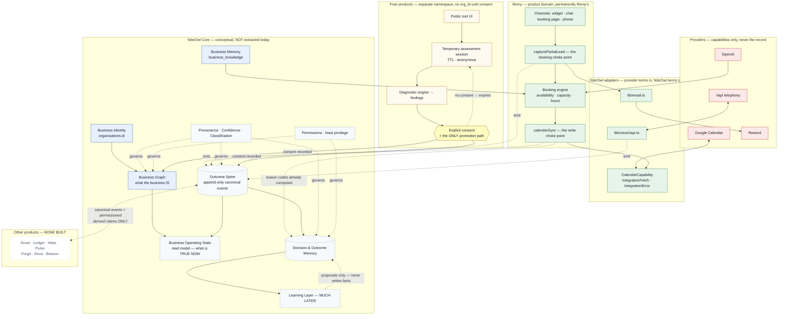

# NiteOwl / Remy — Architecture and Future-Compatibility Guardrail

**Status: documentation only.** Nothing in this document was implemented as part of
writing it. No schema was changed, no route was changed, no environment variable was
changed, no working code was refactored. Written 2026-08-08 against commit `8b4862e`.

**Part I** (§1–5) is the future-infrastructure guardrail review: architecture, tenancy,
entity model, NiteOwl Core and Business Graph compatibility.
**Part II** (§6–16) extends it with the provider-independence and resilience review —
provider inventory and risk, failure isolation, truthful degradation, idempotency,
source of truth, portability and recovery. Part II does not repeat Part I; where a
finding belongs to both, Part II references it by its Part I label (C1, C2, C3, P1).
**Part III** (§17–33, added 2026-08-18) extends both with the compounding-moat and
outcome-intelligence review: business operating state, the outcome spine, decision and
outcome memory, provenance, the cross-product learning contract, the free-product
assessment layer, and what NiteOwl must own rather than rent. Part III likewise does not
repeat Parts I and II; it references their labels (C3, P1, L1, L2, L4, L5, R3, B3).

Governing principle for every recommendation below:

> **MINIMUM CHANGE NOW, MAXIMUM COMPATIBILITY LATER.**

The immediate priority remains Remy's calendar and receptionist work — reliable
booking, cancellation and rescheduling. Everything here is either an observation
about what already exists, or a *deferred* recommendation with a stated trigger.
Where this document names a future NiteOwl product (Scout, Pulse, Beacon, Ledger,
Forge, Atlas, Nova), it does so only to mark a boundary. **None of them is built,
scaffolded or depended on anywhere in this repository, and nothing here creates a
dependency on one.**

Companion documents, which this one does not duplicate:

| Document | What it holds |
|---|---|
| `PROJECT_CONTEXT.md` | Product definition, development principles, roadmap |
| `SESSION_SUMMARY.md` §20 | The twelve integration-framework architecture decisions and their reasoning |
| `CHECKLIST.md` | Live launch-readiness state, per-feature verification status |
| `CHANGELOG.md` | Every change, with root causes |
| `docs/VOICE_AI_PLAN.md` | Voice platform design and isolation guarantees |
| `docs/sql/*.sql` | The schema itself — hand-run, additive, each file self-documenting |

---

## 1. Current architecture

### 1.1 Shape

A single Next.js 16 application on Vercel, one Supabase Postgres per environment
(dev `kioljdihgbcboxlnwghv`, prod `sklcqvvnuigpewzarbiv`), OpenAI for language,
Vapi for telephony, Resend for email, Stripe for billing. There are no
microservices, no message broker and no separate worker. That is the correct shape
for the current product and this document recommends no change to it.

### 1.2 Channels

Four customer-facing entry points share one engine:

```
website widget ─┐
dashboard chat ─┼─→ capturePartialLead()  ─→ leads
public /booking ┤        (leadCapture.ts)
phone call ─────┘─→ voice/calls.ts ────────┘
```

Only `leads.source` differs (`chat`, `web_widget`, `dashboard_preview`, `voice`),
which is what keeps dashboard testing out of production analytics. This is a real
architectural strength and should be preserved: a booking rule can only be enforced
once if there is only one place that books.

### 1.3 Entities that exist today

| Table | Tenant key | Notes |
|---|---|---|
| `organisations` | `id` (is the tenant) | `owner_id` → `auth.users`. Holds business identity, hours defaults, `timezone`, `appointment_duration_minutes`, `max_concurrent_bookings`, `emergency_mode_enabled`, `notification_email`, `widget_key`, Stripe/billing state |
| `leads` | `org_id` | The customer, the enquiry **and the appointment, all in one row** |
| `business_hours` | `org_id` | One row per weekday |
| `business_knowledge` (+ `_revisions`) | `org_id` | The Knowledge Base; RLS-owner-scoped, audit + revision triggers |
| `knowledge_imports` / `_files` / `knowledge_staged_items` | `org_id` | AI import staging |
| `conversations`, `messages` | `org_id` | Chat history |
| `voice_calls`, `voice_events`, `voice_settings` | `org_id` | `voice_events` is append-only raw payloads; `voice_settings.phone_number` is the inbound tenant key |
| `integration_connections` / `_resources` / `_jobs` / `_links` | `org_id` | The integration framework (2026-08-04) |
| `sales_leads` | *none* | NiteOwl's **own** marketing funnel, not tenant data. Correctly separate |

### 1.4 Multi-tenant isolation — inspected, and sound

Every business-owned table carries `org_id` (or is `organisations` itself). Two
distinct trust models are used, deliberately:

1. **RLS-scoped server client** (`lib/supabase/server.ts`) for authenticated
   dashboard reads. Policies are of the form
   `org_id in (select id from organisations where owner_id = auth.uid())`.
2. **Service-role client** (`lib/supabase/admin.ts`) for unauthenticated paths —
   the public widget, the voice webhook, the token-authenticated booking-manage
   page. RLS is bypassed, so **every query must carry an explicit `org_id`**, and
   the file says so.

Inspection findings:

- Every service-role query reviewed either filters by an explicit `org_id`, or
  filters by a primary key that was itself resolved from an org-scoped or
  token-scoped lookup. No query was found that could operate across businesses.
- `/api/leads` verifies `organisations.owner_id = user.id` before both GET and
  POST, and rejects with 403 rather than trusting the client-supplied `org_id`.
- Credential tables (`integration_connections`, `integration_jobs`) have RLS
  enabled with **no policies at all** — deny-all to anon *and* authenticated, so a
  signed-in owner cannot read their own encrypted tokens through the public key.

**Verified against production, read-only, 2026-08-08** (counts only; no row
contents, keys or PII were printed):

| Table | service-role rows | anon-key rows |
|---|---|---|
| `integration_connections` | 1 | **0** |
| `integration_resources` | 1 | 0 (owner-policy table; no session on the probe) |
| `leads` | 5 | **0** |
| `integration_jobs` | 0 | 0 — *empty, so not conclusive* |
| `integration_links` | 0 | 0 — *empty, so not conclusive* |

`integration_connections` holding a row that the public key cannot see is direct
proof that encrypted Google credentials are not readable via the anon key. This
closes the outstanding item at `CHECKLIST.md` line 55 for the table that matters;
`integration_jobs` remains formally unproven only because it has no rows yet.

**Assessment: tenant isolation is adequate. Do not redesign it.**

### 1.5 Calendar architecture

```
booking caller
   │
   ├─ checkBookingSlot()                    lib/bookingAvailability.ts
   │     business hours → internal capacity → external calendar
   │                                          (in that order, short-circuiting)
   │
   ├─ availability.ts                        the internal engine. Imports NO
   │                                         integration module — the external
   │                                         layer composes ON TOP of it
   │
   └─ calendarService.ts                     the org-level capability contract
          resolveOrgCalendar / getOrgBusyIntervals /
          createOrgEvent / updateOrgEvent / cancelOrgEvent
                     │
                     ▼
          registry → CalendarCapability      lib/integrations/types.ts
                     │
                     ▼
          providers/google.ts                the only adapter today
```

Three rules already hold and must not be weakened:

1. **"Not connected" is not an error.** The flag is checked before any query, so an
   org with no calendar costs zero database round trips and behaves exactly as it
   did before the feature existed.
2. **"Cannot check" is never "free."** An outage, an expired token or an unreadable
   calendar returns `lookup_failed`/`needs_reauth`, never an empty busy list. The
   caller must refuse to confirm.
3. **One provider request per question.** `getBusyIntervals` covers the whole
   14-day window once; candidate scanning reuses the returned list rather than
   re-asking per candidate.

**Live state (verified 2026-08-08).** `INTEGRATIONS_ENABLED`,
`CALENDAR_SYNC_ENABLED` and `CALENDAR_AVAILABILITY_BLOCKING` are all present in
Vercel production. Google Calendar is connected and a primary calendar is selected
for org `e3a9ae40…`. Reads are wired **only** into the phone path
(`voice/availabilityTool.ts`). Writes are **not wired at all** —
`createOrgEvent`, `updateOrgEvent` and `cancelOrgEvent` have zero call sites, and
nothing has ever written a row to `integration_links`.

---

## 2. Findings

Classified per the guardrail: **CRITICAL NOW** (a real current risk),
**PREPARE NOW** (small, low-risk, clearly justified), **LATER** (default).

### CRITICAL NOW

> **RESOLVED 2026-08-08 (not yet deployed).** Capacity is now an interval
> overlap, and both it and the business-hours read fail closed. The finding is
> kept below as the record of what was wrong and why. See the note after it for
> what the fix does and does not cover.

#### C1. The internal capacity check compares exact timestamps, so overlapping appointments are not prevented

`isSlotAvailable` (`src/lib/availability.ts:438`) counts booked leads with
`.eq("appointment_datetime", isoDatetime)` — **exact equality**, not overlap. With
the production settings of `appointment_duration_minutes = 60` and
`max_concurrent_bookings = 1`, a booking at 10:00 and a booking at 10:30 both pass:
neither timestamp equals the other, so each sees a count of zero.

`overlapsBusy()` — correct half-open interval logic — already exists in the same
file, but it is applied only to *external* busy intervals, never to the org's own
bookings.

- **Why it is critical:** `PROJECT_CONTEXT.md` lists "Double Booking Prevention" as
  complete and tested. It prevents *identical-timestamp* double booking only. Every
  channel is affected, because every channel reaches this function.
- **Why it is not fixed here:** the fix changes core booking logic, and would
  change which bookings are accepted for every existing org. That needs the owner's
  explicit approval, and a decision about whether duration comes from the org
  default or from a per-appointment value (see C3).
- **Scope of a fix, when approved:** replace the equality predicate with an overlap
  query over `[start, start + duration)`, reusing `overlapsBusy`'s existing
  semantics so back-to-back bookings stay legal. One function.

#### C1/R1 — what the 2026-08-08 fix actually covers

**Fixed.** One overlap definition (`appointmentOverlapWindow` /
`appointmentsOverlap`) now serves the shared capacity check *and* the voice
held-slot check, expressed as a strict range on `appointment_datetime` so
Postgres can still answer it with an index range scan. Half-open is preserved,
so back-to-back appointments remain bookable. Both the capacity read and the
business-hours read fail closed, with `lookup_failed` kept distinct from
`no_hours_configured` — the latter still fails open, which is what a business
mid-setup depends on.

**Two limits worth recording, neither introduced by the fix:**

1. **Duration is org-level.** Every appointment is
   `organisations.appointment_duration_minutes` long, so all intervals are the
   same width and one can never strictly *contain* another — containment
   reduces to partial overlap. Changing the org default retroactively changes
   every stored appointment's implied end, and therefore which historical
   bookings would now be considered clashes. This is L2, and it is the thing to
   fix before per-service or per-staff durations arrive.
2. **The overlap is checked, not claimed.** Two concurrent bookings can still
   both pass the check before either writes, because nothing takes a lock. That
   is the check-to-create race in §R3, and it is why §R3 asks for the internal
   claim to precede the external write at milestone 5.

**A behaviour change the fix required.** Capacity now excludes the lead being
rescheduled (`excludeLeadId`). Under exact-match a lead moving 10:00 → 10:30
never met itself; under overlap it does, so without the exclusion every short
reschedule would be refused as a clash with its own booking. `capturePartialLead`
resolves the existing lead *before* the availability check for this reason — the
only structural change in the pass.

#### C2. Chat and the widget book without consulting the calendar, while the phone refuses on the same calendar

`capturePartialLead` calls `isWithinBusinessHours` + `isSlotAvailable` directly
(`src/lib/leadCapture.ts:717`). It never calls `checkBookingSlot`. The phone path
does. With `CALENDAR_AVAILABILITY_BLOCKING` live in production, the two channels
now disagree: a caller is turned away from a slot that a website visitor can book
straight over, and the website booking is never written to Google Calendar (no
write path is wired), so the phone will not see it either.

- This is **already the top open item** in `CHECKLIST.md` (line 61) and needs no new
  architecture — only the wiring that is next in the milestone plan.
- It is listed as CRITICAL NOW because turning blocking on made one channel strict
  while leaving the others unchanged, and the asymmetry is live against real
  configuration today.
- **`/api/bookings/manage` has the same gap**, and one more besides: a customer
  self-service reschedule or cancel goes through neither `checkBookingSlot` nor any
  calendar write, so once event sync is wired it will silently desynchronise the
  external event. Wire all four paths in one pass, not three.

#### C3. A lead is a customer, an enquiry and an appointment at once — so a returning customer's second booking overwrites their first

There is no `appointments` table. An appointment *is* a `leads` row with
`status='booked'` and `appointment_datetime` set, guarded by a CHECK constraint and
by `bookingInvariant.ts`. For one enquiry that becomes one booking, this is a clean
and deliberate simplification, and it should not be dismantled casually.

The failure appears on the **second** booking. `findOpenLeadForCapture` layer 2
matches on email or phone across conversations with no time bound, and
`MERGEABLE_STATUSES` includes `booked`. So a chat or widget customer who books
Tuesday 10:00 and comes back a month later to book Friday 14:00 has their existing
row mutated: `appointment_datetime` becomes Friday, the Tuesday appointment
disappears from the calendar, and no confirmation email is sent — the send is
guarded by `existing.status !== "booked"`, which is false.

- Voice is **not** affected: layer 2 is skipped for `source='voice'`, so each call
  creates an isolated lead (fixed 2026-08, for a different reason).
- Verify the real-world incidence before choosing a fix — production currently holds
  test orgs only, so this may have no live victims yet.
- **This is also the single most important decision for future compatibility.** See
  §3.1 and P1.

### PREPARE NOW

#### P1. Decide appointment identity *before* wiring calendar event creation

This is a decision, not a build, and it costs nothing today. It becomes expensive
the moment milestone 5 runs.

`integration_links` carries `unique (subject_type, subject_id, connection_id,
capability)`. When `createOrgEvent` is finally wired, whatever is passed as
`subject_id` becomes the permanent, stored identity of "the thing that has a
calendar event". If that is the **lead id**, then one lead can hold exactly one
calendar event forever, and C3's rebooking case cannot be represented at all —
un-baking it later means a data migration over live rows plus reconciliation
against Google.

The framework already anticipates this: `subject_type` is deliberately
unconstrained text with a default of `'lead'`, so choosing `'appointment'` later
costs nothing *in the schema*. What it costs is the rows already written under the
other choice.

Recommended decision, to be taken before milestone 5 and recorded here:

- Wire event creation with `subject_type = 'appointment'`, and make `subject_id`
  the identity of an appointment.
- **Today that identity can still be the lead's id** — one lead, one appointment,
  no new table, no migration, no behaviour change. Nothing is built.
- If and when appointments are separated from leads (§3.1), `subject_type` already
  says what the row means, and only the id values need reconciling — not the shape,
  not the index, not the semantics.

The same argument applies to `CalendarEventInput.idempotencyKey`, which must be
derived from the appointment identity rather than the lead id if the two ever
diverge.

#### P2. This document

`docs/ARCHITECTURE.md` did not exist. The architecture decisions were real and
well-reasoned but scattered across `SESSION_SUMMARY.md` §20, individual SQL file
headers and long code comments — each excellent in isolation, none of them a map.

### LATER

Each carries the trigger that should promote it. Default to leaving these alone.

| # | Item | Trigger |
|---|---|---|
| L1 | **Split `appointments` from `leads`** (§3.1) | The first of: repeat bookings become common; per-appointment duration is needed; multi-staff arrives; schedule recovery is built |
| L2 | **Per-appointment duration.** Duration is org-level and read at query time, so changing the org default retroactively changes every historical appointment's implied end | Duration becomes per-service or per-staff — which is exactly when Dynamic Schedule Recovery needs it |
| L3 | **Remaining hardcoded `Europe/London`** — `availability.ts` `getLondonParts` default, `leadCapture.ts` `resolveAppointmentDatetime`, `bookings/manage` `londonWallTimeToUtcIso`. `organisations.timezone` exists and defaults to the same value, so behaviour is identical for every org today | Already staged: Stage 2 is the resume point on branch `timezone-aware-availability`. The first non-UK org makes it urgent |
| L4 | **Structured event log** (§3.3) | A second consumer of "what happened", or the first analytics requirement that a query over `leads` cannot answer |
| L5 | **AI permission model** (§3.4) | The first action Remy takes that a business would want to withhold — cancelling, moving a confirmed customer, or messaging out |
| L6 | **Business Operating Profile consolidation** (§3.2) | Configuration outgrows `organisations` columns — realistically at multi-location or multi-staff |
| L7 | **Organisation membership** (staff logins). `organisations.owner_id` is a single owner; there is no memberships table | The first business that needs two people signed in |
| L8 | **`lead_summary` security-definer view** — still outstanding from the 2026-07-15 RLS work | Before any non-owner role reads it |
| L9 | **`/api/leads` is dead code** with an incomplete status whitelist | Decide: wire it up or delete it. Already flagged in `CHECKLIST.md` |
| L10 | **Provider adapters beyond calendar** (messaging, telephony, email) | A second provider in that category. `CapabilityId` is deliberately `"calendar"` only |

---

## 3. Future-compatibility notes

Each subsection answers one question: *does today's architecture block this, and
what is the smallest seam that keeps it open?* None of it is to be built now.

### 3.1 Appointments and the Business Graph

The conceptual graph — Business, Customer, Lead, Service, Appointment, Employee,
Location, Conversation, Outcome — is a **modelling target, not a storage
technology**. Relational Postgres remains entirely appropriate; nothing here argues
for a graph database, and introducing one would be exactly the speculative
infrastructure the guardrail forbids.

What matters is that entities have stable identities and honest relationships.
Today's model collapses three graph nodes into one row:

```
                    today                          eventual
  Conversation ──→ ┌──────────┐          Conversation ──→ Lead ──→ Appointment
                   │  leads   │                             │           │
  Customer ──────→ │  (one    │          Customer ──────────┘           │
                   │   row)   │                                         │
  Appointment ───→ └──────────┘          Service ────────────────────────┘
```

The collapse is *fine* while one enquiry means one booking. It stops being fine at
the first of: a customer with two appointments, an appointment that outlives its
enquiry, appointments assigned to staff, or an appointment history worth learning
from. C3 shows the first of those already produces wrong behaviour.

Seams that already exist and cost nothing to keep:

- `integration_links.subject_type` is polymorphic text — a calendar event can be
  linked to an appointment without a schema change (P1).
- `integration_resources.staff_id` exists with no foreign key, reserved for
  multi-staff routing, and the primary-resource uniqueness is a *partial* index per
  staff — so one-calendar-per-staff needs no redesign.
- `voice_calls.lead_id` and `leads.conversation_id` already express real edges.

Seams to avoid closing: do not add a second unique constraint that assumes one
appointment per lead, and do not write external event ids as columns on `leads` —
`integration_links` already exists precisely so that never happens.

### 3.2 Business Operating Profile

The eventual structured profile — identity, locations, hours, services, pricing,
staff, calendars, policies, appointment/cancellation/callback rules, notification
preferences, etiquette, escalation, AI permissions, travel and buffer rules — today
lives in three places: columns on `organisations`, rows in `business_hours`, and
free text in `business_knowledge`.

That is adequate and should not be consolidated now. The direction, when the
trigger arrives (L6), is **additive**: keep `organisations` as the identity row,
and add profile sections as their own tables keyed by `org_id`, each with the
metadata the guardrail asks for — `source`, `updated_at`, `approval_status`, and
`confidence` where an AI extracted the value. The knowledge-import pipeline already
demonstrates that pattern working (staged items → review → approve → commit →
publish, with revisions and an audit trigger), so it is a proven shape in this
codebase rather than a new invention.

The one thing to avoid: do not let `business_knowledge` become the profile. It is
prose for a language model. Structured operating rules that the *booking engine*
must enforce belong in structured storage — the existing split, where hours drive
both the validator and the prompt from one source, is the correct precedent.

### 3.3 Events and operational history

The application does not emit structured events. Operational history is inferable
from `leads` status transitions, `voice_calls`, `conversations` and Vercel logs.

There is, however, already a **working durable-event pattern** in this codebase,
used twice and worth reusing rather than reinventing:

- `voice_events` — raw payload stored *before* processing, `dedupe_key` unique so
  provider retries are idempotent, `processed_at` NULL plus `processing_error` for
  replay.
- `integration_jobs` — the same idea for outbound work: `dedupe_key` unique,
  `attempts`/`max_attempts`/`next_attempt_at`, payload snapshotted so a retry does
  not depend on the subject still looking the same.

When L4's trigger arrives, an `events` table following that shape — `org_id`,
`event_type`, `occurred_at`, `source`, `actor`, `subject_type`/`subject_id`,
`correlation_id`, `metadata` jsonb, `dedupe_key` — is a small additive step, and
emission can be added at existing call sites without restructuring them. **Do not
build an event bus.** A table plus the existing `after()` pattern is sufficient for
a single application, and a broker would be infrastructure with no consumer.

On shared versus product events: only a handful of concepts are plausibly meaningful
outside Remy — `customer.created`, `lead.created`, `appointment.booked`,
`appointment.cancelled`, `appointment.completed`, `customer.feedback_received`.
Everything else (call ringing, transcript processed, knowledge published) is
internal. The rule to respect today is simply: **never let another consumer read
Remy's tables directly.** A stable event or a service call, or nothing.

### 3.4 Permissions, action safety and audit

Nothing in Remy takes an autonomous consequential action today. It books, and it
escalates. Every write is a direct consequence of a customer message in a live
conversation, and there is no path that cancels, moves, refunds or discounts.

That means the four-level model (Observe → Recommend → Approval required →
Automatic) has nothing to govern yet, and building it now would be governing an
empty set. The architectural obligation today is narrower and worth stating
plainly: **the first action Remy takes that a business would want to withhold is the
moment the permission model becomes mandatory, and it must not ship in the same
change as the action it governs.**

Two properties already hold and should be preserved deliberately, because they are
what a permission and audit layer will later attach to:

- **Idempotency is designed in, not bolted on.** `integration_jobs.dedupe_key`,
  `integration_links`' unique indexes, `CalendarEventInput.idempotencyKey`,
  `voice_events.dedupe_key`, and the needs-review `metadata` flag are five
  independent guards against an action happening twice.
- **Consequential actions already funnel through single choke points** —
  `capturePartialLead` for booking, `calendarService` for the calendar. A
  permission check has somewhere obvious to go. Keep it that way; a second booking
  path is what would make this genuinely hard.

Audit today is `console.log` to Vercel plus Sentry. That is thin but honest, and the
`events` table in §3.3 is the natural home for provenance when it is needed.

### 3.5 Reception Intelligence, Schedule Recovery, Revenue Recovery

All three are Remy-owned, none is built, and none is blocked — but each has one
concrete dependency worth recording:

- **Reception Intelligence / Adaptive Etiquette** depends on interaction outcomes
  being distinguishable. `leads.status` already carries a coarse outcome, and
  `metadata` jsonb absorbs detail without migrations. Not blocked.
- **Dynamic Schedule Recovery** is the most demanding, and depends on exactly the
  things C1, C3, L1 and L2 concern: appointment identity, a real end time (not an
  org-default duration), assigned staff, and reschedule history. It cannot be built
  meaningfully on today's model. **This is the strongest argument for treating C3
  and P1 as real** — not because recovery is imminent, but because every appointment
  written before the model is fixed is data that recovery would later have to
  reinterpret.
- **Revenue Recovery** wants missed calls, abandoned enquiries, unfilled
  cancellation slots and unanswered callbacks. `voice_calls.ended_reason` and lead
  statuses already capture most of the raw signal. Not blocked. Keep the *sales
  pipeline* half of this out of Remy — that is Scout's domain, and Remy's job stops
  at the reception-entry opportunity.

### 3.6 Business Memory and the Shared Business Brain

Remy's eventual contribution to a shared brain is reception and customer-entry
intelligence: what customers ask for, when demand peaks, which services are
requested, where booking friction occurs, what escalates. It should not become
responsible for understanding other domains.

The discipline to hold today is about *what gets stored*, and it is already mostly
right: `business_knowledge` is structured and editable with revisions and audit;
transcripts are stored on `voice_calls` and windowed to the last 10 messages when
used for notifications; the needs-review dedup flag is a structured field, not a
log line. Two things to keep resisting: storing conversation transcripts as a
substitute for structured facts, and collecting anything without a current use.

A future memory layer must distinguish verified business facts from AI-inferred
observations, with source and confidence. The knowledge-import tables already model
exactly that distinction (staged, reviewed, approved, published, with confidence on
AI extraction) — reuse it rather than inventing a parallel scheme.

### 3.7 Privacy and data separation

Three categories, and the current architecture keeps them apart correctly:

- **Business/customer operational data** — `leads`, `conversations`, `voice_calls`,
  `business_knowledge`. Tenant-owned, `org_id`-scoped, RLS-protected.
- **NiteOwl's own software and business data** — the code, and `sales_leads` (the
  marketing funnel, correctly having no `org_id` and living behind an `ADMIN_EMAIL`
  gate).
- **Derived intelligence** — does not exist yet.

Nothing today aggregates across businesses, and nothing should start without a
lawful basis, permissions, minimisation and a retention rule decided first. No
change is recommended and none was made. One live item carried over from
`project_pilot_baseline`: sales-chat diagnostic logging containing PII is
deliberately still on in production for the pilot and should be removed afterwards
— that is a pre-existing, owner-known decision, restated here so it is not lost.

### 3.8 Provider independence

**This is the part of the guardrail the codebase already satisfies**, and it needs
no work. `CalendarCapability` expresses NiteOwl domain semantics —
`getBusyIntervals`, `createEvent`, `updateEvent`, `cancelEvent` — not a wrapped
Google API, and emphatically not a `provider.execute(action)` escape hatch. The
booking engine asks `checkBookingSlot`; it never learns which vendor answered.

Deliberate restraints worth preserving:

- `CapabilityId` is `"calendar"` and nothing else. Messaging and CRM interfaces are
  explicitly *not* defined, because inventing message-threading semantics with no
  product behind them bakes in a guess, and a wrong guess is worse than no
  abstraction.
- Credentials are one encrypted blob whose shape the auth strategy chooses, not
  `access_token`/`refresh_token` columns — which is what keeps the first non-OAuth
  integration from needing a migration.
- Providers receive local wall time plus an IANA zone, never a UTC offset.
- Provider implementations are stateless; decryption, refresh and status transitions
  belong to the connection layer.

The one seam to watch: `resolveOrgCalendar` returns a single primary calendar. That
is the right version-1 rule, and it lives in a partial unique index rather than the
table shape, so multi-calendar and per-staff calendars need no redesign.

### 3.9 NiteOwl Core boundaries, and the network

**Nothing should be extracted into a shared core yet.** Every candidate capability
— identity, permissions, integrations, events, audit — has exactly one consumer.
The trigger for extraction is **a second real consumer**, not a possible one.

When that day comes, the natural candidates, in the order they would earn it:

1. **Business identity + membership** — the thing a business should not have eight
   copies of. Today `organisations` + `owner_id`.
2. **The integration framework** — already generic enough to serve another product
   unchanged; it is the least Remy-specific code in the repository.
3. **Events and audit** — only once they exist (§3.3).

Everything else in Remy — booking, availability, reception behaviour, the voice
adapter, the knowledge base, lead capture — is Remy's specialist domain and should
stay Remy's, permanently.

On the opt-in network (routing an unfulfillable request to another participating
business): nothing in the current architecture makes this prohibitively difficult.
It needs stable business identity, service definitions, availability and consent —
the first three exist in some form, and consent is a permission-model concern
(§3.4). No marketplace, directory, routing engine or matching system is built or
recommended. The only thing that would genuinely block it later is per-business
data that cannot be described in shared terms, which is not the case today.

---

## 4. NiteOwl Compatibility Map

Documentation only. **The application must not be restructured to match this
table.**

| Subsystem | Classification | Note |
|---|---|---|
| Booking engine / availability | **Remy-owned permanently** | Remy's core domain. C1 applies |
| Calendar capability contract | Provider-adapter seam — **already correct** | §3.8 |
| Google provider adapter | Provider-specific adapter | Replaceable without touching booking |
| Integration framework (4 tables + registry) | **Likely future NiteOwl Core** | Least Remy-specific code here. Do not extract until a second consumer |
| Appointments | **Remy-owned**, future Business Graph participant | Currently fused into `leads` — C3, P1, L1 |
| Leads | Remy-owned; **shared entity reference candidate** | `lead.created` is a plausible shared event |
| Customers | Not modelled separately today | Would be a Business Graph node and a Core identity candidate — L1 |
| Conversations / messages | Remy-owned permanently | Reception domain |
| Voice / telephony | Remy-owned; provider-adapter candidate | Vapi is directly integrated, not behind a capability contract. Fine — one provider, one consumer |
| Knowledge Base + import | Remy-owned; **future Shared Business Brain contributor** | Already has provenance, review and revisions |
| Business configuration (`organisations`, hours) | **Future NiteOwl Core** (Business Operating Profile) | §3.2, L6 |
| Staff | Does not exist | Seam reserved: `integration_resources.staff_id` |
| Services | Prose in `business_knowledge` only | Structured services are an L6 concern |
| Notifications / email | Remy-owned; shared-contract candidate | Resend behind `lib/email.ts` — one seam already |
| AI / model usage | Remy-owned; provider-adapter candidate | OpenAI called directly. No action — one provider |
| Analytics | Does not exist | Future cross-product event consumer — L4 |
| Authentication | **Future NiteOwl Core** | Supabase Auth. Single-owner today — L7. **Do not migrate now** |
| Permissions | Does not exist | Future Core capability — L5, §3.4 |
| Audit / activity history | Logs + Sentry only | Future Core capability — L4 |
| Billing (Stripe) | Remy-owned today, Core-shaped later | Per-org subscription. Untouched |
| `sales_leads` / marketing site | **NiteOwl-owned, never tenant data** | Correctly separate already |

---

## 5. Verdict

Remy's architecture is in good shape for what is being asked of it. The integration
framework in particular already implements the capability-contract pattern this
guardrail asks for, with better reasoning than most greenfield attempts, and it
should be left alone. Tenant isolation is sound and was verified against production.

The one genuine structural gap is that **a lead, a customer and an appointment are
the same row**. That is a defensible simplification for one-enquiry-one-booking, it
produces one wrong behaviour today (C3), it hides a second (C1), and it is the
single thing that future scheduling capability most depends on. It does not need to
be fixed now. It needs to be *decided* before calendar event writes bake the current
identity into stored external references (P1).

Everything else defaults to LATER, as it should.

---
---

# Part II — Provider Independence and Resilience

Added 2026-08-08, same commit, same rules: **documentation only**, nothing implemented,
no provider migrated, no vendor added, no working integration touched.

Governing principle for this part:

> **MINIMUM CHANGE NOW, MAXIMUM RECOVERABILITY AND PORTABILITY LATER.**

Two things worth saying before the findings, because they shape everything below.

**First: the calendar integration already satisfies most of what a provider-independence
review asks for.** `CalendarCapability` is a genuine domain contract, `IntegrationError`
is a provider-neutral taxonomy, `integrationFetch` gives every provider one timeout and
one retry classification, and Google's client-supplied event id makes creation idempotent
at the provider. That work does not need redoing and this part recommends no change to it.

**Second: the weak points are not where the abstraction is missing — they are where
failure meets truth.** The three findings that matter are all about what Remy *says*
when something below it breaks, and about state that exists nowhere durable.

---

## 6. Provider inventory and coupling

| Provider | Capability | Depended on by | Coupling today | Abstraction justified? |
|---|---|---|---|---|
| **Supabase** (Postgres + RLS + Auth + Storage) | System of record, identity, file storage | Everything | Deep, and deliberately so | **No.** It *is* the source of truth, not a swappable capability |
| **Vercel** | Hosting, serverless runtime | Everything | Thin — see §12 | No |
| **Google Calendar** | Calendar | `providers/google.ts` only | **Fully isolated** behind `CalendarCapability` | Already done |
| **OpenAI** | Language, extraction, datetime parsing | **9 direct `fetch` call sites** | Direct, repeated, no shared client | Later — §8 |
| **Vapi** | Telephony + voice AI | `lib/voice/*` (adapter layer exists) | Moderate; prompt lives in our code | Later — §9 |
| **Resend** | Email | `lib/email.ts` (single seam) | One module, module-scope client | Later; the seam already exists |
| **Stripe** | Billing | `lib/billing/{stripe,provider}.ts` | Behind a provider indirection already | No |
| **Sentry** | Observability | `instrumentation*.ts`, `next.config.ts` | Thin, non-blocking — §10 | No |
| Twilio, Microsoft/Outlook, SMS | — | **Not integrated.** No groundwork beyond the framework's readiness | — | No |

Applying the §5 abstraction test honestly: only OpenAI and Vapi score enough "yes"
answers to be worth a contract *eventually*, and neither scores enough to be worth one
*now*. Everything else is either already abstracted, or is infrastructure rather than a
replaceable capability.

### 6.1 Provider risk matrix

| Provider | Scope | 5-min outage | Multi-hour outage | Account loss | Replace difficulty | Current fallback | Target level | Priority |
|---|---|---|---|---|---|---|---|---|
| **Supabase** | Core candidate | Total: every channel down | Total | **Existential** — all operational state | Very high (Auth + PostgREST + RLS) | None. Backups exist, restore unproven | L2 | **P0** |
| **Vercel** | Core candidate | Total outage | Total | Severe but recoverable — repo is the app | Low–moderate | None | L1 | **P1** |
| **OpenAI** | Remy | Chat/voice cannot answer or extract | Same | Severe: no second provider wired | Moderate (9 sites, 2 models) | Truthful failure everywhere; no fabrication | L3 | **P1** |
| **Vapi** | Remy | Phone line down; web unaffected | Same | Severe: number + assistant config live there | High (real work) | Web/dashboard/calendar continue | L3 | **P1** |
| **Google Calendar** | Provider-specific | Availability unknown → phone stops confirming | Same, indefinitely, **and silently** | One org's calendar only | **Low** — the contract exists | Truthful "unknown"; internal engine continues | L3 | **P2** |
| **Resend** | Shared candidate | Confirmations silently undelivered | Same | Moderate — domain is ours, sender is portable | Low | **None. Not retried, not recorded** | L3 | **P2** |
| **Stripe** | Core candidate | Checkout/portal unavailable | Same; existing access unaffected (grandfathered) | Severe commercially, not operationally | Moderate | Access already granted continues | L2 | **P2** |
| **Sentry** | Core candidate | Monitoring blind | Same | Low | Very low | Operations unaffected — verified §10 | L3 | **P3** |

Nothing else reaches P2. Twilio, Microsoft and SMS are not dependencies because they are
not integrated.

---

## 7. Findings

### CRITICAL NOW

#### R1. A database read failure makes chat and the widget confirm a booking they never actually checked

`getBusinessHoursForOrg` (`src/lib/availability.ts:96`) returns `[]` on **both** "this
business has configured no hours" and "the query failed" — it has the `error` object in
hand and discards the distinction. `isWithinBusinessHours` reads an empty list as
`no_hours_configured` and returns `isAvailable: true`. `isSlotAvailable` fails open too,
returning `true` on a query error with the comment *"don't block bookings on a query
error."*

So a transient Supabase error on the booking path does not produce a degraded answer — it
produces a **confirmed booking**, emailed to the customer, for a time that may be outside
business hours or over capacity.

The codebase already knows this. `voice/availabilityTool.ts:391–406` guards against
exactly it, and says so:

> *"It is wrong on a live call: it would have Remy tell a customer 3 PM is free on the
> strength of a database error, which is exactly what the engine's own 'could not check is
> never it is free' rule forbids."*

That guard is **voice-only, deliberately** — the comment explains it was scoped narrowly
so shared behaviour would not change. The consequence is that the rule the whole calendar
design turns on is enforced on the phone and not on the website.

- **Why CRITICAL NOW:** it violates truthful customer outcomes, on the customer-facing
  path, with no compensating signal. It also compounds C2 from Part I — chat and the
  widget already skip the external calendar, and this means they can skip the *internal*
  checks too without anyone knowing.
- **Why not fixed here:** the fail-open behaviour is deliberate and load-bearing for the
  genuine no-hours-configured case. Distinguishing the two cases is small, but it changes
  what happens to real bookings during a database blip, and that is the owner's call.
- **Smallest honest fix:** have `getBusinessHoursForOrg` return "failed" distinctly from
  "empty", and treat only "empty" as fail-open. `isSlotAvailable`'s error branch gets the
  same treatment. Roughly one function plus two call sites; no schema change.

### PREPARE NOW

#### R2. Fix the idempotency-key contract before calendar writes are wired

`toGoogleEventId(idempotencyKey)` (`providers/google.ts:86`) turns the key into the
**permanent Google event id**, and `createEvent` maps Google's 409 to
`{ alreadyExisted: true }` — which is exactly right, and is the strongest duplicate guard
available.

It becomes a trap the moment writes are wired, in one specific way: if the key is derived
from the lead id (the obvious choice, and the same choice Part I's P1 concerns), then a
**rescheduled** appointment re-deriving the same key will hit the existing event and come
back `alreadyExisted: true` — carrying the *old* time. A caller that reads that as
success reports "booked" for a time Google never moved.

This is a decision plus one rule, not a build:

- The idempotency key must identify **this version of this appointment**, not the lead.
- `alreadyExisted: true` must never be treated as "the calendar now matches" without
  either an update call or a verification read. The field exists precisely so the caller
  has to look.
- Pairs directly with Part I's P1 (`subject_type = 'appointment'`); take both together,
  once, before milestone 5.

> **ADDRESSED 2026-08-08 by milestone 5 (not yet deployed).** `src/lib/calendarSync.ts`
> implements protections 1, 3, 4 and 5 below; protection 2 is satisfied by Google's
> client-supplied event id. The residual race is stated at the end of this section.

#### R3. The check-to-create race, and what an offered slot actually guarantees

Recorded now because it is cheap to design for and expensive to retrofit, and because
the voice flow already offers alternatives that a caller can accept.

**What is guaranteed today.** An alternative offered mid-call is *not* a second guess.
`gatherAlternatives` derives every candidate from the **same authoritative result** as
the original decision: the one `busy` list `checkBookingSlot` already fetched, plus
`findNextAvailableSlot` enforcing opening hours, closed days, lunch, must-finish-before-
closing and internal capacity, plus `fetchHeldSlots` excluding slots another caller has
already requested. A candidate past `externalBusyWindowEndIso` is refused rather than
offered, because silence outside the fetched window is not evidence of free.

So when a caller accepts an offered alternative, that slot was validated against the
external calendar and the internal engine at the moment it was offered. **Re-checking on
acceptance is redundant** and would cost a provider round trip mid-call; the voice model
sometimes does it anyway, which is harmless. *No code change is warranted, and none was
made.*

**What is NOT guaranteed, and will matter the moment `createOrgEvent` is wired.** The
window between "we checked" and "we wrote" is currently unbounded — seconds of
conversation, plus post-call processing. Nothing prevents the calendar changing inside
it: the owner books over the slot in Google, another caller takes it, or a second Remy
call runs concurrently. Today that is harmless, because nothing is ever written and
nothing is ever called booked. It stops being harmless the instant a create can succeed
against a slot that is no longer free.

The protection required at milestone 5 — design intent, not a build:

1. **Re-verify immediately before the write, not at conversation time.** The freshness
   that matters is at the instant of creation. This is the one place a second freeBusy
   call is justified, and it belongs next to the write rather than in the dialogue.
2. **Let the provider arbitrate, not our read.** A read-then-write is racy however
   tightly it is scoped. Google's client-supplied event id already makes creation
   idempotent (`toGoogleEventId`); the remaining need is a conflict answer from the
   provider rather than a second opinion from us.
3. **Order the internal claim before the external write**, so two concurrent Remy calls
   cannot both pass. The internal capacity check is the only thing we fully control —
   and note it is currently exact-timestamp equality, so C1 must be fixed before it can
   serve as a claim at all.
4. **A failed or conflicted create must never become "booked".** It becomes a request the
   owner sees, exactly as an unreadable calendar does today. The three states —
   available / selected-pending / booked — must stay distinct, and only a *successful*
   create may reach the third.
5. **Never re-check in a way that can silently move the appointment.** If the slot has
   gone, the caller is told; the time is not quietly shifted to the next free one.

The voice prompt is already correct for this and needs no change: it says "preferred
time", never booked, confirmed or reserved.

#### What milestone 5 actually built (2026-08-08)

`confirmAppointmentOnCalendar` in `src/lib/calendarSync.ts` is the only path that writes
an event. It is called from `capturePartialLead` at the two points a lead becomes
`booked`, and the lead's status is decided **from its outcome** rather than before it:

| Outcome | Status | Why |
|---|---|---|
| `no_calendar` | `booked` | Flag off, nothing connected, or sync disabled. Every org today — behaviour byte-identical to before |
| `created` / `already_linked` | `booked` | Google holds the event |
| `conflict` | `needs_review` | The slot went while we were talking |
| `unverified` / `failed` / `stale_link` | `needs_review` | Nothing is known, so nothing is claimed |

- **Protection 1 (re-verify at the write):** `checkBookingSlot` runs immediately before
  the create, not at conversation time. An observed external conflict blocks the write
  **regardless of `CALENDAR_AVAILABILITY_BLOCKING`** — that flag governs whether a
  customer is turned away, but writing on top of a busy window is a double booking in
  the business's own diary and is never acceptable.
- **Protection 3 (internal claim first):** the lead row is written in a pending state
  *before* Google is touched, so a crash between the two leaves a recoverable request
  rather than an event with no lead. This is why C1 had to be fixed first — the capacity
  check can only serve as a claim now that it is overlap-aware.
- **Protection 4:** only `created`/`already_linked` reach `booked`, and the confirmation
  email is gated on the same value.
- **Protection 5:** a conflict returns the engine's suggested alternative; it never
  silently moves the appointment.

**The idempotency key is `leadId + startMs`,** which is what makes `alreadyExisted` safe
to trust: the key encodes the instant, so a 409 can only mean an event for *this*
appointment at *this* time. Keying on the lead alone — the obvious choice — would have
re-derived the same id after a reschedule and reported success carrying the old hour.
That is the §R2 trap, and it is now covered by a test that fails if the key is reduced.

**Residual race, unchanged and accepted.** Two concurrent bookings can still both pass
the pre-write check before either writes, because nothing takes a lock. The window is
now milliseconds rather than minutes, and Google's client-supplied id means the loser
gets a 409 rather than a duplicate event — so the failure mode is a false "already
booked", not two events. Closing it properly needs a database-level claim on the slot,
which is L1/L2 territory.

#### The write gate is an org allowlist, not a global switch (2026-08-08)

`CALENDAR_EVENT_CREATION_ORG_IDS` — comma-separated org UUIDs, whitespace ignored,
matching case-insensitive. **Unset or empty means nobody**, matching the fail-closed
direction of the three switches above it, and `CALENDAR_SYNC_ENABLED` remains a
prerequisite.

It replaced a global boolean because that boolean could not express "the test org only".
A global flip would have been safe only because one org happened to have connected a
calendar — a property of the DATA, not of the flag. `setPrimaryResource` hard-codes
`sync_enabled: true`, so any org connecting a calendar mid-rollout would have begun
receiving writes with no further action. The allowlist makes the blast radius something
stated rather than inferred, and it is how the first paying business should be enabled
too — one org at a time.

`orgId` is threaded through every gate; there is no bypass path.

#### Milestone 6 — reschedule and cancel sync (2026-08-08)

Two operations added alongside creation, sharing the same flag and the same module.

**A reschedule PATCHes the event in place** rather than deleting and recreating it: the
customer keeps one event in their calendar with its history, and the attendee is not sent
a cancellation followed by a fresh invite. The consequence is that a moved event keeps
the id it was *created* with, so the event id no longer encodes the current time — which
is why milestone 5's `stale_link` inference is gone. Guessing was replaced by *making it
true*: when a link already exists, the event is realigned with an idempotent update.
Setting an event to the time it already holds costs one request and changes nothing.

**The truthfulness rule is deliberately asymmetric**, and this is the core of the design:

| | On provider failure | Why |
|---|---|---|
| **Reschedule** | The move is **refused**; the local time is unchanged and the customer is asked to retry | Saying "moved to Thursday" while the event sits on Tuesday is the exact desync this closes. The customer loses nothing by trying again |
| **Cancel** | The local cancellation **goes ahead anyway**; the link is marked `failed` with its error | A customer must always be able to cancel. Trapping them because Google is unreachable is far worse than leaving the business one ghost event to clear |

**One known limitation, handled explicitly.** Google's free/busy returns intervals with no
event ids, so the org's *own* event cannot be filtered out of a conflict check. Moving an
appointment by less than one appointment-duration (10:00 → 10:30) would therefore clash
with the very event it is about to move. The check is skipped when the new slot overlaps
the old one — the internal checks still apply, and the only thing plausibly occupying that
window is the appointment itself. Closing it properly needs an event-id-aware busy read
(`events.list` rather than `freeBusy`), which is not worth it yet.

**Chat-initiated reschedules move the event immediately.** `capturePartialLead` detects an
already-booked lead whose `appointment_datetime` is changing and calls
`rescheduleAppointmentOnCalendar` *before* writing the new time — a refusal keeps the old
time and reports it truthfully. This needed its own path: the calendar-backing block only
ever fires on the transition *into* `booked`, so a reschedule of an already-booked lead
was never covered by it. (Caught in review: the first implementation moved the stored time
and left the event where it was, silently, on a live chat/widget path.)

**Cancellation is local-first.** The lead is marked `cancelled` before Google is touched.
Google-first created the one failure this design does not accept — the event deleted from
the business's diary while the lead still said `booked`, holding the slot internally and
showing nothing in the calendar. This ordering leaves only the accepted failure: a ghost
event, recorded on the link with its error.

**Still not built:** nothing writes to the calendar from the voice path, because voice
never sets `booked`.

### BEFORE SCALE

| # | Item | Why it matters before paying businesses |
|---|---|---|
| **B1** | **A broken calendar connection is invisible.** `needs_reauth` surfaces **only** on Settings → Integrations — no email, no dashboard banner, nothing proactive. Meanwhile the phone correctly refuses to confirm anything. | This *will* fire: the checklist already flags that an unverified Google app in Testing mode issues refresh tokens that **expire after 7 days**. The owner's experience is "Remy silently stopped booking." Truthful, but invisible |
| **B2** | **Email delivery state is not tracked and never retried.** `sendChecked` throws, the caller catches and logs. A booking exists; the customer is simply never told. | §12's degraded-messaging rule explicitly wants confirmation-delivery state tracked separately. Today there is no such state and no record that a send failed |
| **B3** | **`integration_jobs` exists but nothing drains it.** The durable retry queue — dedupe key, attempts, backoff, payload snapshot — is built, migrated, live in production, and has zero rows and zero consumers | It is the right home for B1's notification and B2's retry. Wire it when the first async operation needs it; do not build a second mechanism |
| **B4** | **Every `console.error` becomes a Sentry event** (`captureConsoleIntegration({ levels: ["error"] })`), and soft-fail paths log errors liberally | Quota and cost, not correctness. One noisy org could bury real alerts |
| **B5** | **Rate limiting is per warm instance** (in-memory `Map`), so the effective limit is × the instance count | Documented and deliberate. Fine as an abuse cap; not a quota |
| **B6** | **Restore has never been tested.** Backups were enabled 2026-07-08 on the production project — a Supabase dashboard setting. *Backup exists* ≠ *recovery is proven* | §11 |
| **B7** | **No provider-health model.** Connection status is per-org (`connected`/`needs_reauth`/`error`) with no global signal and no last-success timestamp used for decisions | §13 |

### LATER

| # | Item | Trigger |
|---|---|---|
| L11 | **AI gateway** — 9 hand-rolled `fetch("https://api.openai.com/…")` sites, `gpt-4o-mini` ×8 and `gpt-4o` ×5 hardcoded, each with its own timeout and parsing | A second model provider, or the first time a model id needs changing in one place |
| L12 | **Voice capability contract** — `lib/voice/` is already an adapter layer, and the reception logic (prompt, tools, extraction, lead capture) is ours | Seriously evaluating a second telephony provider |
| L13 | **Email capability contract** — `lib/email.ts` is already the single seam; a contract is one interface away | A second email provider, or SMS |
| L14 | **Lazy Resend client.** `new Resend(...)` at module scope fails the **entire production build** if the key is missing — this already happened 2026-07-20 | Already logged in `CHECKLIST.md` as owner-deferred. Revisit if it recurs |
| L15 | **Microsoft/Outlook adapter** | Customer demand. The framework is ready; this is one provider file |

---

## 8. AI / model boundary

Current usage is simple and, importantly, **already truthful under failure**: every call
site has an explicit `AbortSignal.timeout`, and every one returns a neutral result rather
than a fabricated one. `parseDatetimeToIso` is the model of how to do this — it returns
`{ iso: null, failed: true }`, and the caller's `enforceBookedInvariant` then downgrades
the lead to `needs_review` rather than booking a guessed time. It also applies
`snapToNamedWeekday`, a **deterministic correction over model output**, which is the right
instinct: trust the model for interpretation, verify with code.

What is missing is not safety, it is a single place to change a model id, a timeout or a
retry policy. That is a maintainability argument, not a resilience one, so it stays LATER.

The clean future seam, when it earns its place: one `generateStructuredResult()`-shaped
function taking a task name, returning either a parsed result or an explicit failure —
and never a fabricated one. **Do not build automatic model switching.** Silently falling
back to a different model changes behaviour that tests and prompts are pinned to.

---

## 9. Voice / telephony boundary

The division is already close to correct. NiteOwl code owns the receptionist prompt and
its 13 rules, tool definitions, availability checking, callback/appointment distinction,
lead capture, escalation, extraction and post-call processing. Vapi owns call transport,
audio, and webhook shape — handled in `lib/voice/vapi.ts` and `handler.ts`.

Two things genuinely live at the provider and would have to be recreated on a migration:
the phone number, and the assistant-request/webhook contract. That is an acceptable and
normal cost, and it is far smaller than it would be if the conversation logic lived in
Vapi's dashboard — which was explicitly avoided (the checklist records un-assigning the
dashboard-built assistant so calls hit our server instead).

Post-call durability is genuinely good: `voice_events` stores the raw payload **before**
processing, `(provider, dedupe_key)` makes retries idempotent, and a processing failure
leaves `processed_at` NULL for replay. Two independent structured-extraction paths exist
because the provider's own `structuredData` returns NULL in practice — the transcript
fallback is what carries every real call. That is graceful degradation working.

**No change recommended. Do not migrate.**

---

## 10. Observability resilience — assessed, and fine

- `Sentry.init` runs in `instrumentation.ts` `register()` with `tracesSampleRate: 0`. A
  missing or unreachable DSN disables reporting; it does not prevent startup.
- `captureConsoleIntegration` hooks `console.error` and buffers asynchronously. No
  business path awaits a Sentry response.
- No route reads from Sentry, and no customer-facing outcome depends on it.

**Verdict: observability is correctly non-blocking. No correction needed.** The only
Sentry item is B4, which is about cost, not availability.

---

## 11. Failure isolation, truthful degradation, and recovery

### What happens today, per provider

| Failure | Actual behaviour | Truthful? |
|---|---|---|
| **Google Calendar unavailable** | `getOrgBusyIntervals` → `lookup_failed`; `checkBookingSlot` → `externalCheckFailed`; voice → `unknown`, takes a preference instead of confirming. Lead capture continues, callbacks continue | ✅ Yes — and this is the design's best feature |
| **Google connection dead (`needs_reauth`)** | Same as above, **indefinitely and silently** — B1 | ✅ Truthful, ❌ invisible |
| **OpenAI unavailable** | Datetime parse → `failed`, lead downgraded to `needs_review`; extraction → empty; chat → error to the user | ✅ Yes — nothing fabricated |
| **Vapi unavailable** | Phone line down. Dashboard, widget, calendar, database all unaffected | ✅ Correctly isolated |
| **Sentry unavailable** | Monitoring blind only | ✅ §10 |
| **Resend unavailable** | Booking succeeds, confirmation silently never arrives, nothing recorded — B2 | ⚠️ Partial |
| **Supabase read blip on the booking path** | **Booking confirmed without being checked** — R1 | ❌ **No** |
| **Supabase fully unavailable** | Everything stops. Honest and unavoidable — it is the system of record, not a replaceable capability | ✅ Correct boundary |

### Recovery

- **Point-in-time backups**: enabled on production 2026-07-08. Never restore-tested (B6).
- **Provider mappings survive a restore**: connections, resources and links are all in
  Postgres, not in provider-side state.
- **OAuth reconnection is a supported path**: `saveOAuthConnection` updates the existing
  row on reconnect rather than inserting, and `disconnectConnection` nulls credentials
  rather than merely flagging them.
- **Recovery gap**: `INTEGRATION_TOKEN_ENCRYPTION_KEY` is not part of the database backup.
  A database restored without the matching key holds credentials nobody can decrypt. The
  keyring already supports versioned keys, so this is a *key-custody* question, not an
  architecture one — but it should be written down wherever the restore procedure lives.

---

## 12. Portability — hosting and backend

### Vercel — **ACCEPTABLE**

No `@vercel/*` import anywhere. No `vercel.json`. No KV, Blob, Edge Config or Cron. The
only platform-shaped things are `export const maxDuration = 300` on one route (a no-op
elsewhere) and `after()` from `next/server` (framework, not platform). This is a standard
Next.js application that would run on any Node host. **Do not sacrifice current simplicity
for further portability.**

### Supabase — **WATCH**, and correctly so

| Dependency | Assessment |
|---|---|
| Postgres + SQL + RLS | **ACCEPTABLE** — plain Postgres. Policies are standard SQL. Fully portable |
| PostgREST query builder (`.eq()`, `.or()`, `.maybeSingle()`) | **ACCEPTABLE** — mechanical to port, spread wide but shallow |
| **Supabase Auth** | **WATCH** — the real lock-in. 32 `getUser()` sites, middleware, OAuth, password reset, `auth.admin.getUserById`, and `organisations.owner_id` → `auth.users` FK |
| Supabase Storage | **ACCEPTABLE** — 2 call sites, knowledge import only |
| Realtime / Edge Functions / RPC | **Not used at all** — nothing to unpick |

Auth is a deliberate, high-value trade: it provides sessions, OAuth, password reset and
email confirmation that would otherwise be weeks of work. **Its value currently outweighs
its lock-in.** The one thing to keep true is that `organisations.owner_id` is the only
place identity crosses into business data — which it is.

**Middleware note, checked rather than assumed:** the matcher covers nearly every request
including `/api/*`, but `getUser()` short-circuits locally with `AuthSessionMissingError`
when there is no session cookie (verified in the installed `auth-js` source), so the
widget and voice webhook paths pay **no** auth round trip. Authenticated dashboard requests
do hit Supabase Auth per request; an outage there resolves to `user: null`, which logs
dashboard users out but leaves public routes untouched. Contained.

### Data portability — **gap, documented not built**

There is no export feature. The data is all in Postgres with clean `org_id` scoping, so a
per-tenant export is a straightforward query set rather than an architectural problem. The
categories that should be exportable — configuration, customers, leads, appointments,
knowledge, call metadata — are all structured. Secrets, `credentials_encrypted` and
internal system state must be excluded. **Build when a customer asks or a regulation
requires; nothing today blocks it.**

---

## 13. Provider health, retries and connection model

**Connection model — already right.** `integration_connections` holds tenant, provider,
capability array, auth strategy, status, `last_error`, `token_expires_at`,
`last_verified_at`, provider account identity, and an **encrypted** credential blob under
deny-all RLS. That is essentially the model a future Core would want, built for one
consumer. No change.

**Provider health — the one real gap (B7).** Today's status is per-org connection health
only. There is no notion of *global* provider health, which matters because the two need
different responses: one org's dead OAuth token means "tell that owner to reconnect";
Google being down for everyone means "stop hammering it." The fields to derive both
already exist (`status`, `last_error`, `last_verified_at`). This is a small read-model
over existing columns when it is needed — **not a monitoring platform.**

**Retry policy — half built, half unused.** Timeouts, error classification
(`isRetryable`, `requiresReauth`), `Retry-After` parsing and abort-on-deadline are all
implemented and good. What is missing is anything that *acts* on them asynchronously,
because `integration_jobs` has no drain (B3). Today every provider call is synchronous
inside a request, which is correct while the only operation is a read with a caller
waiting. The moment event writes are wired, the queue is the right home — and it already
enforces the duplicate-action rule through its unique `dedupe_key`.

### Idempotency scorecard

| Operation | Guard | Verdict |
|---|---|---|
| Calendar event create | Client-supplied Google event id; 409 → `alreadyExisted` | ✅ Strong — see R2 for the caveat |
| Calendar event cancel | 404/410 → `not_found` → success | ✅ Idempotent |
| Calendar event update | PATCH, naturally idempotent; `external_etag` stored for conflict detection | ✅ |
| Voice webhook | `(provider, dedupe_key)` unique; duplicate → ack without reprocessing | ✅ Strong |
| Voice lead capture | Layer 1 keyed on the provider call id; replay updates the same lead | ✅ |
| Booking confirmation email | Fires only on the `!booked → booked` transition | ✅ Effectively idempotent |
| Needs-review notification | `metadata.needs_review_notification_sent` + conversation id | ✅ |
| Stripe webhook | SDK `constructEvent` signature verification | ✅ |
| Job queue | `unique (dedupe_key)` | ✅ Built, unused (B3) |

**No current duplicate-business-action vulnerability was found.** This is the strongest
part of the architecture and it is not an accident — five independent mechanisms, each
documented at its site.

### Security and account isolation — inspected, no change recommended

Credentials AES-256-GCM encrypted with a versioned keyring, never stored raw, never
returned to the browser, deny-all RLS on the credential tables (proven against production
in §1.4). Least-privilege Google scopes with a stated rationale. Webhook secrets compared
with `timingSafeEqual`. Separate dev and production Supabase projects. No secrets in
source control. Every kill switch fails closed — anything other than the literal `"true"`
reads as off, so a misconfigured environment yields "no integrations", never "half an
integration against real customers".

The one open item is custody of `INTEGRATION_TOKEN_ENCRYPTION_KEY` relative to database
backups (§11).

---

## 14. Remy vs NiteOwl Core — provider-control boundary

Refining Part I §3.9 for provider concerns specifically. **Nothing is extracted; the
trigger remains a second real consumer.**

| Layer | Classification |
|---|---|
| Booking rules, availability, reception behaviour, prompts | **Remy-owned permanently** |
| `CalendarCapability`, `IntegrationError`, `integrationFetch` | **Core candidate** — the most product-neutral code in the repo |
| `integration_connections/_resources/_jobs/_links` + connection lifecycle | **Core candidate** — already generic |
| Provider health read-model (B7) | **Core candidate** when it exists |
| `providers/google.ts` | **Provider-specific**, permanently isolated |
| `lib/voice/vapi.ts`, `handler.ts` | **Provider-specific** adapter |
| Voice reception orchestration (`assistant.ts`, `availabilityTool.ts`, `extraction.ts`) | **Remy-owned** |
| OpenAI call sites | Remy-owned today; a future gateway would be a **Core candidate** |
| `lib/email.ts` | Shared candidate — one seam already |
| Supabase Auth usage | **Core candidate** (identity), but do not migrate — Part I L7 |

## 15. Redundancy maturity — current standing

| Provider | Level 1 Portable | Level 2 Recoverable | Level 3 Gracefully degradable |
|---|---|---|---|
| Google Calendar | ✅ | ✅ | ✅ *(truthful, but invisible — B1)* |
| OpenAI | ⚠️ 9 sites | ✅ | ✅ |
| Vapi | ⚠️ real work | ✅ | ✅ |
| Resend | ✅ | ⚠️ no delivery state | ⚠️ B2 |
| Sentry | ✅ | ✅ | ✅ |
| Vercel | ✅ | ✅ | n/a |
| Supabase | ⚠️ Auth | ⚠️ restore unproven (B6) | n/a — correct boundary |

**Level 4 (failover) is not recommended for any provider.** No current downtime impact
justifies the complexity, and a second calendar or model provider would add more failure
modes than it removes.

## 16. Part II verdict

The provider architecture is in better shape than the resilience gaps suggest, because the
gaps are not abstraction gaps. Portability is already good, idempotency is genuinely
strong, and degradation is truthful nearly everywhere.

The exception is R1, and it is worth being precise about why it matters: the entire
calendar design rests on *"cannot check is never free."* That rule is enforced against
Google, and enforced on the phone — but a database blip on the website path still produces
a confirmed booking that nothing ever checked. The rule should hold against every provider
below Remy, including the one Remy is built on.

---
---

# Part III — Compounding Moat and Outcome Intelligence

Added 2026-08-18 against commit `c7d9b78`. Same rules as Parts I and II:
**documentation only.** No schema was created, no table was added, no route was changed,
no flag was introduced, no working code was touched. Nothing below was implemented, and
nothing below asks for implementation now.

Governing principle for this part:

> **MINIMUM CHANGE NOW, MAXIMUM OPTIONALITY, RECOVERABILITY AND COMPOUNDING
> INTELLIGENCE LATER.**

Parts I and II asked *can this architecture survive growth, and can it survive its
providers?* Part III asks a different question: **when every capability in this product
has been commoditised, what is left that a competitor cannot buy?**

The eight-product NiteOwl line (Remy, Ledger, Atlas, Scout, Pulse, Forge, Nova, Beacon)
is referenced here only to mark boundaries. **None of them is built, scaffolded or
depended on anywhere in this repository, and nothing in Part III creates a dependency on
one.** The current development priority is unchanged and is restated in §32: Remy's
calendar reliability.

---

## 17. What the competitive review actually exposes

The strategic finding to be tested is that large competitors are combining AI agents with
proprietary native workflow data — field-service platforms pairing voice AI with dispatch,
CRM platforms pairing agents with pipeline data, accounting platforms pairing agents with
ledgers, suites pairing many agents with one customer record.

Applying Part I's own abstraction discipline to that claim gives an uncomfortable but
correct result. **"Several AI specialists over shared business data" is not a moat**,
because every component of it is purchasable:

| Component | Time for a funded competitor to reproduce | Verdict |
|---|---|---|
| An AI receptionist that answers and books | Weeks | Commodity |
| Voice, telephony, transcription | Bought, not built | Commodity |
| Calendar/CRM/accounting integrations | Weeks each | Commodity |
| A shared customer/business record across products | Months | Table stakes |
| Prompts, RAG, dashboards, lead scoring | Days to weeks | Commodity |
| **A five-year record of what this business promised, what it actually delivered, and which promises produced repeat revenue** | **Cannot be bought at any price** | **Candidate moat** |

Only the last line survives the copy test in §25, and it survives for one reason: it is
not information *about* a business, it is information *produced by* a business over time,
which no amount of funding compresses.

That yields the honest verdict of this part:

> **NiteOwl's moat is not that several products share data. It is that NiteOwl records
> what was decided, what was done and what followed — and that this record cannot be
> back-filled by anyone who starts later.**

And it yields the finding that matters most today, which is not about anything NiteOwl
lacks. It is about something NiteOwl is actively destroying.

---

## 18. Existing architecture assessment — what already supports this, and must not be touched

Before the gaps, the assets. A surprising amount of what an outcome-intelligence
architecture needs is already present, because it was built for other reasons and built
well. **None of the following should be redesigned to serve Part III.**

| Asset that already exists | Why Part III depends on it |
|---|---|
| **One booking engine behind four channels** (§1.2) | Outcome data is only comparable if every channel produced it the same way. A second booking path would fork the history, not just the code |
| **`org_id` on every business-owned table, two deliberate trust models** (§1.4) | Tenant isolation is the precondition for *any* cross-tenant aggregation ever being permissible. It is sound and was verified against production |
| **Capability contracts, not wrapped vendor APIs** (§3.8) | The event and decision models can be expressed in NiteOwl's own terms because the calendar layer already proved the pattern |
| **`voice_events`: raw payload stored before processing, `dedupe_key` unique, `processed_at` for replay** | This *is* an append-only event log with idempotency and replay. The outcome spine should copy it, not invent a rival |
| **`integration_jobs`: dedupe key, attempts, backoff, payload snapshot** (B3) | The durable-work pattern an outcome pipeline would otherwise reinvent. Built, migrated, live, unused |
| **`integration_links.subject_type` polymorphic, `subject_id` uuid** (P1) | Canonical entity references across products need exactly this shape, and the decision to write `subject_type = 'appointment'` has already been taken |
| **Knowledge import: staged → confidence → review → approve → publish, with revisions and an audit trigger** | A **working provenance pipeline in this codebase**. §20.6 asks for nothing that this has not already demonstrated |
| **`business_knowledge_revisions`** | Proof that the team already knows how to keep history for a mutable entity |
| **Reason codes computed at every choke point** — `CalendarConfirmOutcome`, `BookingOutcome`, `UnavailableReason`, `parseDatetimeToIso`'s `failed`/`needsClarification`, `checkBookingSlot`'s `lookup_failed` | §19/M2. The hard part of a decision record is already computed. It is then discarded |
| **Truthful degradation everywhere** (§11) | An outcome record built on fabricated confirmations would be worse than none. "Cannot check is never free" is what makes the eventual history trustworthy |
| **`sales_leads` has no `org_id`** (§3.7) | NiteOwl's own funnel is already separated from tenant data — the boundary a free-product platform must respect |

Two further properties are load-bearing for everything below and are stated so they are
not weakened by accident:

1. **Consequential actions funnel through single choke points** — `capturePartialLead` for
   booking, `calendarService`/`calendarSync` for the calendar, `lib/email.ts` for
   messaging. Every event and decision Part III describes can be emitted from a place that
   already exists. This is the single biggest reason the eventual work is small.
2. **Idempotency is designed in, not bolted on** (§13 scorecard). An event log without
   idempotency becomes a corpus of duplicates that no learning can survive. This codebase
   already has five independent guards.

---

## 19. Gap analysis

Six genuine gaps. They are labelled **M1–M6** and continue the existing scheme (Part I
C/P/L, Part II R/B/L).

### M1 — NiteOwl records state, not history, and the state is destructively overwritten

**This is the finding of Part III, and it costs nothing to see.**

`leads` is mutated in place. A lead moves `new → qualified → booked`, its
`appointment_datetime` is overwritten on every reschedule, its contact fields are merged
from later messages, and its `status` is replaced. There is **no revision table, no audit
trigger and no history on `leads`** — unlike `business_knowledge`, which has both.

So today the following questions are **unanswerable, permanently, for every booking
already taken**:

- How many times was this appointment moved before it happened?
- Was it moved by the customer, the business, or Remy?
- What time was originally requested, and what was accepted instead?
- How long between enquiry and booking?
- Did the customer who cancelled ever come back?
- Which offered alternative did callers accept, and which did they refuse?

Every one of those is raw material for Reception Intelligence, Dynamic Schedule Recovery
and every product-level moat in §25. **None of it is recoverable later.** Configuration
can be re-entered, inferences can be recomputed, models can be retrained — but a
transition that was overwritten is gone.

This also **reprices C3**. Part I found that a returning customer's second booking
overwrites their first, and classified it as a correctness bug affecting one behaviour.
It is that, and it is also the clearest instance of M1: the *most valuable customer* —
the one who came back — is precisely the one whose history is destroyed.

**It does not follow that anything must change today**, and §30 does not ask for it.
Production holds test orgs only, so almost nothing of value has been lost yet. What
follows is that the window in which this is cheap is open now and closes with the first
paying business.

### M2 — The decision is computed and then thrown away

Remy already decides things and already knows why. `checkBookingSlot` returns a reason.
`calendarSync` returns one of seven outcomes and the caller derives the lead's status
*from* it. `bookingOutcome.ts` exists specifically to state what was actually persisted.
`parseDatetimeToIso` reports `failed` and `needsClarification` rather than guessing.

All of it is used to shape one reply to one customer, and then discarded. Nothing records
that on 14 August Remy refused a 10:00 request because the external lookup failed, offered
10:30 instead, and the customer accepted. **The evidence, the confidence, the alternatives
considered and the outcome all exist in memory at the same instant** — which is the exact
shape of a decision record, and the reason §20.5 is a small piece of work rather than a
research project.

### M3 — There is no canonical vocabulary for "what happened"

Confirmed by inspection: no `events` table, no emitter, no event type constants. Part I
raised this as L4 with the trigger "a second consumer of what happened". Part III's
competitive framing raises the stakes but **not the urgency** — the correct response is
still to define the vocabulary and *not* build the pipeline (§30, PREPARE).

The risk of leaving it entirely undefined is specific and worth naming: when a second
product or an analytics need does arrive, the fastest path will be to read Remy's tables
directly. Part I §3.3 already forbids that. A named vocabulary is what makes the
prohibition actionable rather than aspirational.

### M4 — Nothing distinguishes an observed fact from an inferred one, outside the Knowledge Base

The knowledge-import pipeline models provenance properly. **Nothing else does.** A time
extracted by `gpt-4o-mini` from a phone transcript lands in `appointment_datetime` in a
column shaped identically to one the owner typed. `voice_calls` extraction is inferred.
Lead names and emails from chat are inferred. None of them carries a source, a confidence
or a verification state.

Today this is tolerable because the inferences are immediately acted on and immediately
visible to a human — a wrong appointment time produces a wrong confirmation email that
someone notices. It stops being tolerable the moment inferences are *accumulated* rather
than acted on, because at that point a model's mistake becomes a permanent business fact
that a later model learns from. That is the single most damaging failure mode available
to this architecture, and §20.6 exists to prevent it.

### M5 — Business Operating State has no home, and the current substitute is a query

"What is true right now?" is currently answered by re-deriving it: business hours plus
booked leads plus a Google free/busy call, computed per request. For a single-location,
single-staff, one-calendar business that is **correct and should not be changed** — the
derivation is cheap and always fresh.

The gap is conceptual rather than urgent. There is no place to express *running late*,
*capacity temporarily reduced*, *staff member off*, *travel time between two jobs*,
*a slot held pending confirmation*, or *this appointment's real duration is uncertain* —
and Dynamic Schedule Recovery is made entirely of those. §20.4 defines the concept and
§30 defers the build, because the honest trigger is L1/L2 (appointment identity and real
durations), not a new subsystem.

### M6 — No permission model, and Part III raises the cost of not having one

Part I L5 deferred permissions on the sound reasoning that Remy takes no autonomous
consequential action, so the model would govern an empty set. **That reasoning still
holds and no change is recommended.**

Part III adds a second consumer that L5 did not anticipate: an intelligence layer is a
*read* privilege problem as much as an action problem. "Which of Nova's personal signals
may Atlas see?" and "may a cross-product recommendation cite evidence the requesting
product could not read directly?" are permission questions, and answering them by
convention rather than by mechanism is how tenant and personal boundaries erode. The
mechanism is not needed until the second product exists; the *rule* is needed before the
first cross-product read, and is stated in §24.

---

## 20. Recommended architecture

Nine layers. Each is a **conceptual boundary**, not a table, a service or a package. The
existing application implements a subset of them today by other means, and that is
correct — the value of naming them is that future work lands in the right place instead of
being bolted onto `leads`.

```
                       ┌─────────────────────────────────────────────┐
                       │  NiteOwl Core (conceptual — not extracted)  │
   ┌───────────────────┤  identity · graph · events · decisions ·    │
   │                   │  provenance · permissions · learning        │
   │                   └─────────────────────────────────────────────┘
   │
   │  1. Business Identity      who the tenant is                 (exists: organisations)
   │  2. Business Graph         what the business IS              (partly: leads/hours/KB)
   │  3. Business Operating     what is TRUE RIGHT NOW            (derived; no home — M5)
   │     State
   │  4. Outcome Spine          what HAPPENED                     (absent — M3)
   │  5. Decision & Outcome     what we DECIDED, why, and what    (computed then discarded
   │     Memory                 followed                           — M2)
   │  6. Provenance & Confidence  how do we KNOW                  (KB only — M4)
   │  7. Permissions & Classification  who may see or do          (absent — M6/L5)
   │  8. Business Memory        durable institutional knowledge   (business_knowledge)
   │  9. Learning Layer         which decisions actually worked   (MUCH LATER)
   └────────────────────────────────────────────────────────────────────────────────
```

### 20.1 Business Identity

`organisations.id` is the tenant, and it should remain the only business identity NiteOwl
ever has. Part I L7 (membership) and Part II §12 (Supabase Auth lock-in) already cover the
open questions and neither changes here.

One rule Part III adds, because eight products make it violable for the first time:
**no product may mint its own business id.** A future product joins by referencing
`org_id`; it does not create a parallel "account" concept that later has to be reconciled.
Reconciling two identity spaces after both have history is among the most expensive
mistakes available in this design.

### 20.2 Business Graph — *what the business is*

Unchanged from Part I §3.1, restated for completeness: a **modelling target, not a storage
technology**. Relational Postgres remains correct; nothing here argues for a graph
database, and adding one would be exactly the speculative infrastructure the guardrail
forbids.

Eventual entities: business, locations, staff, roles, customers, suppliers, services,
products, resources, assets, policies, schedules, territories, channels, commercial
relationships, operational dependencies. Today three of those (customer, lead,
appointment) are one `leads` row — the C3/L1 collapse.

Two rules:

- **The Graph belongs to Core, not to a product.** Remy contributes customers and
  appointments; it does not own the definition of a customer. The first product to declare
  "the customers table is mine" is the moment the suite becomes a monolith.
- **Products own their specialist entities permanently.** Booking rules, availability,
  reception behaviour and prompts are Remy's and stay Remy's (§4, §14).

### 20.3 Why the Graph is not enough

The Graph says a staff member exists and works Tuesdays. It cannot say that they are
running forty minutes late, that the 15:00 job has uncertain duration, or that a slot is
held pending a caller's confirmation. Those are the facts every scheduling decision
actually turns on, and they have different lifetimes, different truth conditions and
different failure modes from the Graph's.

### 20.4 Business Operating State — *what is true right now*

**Keep the name, with one qualifier that changes how it gets built:**

> **Business Operating State is a read model — a projection over durable facts and
> events — not a stored object.**

The name is right; the danger is that it *sounds* like a table, and a single mutable
`business_state` row per org would be the worst outcome available: unauditable,
racy, impossible to reconstruct, and stale in exactly the situations that matter. The
qualifier is the whole design.

Four categories, each with its own truth rule:

| Category | Example | Lifetime | Source of truth |
|---|---|---|---|
| **Durable fact** | Opening hours, staff roster, service list | Until changed | The Graph / Operating Profile (§3.2) |
| **Commitment** | A booked appointment; a held slot | Until fulfilled, moved or cancelled | The record itself (`leads` today) |
| **Observation** | Running 40 min late; van broken down; staff off sick | **Expires** — must carry a validity window | An event, with provenance |
| **Derived** | Capacity remaining at 15:00; next available slot | Computed per query, never stored authoritatively | Recomputation |

Design constraints, all of which today's code already satisfies by accident and should
satisfy deliberately:

- **Derived state is recomputed, not cached, until measurement says otherwise.** The
  current per-request derivation is correct and Part III recommends no change to it.
- **Every observation expires.** "Running late" with no expiry is a permanent lie the
  moment the day ends. An observation without a validity window must not be storable.
- **State is reconstructible from events plus durable facts.** If the projection is ever
  materialised, it must be rebuildable by replay — which is why the Outcome Spine (§20.5)
  precedes any materialisation, not the reverse.
- **Tenant-scoped, always.** No cross-org state object exists, ever.

The relationship, stated once:

> **The Graph is what changes when the business changes. Operating State is what changes
> when the day changes. History (§20.5) is what never changes at all.**

### 20.5 The Outcome Spine — canonical events

One append-only, tenant-scoped record of business-meaningful things that happened.
**Not an event bus.** Part I §3.3 already ruled: a table plus the existing `after()`
pattern is sufficient for a single application, and a broker would be infrastructure with
no consumer. Part III does not overturn that — it only names what the table would hold.

**Shape** (conceptual; deliberately close to `voice_events`, which already works):

| Field | Why |
|---|---|
| `org_id` | Tenant. Non-negotiable, on every row |
| `event_type` | Canonical name — see conventions below |
| `schema_version` | Events outlive the code that wrote them |
| `occurred_at` / `recorded_at` | **Both.** They differ for a phone call processed after it ended, a webhook replay, or any back-fill. Learning that conflates them will draw false conclusions about latency and sequence |
| `source_product` | `remy` today, permanently |
| `source_provider` | `google`, `vapi`, `resend`, or null when NiteOwl itself is the source |
| `actor_type` / `actor_id` | `customer` / `owner` / `staff` / `system` / `ai`. **The distinction between a human and a model acting is the one an audit will most want** |
| `subject_type` / `subject_id` | Canonical entity reference. Uses the **same identity P1 already fixed** — `appointment`, not `lead`, for anything appointment-shaped |
| `correlation_id` | The whole customer episode: enquiry → booking → reminder → completion |
| `causation_id` | The immediate prior event. Cheap, and the only honest basis for deterministic causal links (§23) |
| `dedupe_key` (unique) | Copies `voice_events`. Without it, retries corrupt every count that follows |
| `confidence` + `provenance` | Null for observed facts; populated when the event asserts something inferred (§20.6) |
| `data_classification` | `operational` / `personal` / `sensitive` / `financial`. Cheaper to assign at write time than to retrofit before the first data-subject request |
| `payload` jsonb | Type-specific detail, kept small |

**Naming conventions** — chosen so the vocabulary stays governable:

- `noun.past_tense_verb`, always past tense: `appointment.booked`, not `book_appointment`.
  An event is a fact, and facts do not take imperatives.
- The noun is a **canonical entity**, not a product concept. `appointment.rescheduled`,
  never `remy_lead_updated`. If a name only makes sense inside one product, it is an
  internal detail and does not belong on the spine.
- **Never name an event after a provider.** No `google.event_created`. Providers map in
  through adapters; if Google is replaced, the history must not need rewriting.
- **No event without a consumer, with one exception**: information that *cannot be
  recomputed later*. That exception is the whole point of §19/M1 and is stated as a
  principle in §30.

**Volume discipline.** An event per HTTP request is telemetry, not history — that is
Sentry's and Vercel's job, and duplicating it here is the "uncontrolled event growth" risk
in §31. The spine records **business-meaningful transitions only**, which for Remy today
would be well under ten types (§22) and a handful of rows per booking.

### 20.6 Provenance and confidence — the rule that protects everything else

One rule, and it is the most important sentence in Part III:

> **An inference may drive an action. An inference may never silently become a fact.**

Nine source types, in descending trust:

| Source type | Example today | May become a durable fact? |
|---|---|---|
| `verified` | Owner confirmed in the dashboard; provider-confirmed write | Yes |
| `business_provided` | Owner typed it into settings | Yes |
| `provider_reported` | Google says the event exists | Yes, attributed to the provider |
| `observed` | A call arrived; an email was delivered | Yes — it happened |
| `derived_deterministic` | Capacity remaining; overlap computation | Yes, and recomputable |
| `ai_inferred` | Datetime parsed from a transcript; extracted name | **Only after confirmation** |
| `ai_predicted` | "This customer is likely to churn" | **Never** |
| `recommended` | "Offer 10:30 instead" | Never — it is a proposal |
| `assumed` | Default duration standing in for a real one | Never — and must be visible as an assumption |

Carried alongside where relevant: `source_product`, `provider`, `model` + `model_version`,
`observed_at`, `valid_until`, `verification_state`, supporting and contradicting evidence
references, and `data_classification`.

**This has already been built once in this codebase.** The knowledge-import pipeline —
staged item with a confidence score → owner review → approve → publish → revision history
— is precisely the `ai_inferred → verified` promotion path. Reuse that shape; do not
invent a parallel scheme (Part I §3.6 says the same thing, and Part III only sharpens why).

The failure this prevents is specific: a model extracts "prefers morning appointments"
from one ambiguous sentence; it is stored as a customer preference; six months later a
second model learns from a corpus in which that guess is indistinguishable from a
statement the customer actually made. Nothing downstream can undo it, because the evidence
that it was ever a guess was never written down. **Confidence must be stored at the moment
of inference or it is unrecoverable** — the same argument as M1, applied to belief rather
than to history.

### 20.7 Decision & Outcome Memory

The record of a judgement NiteOwl made. Distinct from an event: an event says the
appointment was booked; a decision record says *why 10:30 was offered when 10:00 was
asked for, what was known at the time, how confident we were, whether a human had to
approve it, and what became of it three months later.*

Conceptual fields, pruned to what §25's learning loops genuinely need:

| Group | Fields |
|---|---|
| Identity | `org_id`, `decision_id`, `decision_type`, `originating_product`, `decided_at` |
| Subject | canonical entity references (`subject_type`/`subject_id`), `correlation_id` |
| Content | `action_taken`, `alternatives_considered` (only where a real choice existed), `reason_codes` (**enumerated, not prose**), `explanation` |
| Basis | `evidence_refs` (events, records, provider responses), `confidence`, `provenance` |
| Authority | `authority_level` (observe / recommend / approval-required / automatic), `approval_required`, `approved_by`, `approved_at` |
| Execution | `action_status`, `resulting_event_ids` |
| Outcome | `outcome_refs`, `outcome_measured_at`, `outcome_quality`, `attribution_model_version` |
| Traceability | `model`, `model_version`, `policy_version`, `schema_version` |

**This is the single canonical `DecisionRecord`, and it belongs here.** Every decision
NiteOwl records — whoever or whatever originated it — is one row of this shape.
`docs/AGENT_ACCESS_LAYER.md` §6.2 does **not** define a second record: it defines the
**agent-originated profile**, the additional fields an agent invocation populates on top of
these (`principal`, `capability_id` + `capability_version`, `deciding_check`,
`adjudication_outcome`). The access layer governs *who may create, recommend, approve,
execute or read* a decision; it does not own the definition of one. **One record, one
store** — a second decision store keyed to agents would fragment the exact history §25 says
is the only thing that cannot be copied.

Two requirements follow, and both belong to this record rather than to the access layer:

- **Inputs are stored as a digest plus explicitly whitelisted fields, never raw.** Decision
  inputs carry customer names, phone numbers and email addresses; a decision log that
  stores them raw becomes the largest PII surface in the product — retained longest and
  read least.
- **`authority_level` is what the business granted, not what adjudicating one instance
  produced.** They are different axes and must not collapse into one another: a capability
  granted `automatic` authority can still end in "we could not tell" when the governance
  store is unreadable. A history that cannot separate **"we refused"** from **"we could not
  tell"** teaches a learner the wrong lesson in exactly the situations that matter most —
  the same rule that keeps `lookup_failed` distinct from `capacity_full` in
  `checkBookingSlot`.

Three rules keep this from becoming a research project:

1. **`reason_codes` are enumerated, and the enumeration already exists.**
   `lookup_failed`, `no_hours_configured`, `capacity_full`, `external_conflict`,
   `needs_clarification`, `unverified` are live values in today's code. Free-text
   explanations are for humans; only codes are learnable.
2. **Write the decision at the choke point, once.** `calendarSync` already computes
   outcome, evidence, alternative and confidence in one place at one instant (M2). A
   decision record is a projection of what that function already knows.
3. **The outcome is filled in later, by a separate process, and may stay empty forever.**
   A decision with no outcome is normal and honest. A decision with a *guessed* outcome is
   corruption.

### 20.8 Permissions and classification

No mechanism is recommended now (M6/L5 stand). Three rules are, because they are free
today and expensive later:

- **Every stored assertion carries a data classification.** Retrofitting classification
  across an accumulated corpus is the kind of work that stops a product for a quarter.
- **Personal-scope data never widens by default.** Nova's personal execution signals are
  the clearest case: personal → business-wide must be an explicit, recorded, revocable
  consent, never a side effect of an employee using a product.
- **Cross-product reads are permissioned at the boundary, not at the table.** §24.

### 20.9 Business Memory and the Learning Layer

Business Memory is durable institutional knowledge — what the business is, how it
operates, what it has learned about its own customers. `business_knowledge` is today's
implementation and it already has revisions, audit and review.

The Learning Layer — "which kinds of recommendation actually worked" — is **MUCH LATER**
and requires the outcome data that does not yet exist. The only thing to decide now is
where it will sit: **it consumes Decision & Outcome Memory and produces new decision
inputs; it never writes to the Graph or to Business Memory directly.** A learner that can
edit the facts it learns from will eventually launder its own predictions into the record.

---

## 21. Data flow



Solid arrows exist today. **Dashed arrows and dashed boxes do not exist and are not to be
built now.**

---

## 22. Canonical event and decision examples

Deliberately few. **These are illustrations of shape, not a schema to implement**, and the
list is short on purpose — a hundred event types defined before a consumer exists is a
hundred guesses.

Six events would cover everything Remy does today that is plausibly meaningful outside
Remy:

`customer.identified` · `enquiry.received` · `appointment.requested` ·
`appointment.booked` · `appointment.rescheduled` · `appointment.cancelled`

Everything else Remy does — call ringing, transcript processed, knowledge published,
capacity checked — is internal detail and does not belong on the spine (Part I §3.3 drew
the same line).

**Event example**

```jsonc
{
  "org_id": "e3a9ae40-…",
  "event_type": "appointment.booked",
  "schema_version": 1,
  "occurred_at": "2026-08-18T09:14:22Z",   // when the customer confirmed
  "recorded_at": "2026-08-18T09:14:23Z",   // when we wrote it — differs on replay
  "source_product": "remy",
  "source_provider": "google",             // the write was provider-confirmed
  "actor_type": "customer",
  "subject_type": "appointment",           // P1's identity, not "lead"
  "subject_id": "b21f…",
  "correlation_id": "conv_8f2c…",          // the whole episode
  "causation_id": "evt_…",                 // appointment.requested
  "dedupe_key": "appointment.booked:b21f…:1755508462000",
  "data_classification": "personal",
  "payload": {
    "starts_at": "2026-08-20T13:00:00Z",
    "business_timezone": "Europe/London",  // stored UTC, interpreted business-local
    "channel": "web_widget",
    "calendar_confirmed": true             // "booked" only if Google said so
  }
}
```

**Decision example** — the same episode, one layer up. Every value below is *already
computed* by `checkBookingSlot` and `calendarSync`; none of it requires new inference:

```jsonc
{
  "org_id": "e3a9ae40-…",
  "decision_id": "dec_…",
  "decision_type": "appointment.alternative_offered",
  "originating_product": "remy",
  "decided_at": "2026-08-18T09:13:58Z",
  "subject_type": "appointment",
  "subject_id": "b21f…",
  "correlation_id": "conv_8f2c…",
  "action_taken": "offer_alternative",
  "alternatives_considered": [
    { "starts_at": "2026-08-20T12:00:00Z", "rejected_because": "external_conflict" },
    { "starts_at": "2026-08-20T13:00:00Z", "offered": true }
  ],
  "reason_codes": ["external_conflict"],   // an existing live value, not a new vocabulary
  "evidence_refs": [
    { "type": "provider_response", "provider": "google", "capability": "freebusy",
      "observed_at": "2026-08-18T09:13:57Z" },
    { "type": "internal_capacity", "result": "available" }
  ],
  "confidence": 1.0,                        // deterministic — an engine result, not a model
  "provenance": "derived_deterministic",
  "authority_level": "automatic",
  "approval_required": false,
  "action_status": "completed",
  "resulting_event_ids": ["evt_appointment_booked_…"],
  "outcome_refs": [],                       // empty, honestly, until the job completes
  "model": null,                            // no model participated in this decision
  "policy_version": "booking-rules-2026-08"
}
```

Note what the second document makes possible that nothing today can answer: *when Remy
offers an alternative, how often is it accepted — and do those appointments get kept?*
That is Reception Intelligence's first real question, and it needs no new data collection
beyond persisting what already exists.

---

## 23. Action → outcome linking, without lying about causation

The chain the moat depends on:

```
signal → interpretation → recommendation → decision → action → outcome
```

The temptation is to store this as one causal graph. **That would be the most damaging
possible form of overreach**, because a stored claim of causation is indistinguishable
from a measured one once it is a row in a table.

Four link tiers, each with a different evidential standard, and **no automatic promotion
between them**:

| Tier | Meaning | Standard | Example |
|---|---|---|---|
| `caused_by` | The system knows it, because the system did it | Deterministic; same execution path or provider confirmation | `appointment.booked` caused by `decision:offer_alternative` |
| `attributed_to` | A stated rule assigned it | Explicit attribution window + `attribution_model_version` recorded | Revenue attributed to a campaign within a 30-day window |
| `correlated_with` | Observed together, above a threshold | Sample size and time window stored with the claim | "Same-day callbacks correlate with higher booking rates" |
| `hypothesised` | A model proposed it | Never displayed as fact; requires evidence to move tiers | "Thursday cancellations may be weather-driven" |

Rules:

- **A link's tier is stored, and every surface that displays it must display the tier.**
  Atlas presenting a `correlated_with` claim as "X caused Y" is a product bug of the most
  expensive kind — it destroys trust in the entire intelligence layer at once.
- **Attribution models are versioned, and re-attribution never rewrites history.** It
  produces a new attribution row referencing the same events. Otherwise last quarter's
  numbers silently change and no one can reconcile them.
- **Absence of outcome is a valid state, permanently.** Most decisions will never have a
  measured outcome. Filling that gap with an inference is exactly the M4 failure.
- **Multi-touch reality is acknowledged, not resolved.** A retained customer may have been
  influenced by a Pulse campaign, a Remy interaction and a Beacon intervention. The
  honest representation is several `attributed_to` links with a stated model, not one
  winner.

---

## 24. Cross-Product Learning Contract

Applies when a second product exists. **No product exists today, and this contract creates
no work now.**

### The four permitted exchange types

1. **Canonical events** from the spine, filtered by permission and classification.
2. **Canonical entity references** — `org_id` plus `subject_type`/`subject_id`. A
   reference, never a copy of the row.
3. **Permissioned derived claims** — a finding, a score, a recommendation, always carrying
   provenance, confidence, model version and the tier from §23.
4. **Approved operating state** — a projection, read-only, with its freshness stated.

### The five prohibitions

- **No product reads another product's tables.** This is Part I §3.3's rule, promoted to
  a contract. It is the single rule that keeps eight products from becoming one monolith
  with eight names.
- **No cross-product foreign keys.** A foreign key is a deployment dependency and a
  deletion hazard; references are by id and are resolved through Core.
- **No synchronous cross-product call on a customer-facing path.** Remy must never wait on
  Ledger to answer a caller. Cross-product intelligence is read from what Core already
  holds, or it is absent.
- **No product writes another product's facts.** Beacon may recommend; only Remy may
  reschedule an appointment, through Remy's own choke point, subject to Remy's own rules.
- **No derived claim loses its provenance in transit.** A confidence-0.4 prediction that
  arrives in a second product as a bare value has become a fact by accident (M4).

### Degradation

Every product must be fully usable with Core intelligence unavailable. Concretely: Remy
books appointments if the entire rest of NiteOwl is down. Cross-product intelligence is
**additive only**, and a product that cannot function without it has violated its own
standalone promise.

This mirrors what the calendar layer already does: "not connected" is not an error, and
"cannot check" is never "free" (§1.5).

### Direction of the moat

A deliberate stance, because it is easy to get backwards:

> **Each product's moat must be real on its own, per tenant. Cross-product linking is a
> multiplier, not the foundation.**

An architecture whose moat only appears when a business buys four products has no moat at
all — most businesses will buy one.

---

## 25. Moat mapping, and the copy test

| Product | Accumulating asset | Outcome loop | Survives the copy test? |
|---|---|---|---|
| **Remy** | **Reception & Service Operations Memory** — real job durations vs. promised, which enquiry patterns convert, which offered alternatives are accepted, reschedule and no-show patterns, safe-promise limits | enquiry → intent → response → appointment → job → revenue → satisfaction → repeat | **Yes.** "An AI receptionist" fails instantly. "This business's measured duration truth, so promises are keepable" cannot be copied without the same years of that business's jobs |
| **Scout** | **Commercial Opportunity Intelligence** — which signals became profitable *retained* customers, per sector and per business | signal → opportunity → outreach → meeting → sale → margin → retention | **Partly.** Opportunity scoring is a commodity; scoring calibrated on realised profit and retention is not |
| **Ledger** | **Financial Decision Memory** — recommendation → business action → cash/margin consequence | recommendation → action → cash → margin → risk | **Yes**, provided it stays decision-and-consequence. Reduced to bookkeeping or financial chat it is a commodity within months |
| **Atlas** | **Institutional Business Intelligence** — a business's causal model over its own history | change → measured consequence, with §23 tiers | **Yes**, and it is the most dependent on §23 discipline. Atlas confusing correlation for causation destroys the asset rather than building it |
| **Pulse** | **Marketing-to-Profit Memory** — campaign → enquiry → customer → revenue → **profit** → retention | as stated | **Yes.** Click and lead attribution is a commodity; profit-and-retention attribution requires Remy's and Ledger's outcomes for the same tenant |
| **Forge** | **Operational Process Intelligence** — task → resources → constraints → exceptions → intervention → outcome | as stated | **Yes**, but slowest to accumulate and most dependent on honest exception recording |
| **Nova** | **Personal Execution Model** | personal signal → intervention → completion | **Weakest as a moat, strongest as a privacy risk.** Value it for retention, not defensibility, and hold the §20.8 boundary absolutely |
| **Beacon** | **Customer Relationship Memory + Retention Outcome Intelligence** — which interventions actually retained customers | intervention → response → retained/churned | **Yes.** Requires measured churn over years, which is precisely what cannot be back-filled |

Applying the copy test honestly to the whole line:

- **Fails (features, not moats):** AI calling, AI email writing, lead scoring, dashboards,
  chatbots, basic scheduling, generic RAG, prompts, calendar and CRM integrations,
  multilingual support, basic workflow automation. Every one is 6–12 months for a funded
  competitor, and several are 6–12 *weeks*.
- **Passes:** measured action-to-outcome history per tenant; decision provenance with
  confidence, checkable in hindsight; real operational truth (durations, delays, keepable
  promises); linked outcomes across the same business's products; and — much later, and
  only if earned legitimately — privacy-safe cohort benchmarks.

The uncomfortable corollary, which should be stated plainly rather than discovered later:
**none of the passing items exists yet, and none can be accelerated with money.** They
accumulate at the rate real businesses use the product, which is the reason they are worth
having, and the reason §30 puts almost everything in PREPARE rather than NOW. The clock
starts when the first paying business books its first real appointment — which is why
Remy's calendar reliability, not this document, is the actual priority.

---

## 26. Free products platform

Free tools must be genuinely useful on their own. A tool that exists to harvest data is
both a bad product and, under most privacy regimes, a bad legal position.

### Staged model

```
Public tool UI
   → Temporary assessment session   (anonymous, TTL, NO org_id)
   → Evidence collection            (self-reported + optional read-only connection)
   → Diagnostic engine              (deterministic rules first, model second)
   → Findings + confidence + provenance
   → Report                         ← FULL VALUE DELIVERED HERE, no account required
   → [optional] account / business identity
   → [optional] EXPLICIT CONSENT
   → promotion into Business Graph / Business Memory
```

### Non-negotiable rules

- **Value is delivered before any account exists.** If the report is worthless without
  signing up, it is an advertisement wearing a diagnostic's clothes.
- **Assessment data lives in its own namespace with no `org_id` until promotion**, and
  expires by default. `sales_leads` already proves the codebase can keep NiteOwl's funnel
  separate from tenant data (§3.7); assessments follow the same separation.
- **Promotion is explicit, recorded, scoped and revocable.** Consent names what is
  promoted and for what purpose. Running a tool must never create permanent unrestricted
  Business Memory — that is the single rule this section exists for.
- **Self-reported inputs are promoted as `business_provided`, never as `verified`.**
  A number typed into a public form by an unauthenticated visitor is the lowest-trust
  input in the entire architecture and must be labelled as such forever (§20.6).
- **Findings carry confidence and their evidence.** "You may be losing ~£2,400/month"
  requires the assumptions to be visible, or it is a sales figure, not a finding.

### The outcome loop

`assessment → finding → recommendation → business acts → re-assessment → measured change`
is a genuinely defensible asset, because it accumulates knowledge of *which
recommendations actually improved things*. Architecturally it needs only three things,
all of which the model above already provides: a stable assessment identity, comparable
scoring across runs (so **the scoring version must be stored with every result**), and
consent to link runs to the same business.

**No benchmarking until it is earned.** A "you rank in the bottom 30% of plumbers"
statement made before enough legitimate data exists is a fabrication with a chart on it.
Gate it as in §27 — and build the gate before the feature, or ship neither.

---

## 27. Privacy-safe network intelligence — MUCH LATER, gates first

Not designed here beyond its preconditions, because designing it now would be exactly the
speculative infrastructure this guardrail forbids. **All five gates must hold before any
cross-business statistic is computed, let alone displayed:**

1. **Minimum cohort size**, enforced in code, with suppression of small cells and of
   differences that would re-identify a member.
2. **De-identification with re-identification analysis** — sector plus region plus size
   plus service mix identifies a single business surprisingly often.
3. **Lawful basis and explicit, revocable, per-purpose consent.** Buried terms-of-service
   language is not consent for this.
4. **Opt-out that actually removes contribution**, including from anything already derived.
5. **Benchmark provenance** — every displayed statistic states cohort size, period and
   method.

Two absolute prohibitions, which no future business case overrides:

- **No cross-tenant raw-data access, ever.** Aggregates only, computed inside the boundary.
- **No training on confidential tenant data without a specific, informed, revocable
  agreement** — and never by default, and never at a third-party provider (§28).

---

## 28. Provider boundary review

Part II §14's table stands unchanged. Part III adds the ownership line for the
intelligence layers specifically:

| Concern | Owner | Note |
|---|---|---|
| Business identity | **NiteOwl** | `organisations.id`. §20.1 |
| Business Graph, entity definitions | **NiteOwl** | Never a provider's object model |
| Canonical event schema | **NiteOwl** | Providers map in through adapters; no provider name in an event type |
| Decision records, outcome links, attribution models | **NiteOwl** | The moat itself |
| Provenance, confidence, classification | **NiteOwl** | |
| Permissions and consent records | **NiteOwl** | |
| Business Memory, institutional knowledge | **NiteOwl** | |
| Learning logic and models trained on outcomes | **NiteOwl** | Weights may be computed anywhere; the *data and the models* are NiteOwl's |
| Calendar, telephony, email, payments, language, observability | **Providers** | Capabilities, replaceable, already contracted (§3.8, §14) |

Future gateway boundaries — AI Model, Voice/Telephony, Calendar, CRM,
Accounting/Finance, Messaging, Evidence/Web Data, Analytics/Observability — remain as
Part II left them: **only Calendar is built, and only OpenAI and Vapi would eventually
justify one** (L11, L12). Nothing here promotes any of them.

**One new guardrail, ADOPTED 2026-08-18, which Part II had no reason to state.** The moat
framing creates a specific new lock-in temptation that did not exist when the only
question was capability:

> **Never let a provider hold NiteOwl's memory.** Provider-hosted assistant threads,
> managed conversation state, hosted vector stores, provider-side "memory" features and
> provider-resident fine-tunes over tenant data all move the asset this entire document is
> about into someone else's account, under their retention and export terms.
>
> Providers may *process* NiteOwl data. The **record of what happened, what was decided
> and what followed lives in NiteOwl's own database**, and any embedding, index or model
> derived from it must be rebuildable from that database alone.

The same rule reads onto today's providers: Google holds calendar events but NiteOwl holds
the appointment record and the link; Vapi carries the call but `voice_events` and
`voice_calls` hold what happened; Resend delivers but the send decision is ours. That
posture is already correct and merely needs to survive the next eight products.

---

## 29. Architecture quality review

| Requirement | Standing | Note |
|---|---|---|
| Multi-tenancy, tenant isolation | **Strong** | §1.4, verified against production. Every Part III structure is `org_id`-scoped by construction |
| Least privilege | **Adequate today, insufficient for eight products** | M6/L5 — needed at the first cross-product read, not before |
| Data ownership & portability | **Adequate, gap known** | No export feature; clean `org_id` scoping makes it a query set (§12). Part III raises the bar: an export must include the tenant's *history*, not just current state |
| Privacy | **Adequate today** | Classification at write time (§20.8) is the cheap step; the pilot's sales-chat PII logging remains a known, owner-accepted item (§3.7) |
| Auditability | **Weak — M1** | State is overwritten with no history on `leads`. The single biggest gap in this part |
| Idempotency | **Strong** | Five independent guards (§13). Any event emitter must inherit `dedupe_key` |
| Failure isolation | **Strong** | §11. §24's degradation rule extends it to products |
| Graceful degradation | **Strong** | Truthful everywhere except R1's path |
| Provider independence | **Strong** | §3.8, §14, plus §28's memory guardrail |
| Event schema evolution | **N/A — nothing to evolve** | `schema_version` from the first event is what keeps it that way |
| Provenance | **Weak outside the Knowledge Base — M4** | The pattern exists and is proven; it is simply not applied elsewhere |
| Model/version traceability | **Absent** | Model ids are hardcoded at nine call sites (L11). No stored record of which model produced which value |
| Business continuity & recoverability | **Adequate, restore unproven** | B6, plus the `INTEGRATION_TOKEN_ENCRYPTION_KEY` custody gap (§11) |
| Product independence | **N/A today, contracted for later** | §24 |
| Cross-product interoperability | **Not blocked** | Requires only stable identity and canonical references, both of which exist |

**Simplicity check.** Part III proposes zero new tables, zero new services, zero new
providers and zero new abstractions for the current product. Every recommendation is
either a decision, a naming convention, or a documented seam. That is the correct ratio
for a product whose next milestone is booking reliability for its first paying customer.

---

## 30. Phased plan

### NOW — changes genuinely necessary to avoid a dead end

**None.**

No code change, no schema change, no migration, no flag, no new table is required now, and
none is requested. The §21 rule holds: **default is no production code change**, and
nothing found in this review meets the bar of "cannot safely wait."

Two items are re-priced rather than promoted, and both remain owner decisions already on
the checklist:

- **C3 (a returning customer's second booking overwrites their first)** is now understood
  to destroy history as well as produce a wrong booking (M1). Its cost went up; its
  urgency did not, because production holds test orgs only. It is to be settled **before
  the first paying business**, not before the calendar work. **Deadline owner-approved
  2026-08-18.**
- **P1 (`subject_type = 'appointment'`)** was already decided and implemented. Part III
  confirms it was the right call for a second reason: every future canonical reference to
  an appointment inherits that identity, and had it been the lead id, the outcome spine
  would have been born with a wrong subject.

### PREPARE — define now, build nothing

| # | Item | Why now |
|---|---|---|
| **P3** | **ADOPTED 2026-08-18** — the standing principle: ***record what cannot be recomputed***. Configuration, inferences and projections can be rebuilt; a transition that was overwritten cannot. This is the one exception to §3.6's "collect nothing without a current use", and the two now stand together as standing rules | Free. Resolves a genuine tension between two correct rules, and is the reason M1 matters |
| **P4** | **Canonical event vocabulary and shape** (§20.5, §22) — six event names, the field list, `occurred_at` vs `recorded_at`, `dedupe_key`, `schema_version`, no provider names | Documented, not built. Prevents the first analytics need from being met by reading Remy's tables |
| **P5** | **Provenance vocabulary** (§20.6) — the nine source types and the inference-never-becomes-fact rule | Free, and it is the rule that protects the corpus from the model |
| **P6** | **Decision record shape** (§20.7), and the observation that `calendarSync` already computes every field | Makes the eventual implementation a projection of existing values rather than new instrumentation |
| **P7** | **Cross-Product Learning Contract** (§24) | Costs nothing until a second product, and is unenforceable if written after one |
| **P8** | **Causal-tier vocabulary** (§23) | Written before any product can display a claim it cannot support |
| **P9** | **Data classification on new stored assertions** | Retrofitting classification across an accumulated corpus is a quarter of work |
| **P10** | **Free-product staging rule** (§26) — separate namespace, no `org_id` until explicit consent | Must exist before the first free tool ships, not after |

### LATER — build when the trigger fires

| # | Item | Trigger |
|---|---|---|
| **L16** | **Appointment history / status-transition record** (M1) | The first paying business — or L1, whichever comes first. Cheapest form: an append-only transition record at `capturePartialLead`, not a general event bus |
| **L17** | **The events table itself** | Part I L4's trigger, unchanged: a second consumer of "what happened". Follows `voice_events`' shape; drained by `integration_jobs` (B3) if it ever needs async work |
| **L18** | **Decision records persisted** | Reception Intelligence, or the first "why did Remy do that?" the owner cannot answer from logs |
| **L19** | **Provenance on non-KB assertions** (M4) | The first stored value derived from a model that is *accumulated* rather than immediately acted on |
| **L20** | **Business Operating State as a materialised projection** (M5) | Dynamic Schedule Recovery — which itself depends on L1/L2 |
| **L21** | **Permission model** | Part I L5's trigger (first withholdable action) **or** the first cross-product read, whichever comes first |
| **L22** | **Tenant data export including history** | A customer asks, or a regulation requires (§12) |

### MUCH LATER — requires legitimate accumulated outcome data

| # | Item | Precondition |
|---|---|---|
| **X1** | Learning layer — which recommendations actually worked | Years of decision records with measured outcomes, for the same tenants |
| **X2** | Cross-product outcome attribution | Two products live for the same tenant, plus §23 discipline |
| **X3** | Privacy-safe cohort benchmarks | All five §27 gates, in code, before the first statistic |
| **X4** | Proprietary outcome-trained models | X1 plus explicit, revocable agreements — and never at a provider (§28) |
| **X5** | Opt-in business network / referral routing | Part I §3.9 plus consent and permissions |

---

## 31. Risks

| Risk | Where it bites | Mitigation in this design |
|---|---|---|
| **Premature complexity** | An event bus, a graph database or nine tables built for products that do not exist — slowing the one product that does | Zero NOW items; PREPARE is documentation; every LATER item carries a trigger |
| **AI inference becoming stored fact** | A guess is learned from as truth, unrecoverably | §20.6, and it is the reason provenance is PREPARE rather than LATER |
| **Bad causal inference** | Atlas or Pulse claiming "X caused Y" from correlation; a business acts on it and loses money, and trust in the whole layer goes with it | §23 tiers, stored and displayed; versioned attribution; no automatic promotion |
| **History already being lost** | M1 — every day of real use adds outcomes that cannot be reconstructed | Named, priced, and tied to the first-paying-business trigger |
| **Data quality** | Voice extraction is imperfect; free-tool inputs are self-reported | Provenance labels the difference; deterministic corrections over model output (`snapToNamedWeekday`) are the existing precedent |
| **Cross-tenant leakage** | The end of the company | `org_id` on every structure; §27 gates; no cross-tenant raw access at any tier |
| **Over-coupling products** | Eight products become one monolith with eight names | §24's five prohibitions, especially no cross-product table reads and no cross-product foreign keys |
| **Provider lock-in of the asset itself** | Provider-hosted memory/threads/vector stores hold the moat | §28's new guardrail; everything rebuildable from NiteOwl's database alone |
| **Uncontrolled event growth** | Storage cost, unusable corpus, retention exposure | Business-meaningful transitions only; telemetry stays in Sentry/Vercel; classification and retention decided at write time |
| **False benchmark claims** | A fabricated statistic shown to a customer; reputational and possibly regulatory | §27 gates built before the feature; §26 forbids benchmarking until earned |
| **Privacy and consent** | Free-tool data becoming permanent business data by default | §26's staged model; consent explicit, scoped, recorded, revocable |
| **Model drift** | Yesterday's confidence scores incomparable with today's | `model_version`, `policy_version`, `schema_version` and scoring version stored with every result |
| **Moat framing distracting from the product** | The largest practical risk on this page | §32, and the fact that the moat cannot start accumulating until real businesses book real appointments |

---

## 32. Remy roadmap protection — verified

The current sequence is unchanged by everything above:

```
Google Calendar connection reliability → OAuth/token handling → timezone correctness
→ availability checking → booking creation → cancellation → rescheduling
→ duplicate/conflict prevention → truthful confirmations → end-to-end testing
```

Checked explicitly against this document:

- **No production code was changed, and none is requested** (§21 rule, §30 NOW = none).
- **No schema was created or migrated.** Zero new tables are proposed for the current
  product.
- **Google Calendar, Vapi, Supabase, Sentry and authentication are untouched**, and §28
  reinforces rather than revisits Part II's conclusion not to migrate any of them.
- **The open calendar items are unchanged and keep their existing priority** — chat/widget
  not consulting the calendar, the `CALENDAR_EVENT_CREATION_ORG_IDS` allowlist rollout,
  `needs_reauth` being invisible (B1), and the residual check-to-create race (R3).
- **Reception Intelligence and Dynamic Schedule Recovery remain later features**, behind
  calendar reliability, exactly as Part I §3.5 placed them. §25 describes what they would
  eventually accumulate; it does not move them.
- The **only** intersections with current work are C3 (re-priced, still an owner decision,
  still deferrable) and P1 (already decided and implemented, and confirmed correct).

**Verdict: the roadmap is unchanged.**

---

## 33. Part III verdict

The competitive review is right that "multiple AI specialists over shared data" is not a
moat, and the honest reading of this codebase is that **NiteOwl does not yet have the
asset it wants to defend** — not because the architecture prevents it, but because the
product has barely any real use yet. That is the correct position for where the company
is, and the correct response is to finish Remy's calendar work rather than to build an
intelligence layer for data that does not exist.

Three things are genuinely worth taking from this review:

1. **The moat is history, and history is currently overwritten** (M1). Everything else in
   this part is downstream of that one sentence. It needs no fix today and it must not be
   left unfixed when the first real business starts booking.
2. **The decision record is already computed** (M2). `calendarSync`, `checkBookingSlot`
   and `bookingOutcome` produce outcome, evidence, alternatives and reason codes at a
   single choke point and then discard them. When the time comes, this is persistence of
   known values, not new instrumentation — which is why §30 could keep NOW empty with a
   clear conscience.
3. **Inference must never silently become fact** (§20.6). It is free to adopt as a rule
   today and effectively impossible to retrofit onto an accumulated corpus, and it is the
   difference between an intelligence asset and a large pile of confident-sounding guesses.

Everything else defaults to PREPARE or LATER, as it should.

